# AEGIS Memory-Estimator Sensitivity

This report compares AEGIS variants that use the same runtime pressure filter and placement policy while changing only the memory-feasibility input.

Manifest: `evaluation/experiments/manifests/estimator_sensitivity_analysis.yaml`

## Validation Status

| kind      | trace   | label               | status   | has_summary   | has_job_metrics   |   submitted |   completed |   failed |   recovered |
|:----------|:--------|:--------------------|:---------|:--------------|:------------------|------------:|------------:|---------:|------------:|
| estimator | philly  | AEGIS+PeakMem       | complete | True          | True              |          60 |          60 |        0 |           0 |
| estimator | philly  | AEGIS+HorusMem      | complete | True          | True              |          60 |          60 |        1 |           1 |
| estimator | philly  | AEGIS+FakeTensorMem | complete | True          | True              |          60 |          60 |        0 |           0 |
| estimator | philly  | AEGIS+GPUMemNet     | complete | True          | True              |          60 |          60 |        0 |           0 |
| estimator | philly  | AEGIS-EstimatorFree | complete | True          | True              |          60 |          60 |        3 |           3 |
| baseline  | philly  | Exclusive           | complete | True          | True              |          60 |          60 |        0 |           0 |
| estimator | saturn  | AEGIS+PeakMem       | complete | True          | True              |          60 |          60 |        0 |           0 |
| estimator | saturn  | AEGIS+HorusMem      | complete | True          | True              |          60 |          60 |        2 |           2 |
| estimator | saturn  | AEGIS+FakeTensorMem | complete | True          | True              |          60 |          60 |        0 |           0 |
| estimator | saturn  | AEGIS+GPUMemNet     | complete | True          | True              |          60 |          60 |        1 |           1 |
| estimator | saturn  | AEGIS-EstimatorFree | complete | True          | True              |          60 |          60 |        3 |           3 |
| baseline  | saturn  | Exclusive           | complete | True          | True              |          60 |          60 |        0 |           0 |
| estimator | venus   | AEGIS+PeakMem       | complete | True          | True              |          60 |          60 |        0 |           0 |
| estimator | venus   | AEGIS+HorusMem      | complete | True          | True              |          60 |          60 |        0 |           0 |
| estimator | venus   | AEGIS+FakeTensorMem | complete | True          | True              |          60 |          60 |        0 |           0 |
| estimator | venus   | AEGIS+GPUMemNet     | complete | True          | True              |          60 |          60 |        0 |           0 |
| estimator | venus   | AEGIS-EstimatorFree | complete | True          | True              |          60 |          60 |        6 |           6 |
| baseline  | venus   | Exclusive           | complete | True          | True              |          60 |          60 |        0 |           0 |

## Memory-Estimation Behavior

This section compares each memory estimator against the measured solo-run peak memory recorded in the workload YAML profile. `AEGIS+PeakMem` is therefore a reference using measured peak memory for feasibility; it is not a performance oracle.

| estimator     |   task_count |   mean_ratio |   median_ratio |   p05_ratio |   p95_ratio |   mean_abs_error_mib |   median_abs_error_mib |   underestimate_count |   severe_underestimate_count |   overestimate_count |   severe_overestimate_count |   extreme_overestimate_count |
|:--------------|-------------:|-------------:|---------------:|------------:|------------:|---------------------:|-----------------------:|----------------------:|-----------------------------:|---------------------:|----------------------------:|-----------------------------:|
| FakeTensorMem |           52 |        1.166 |          0.319 |       0.039 |       3.021 |              4960.35 |                1045.41 |                    44 |                           40 |                    8 |                           5 |                            5 |
| GPUMemNet     |           52 |        6.365 |          5.671 |       1.127 |      13.39  |              7806.96 |                7175    |                     2 |                            1 |                   50 |                          40 |                           34 |
| HorusMem      |           52 |        3.297 |          2.14  |       0.405 |       8.902 |              5486.61 |                2509.45 |                     5 |                            4 |                   47 |                          31 |                           30 |

### Memory-Estimation Figures

#### Estimate Ratio Boxplot

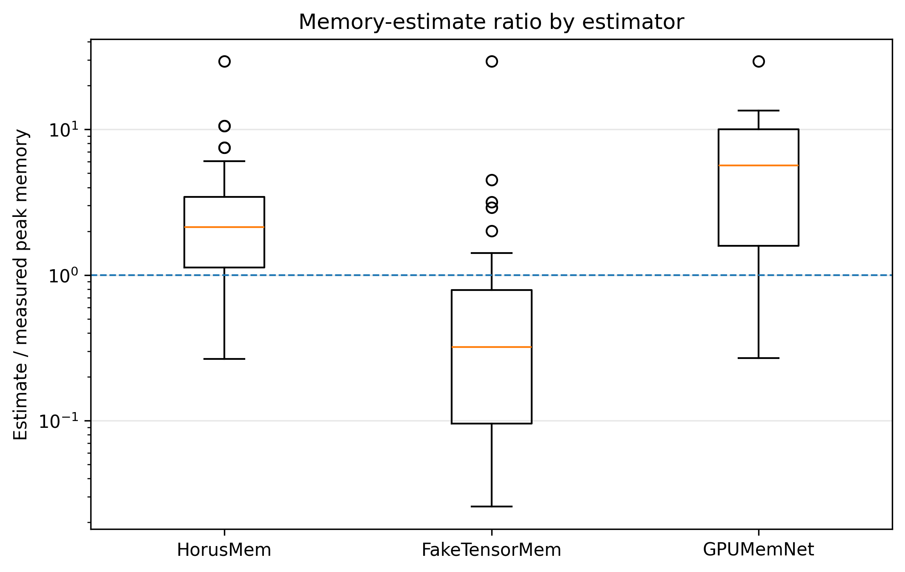

#### Estimate Ratio Ecdf

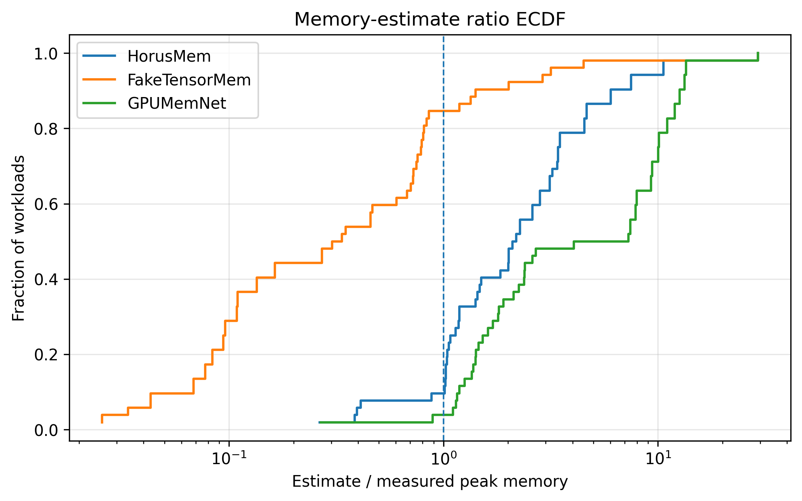

#### Estimate Vs Peak Memory

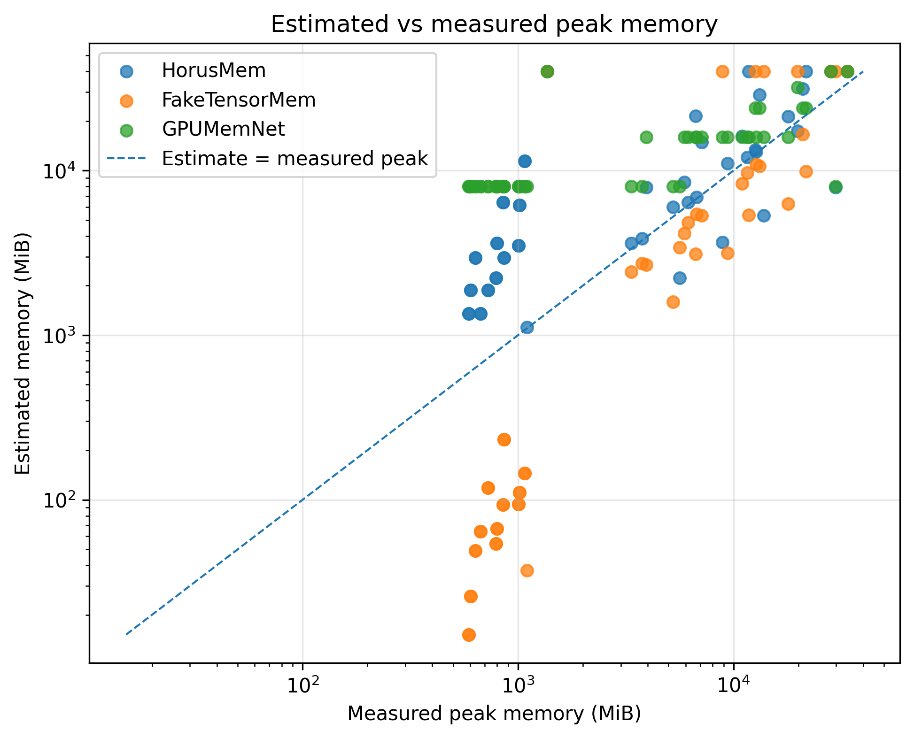

## Actual End-to-End Performance

| trace   | label               |   completion_rate |   makespan_s |   mean_jct_s |   p95_jct_s |   mean_queue_wait_s |   p95_queue_wait_s |   mean_execution_time_s |   failed |   recovered |
|:--------|:--------------------|------------------:|-------------:|-------------:|------------:|--------------------:|-------------------:|------------------------:|---------:|------------:|
| philly  | AEGIS+PeakMem       |                 1 |      31257.6 |     11924.6  |     21659.9 |             8555.88 |            16628.4 |                 3368.69 |        0 |           0 |
| philly  | AEGIS+HorusMem      |                 1 |      31379.9 |     12300.9  |     20643.2 |             9499    |            17738.5 |                 2801.82 |        1 |           1 |
| philly  | AEGIS+FakeTensorMem |                 1 |      33296.6 |     12737.8  |     22742   |             9688.2  |            18940.2 |                 3049.54 |        0 |           0 |
| philly  | AEGIS+GPUMemNet     |                 1 |      30982.1 |     12424.5  |     22559.4 |             9535.03 |            17064.3 |                 2889.43 |        0 |           0 |
| philly  | AEGIS-EstimatorFree |                 1 |      30208.2 |     11915.9  |     20698.9 |             8686.46 |            15885.2 |                 3229.45 |        3 |           3 |
| saturn  | AEGIS+PeakMem       |                 1 |      32342.8 |      9963.53 |     22467.2 |             5922.94 |            20841.6 |                 4040.57 |        0 |           0 |
| saturn  | AEGIS+HorusMem      |                 1 |      33852   |     10764.9  |     26126.3 |             7884.15 |            24489.2 |                 2880.68 |        2 |           2 |
| saturn  | AEGIS+FakeTensorMem |                 1 |      39076.5 |     11605    |     28181.2 |             8954.23 |            26571.8 |                 2650.72 |        0 |           0 |
| saturn  | AEGIS+GPUMemNet     |                 1 |      34973.5 |     10566.6  |     24156.5 |             7431.17 |            22899.5 |                 3135.4  |        1 |           1 |
| saturn  | AEGIS-EstimatorFree |                 1 |      33248.6 |     10037.9  |     21282.5 |             6696.88 |            20007.3 |                 3341.03 |        3 |           3 |
| venus   | AEGIS+PeakMem       |                 1 |      32064.3 |      9371.44 |     14291   |             6369.1  |            10359.3 |                 3002.32 |        0 |           0 |
| venus   | AEGIS+HorusMem      |                 1 |      33331.2 |      9745.8  |     14959.2 |             7015.9  |            11746.5 |                 2729.88 |        0 |           0 |
| venus   | AEGIS+FakeTensorMem |                 1 |      34545.6 |      9766.07 |     15190.4 |             6869.17 |            13350.8 |                 2896.88 |        0 |           0 |
| venus   | AEGIS+GPUMemNet     |                 1 |      33252.2 |     10067.4  |     14668.4 |             6970.98 |            12308.4 |                 3096.4  |        0 |           0 |
| venus   | AEGIS-EstimatorFree |                 1 |      34787.7 |     10202.9  |     15059.7 |             7725.67 |            13097.8 |                 2477.25 |        6 |           6 |

## Normalized End-to-End Performance

Values are normalized to the Exclusive run from the same trace.

| trace   | label               |   completion_rate |   normalized_makespan_s |   normalized_mean_jct_s |   normalized_p95_jct_s |   normalized_mean_queue_wait_s |   normalized_p95_queue_wait_s |   normalized_mean_execution_time_s |   failed |   recovered |
|:--------|:--------------------|------------------:|------------------------:|------------------------:|-----------------------:|-------------------------------:|------------------------------:|-----------------------------------:|---------:|------------:|
| philly  | AEGIS+PeakMem       |                 1 |                   0.733 |                   0.634 |                  0.704 |                          0.505 |                         0.571 |                              1.778 |        0 |           0 |
| philly  | AEGIS+HorusMem      |                 1 |                   0.736 |                   0.653 |                  0.671 |                          0.561 |                         0.609 |                              1.479 |        1 |           1 |
| philly  | AEGIS+FakeTensorMem |                 1 |                   0.781 |                   0.677 |                  0.739 |                          0.572 |                         0.651 |                              1.609 |        0 |           0 |
| philly  | AEGIS+GPUMemNet     |                 1 |                   0.727 |                   0.66  |                  0.733 |                          0.563 |                         0.586 |                              1.525 |        0 |           0 |
| philly  | AEGIS-EstimatorFree |                 1 |                   0.709 |                   0.633 |                  0.673 |                          0.513 |                         0.546 |                              1.704 |        3 |           3 |
| saturn  | AEGIS+PeakMem       |                 1 |                   0.682 |                   0.579 |                  0.549 |                          0.389 |                         0.566 |                              2.055 |        0 |           0 |
| saturn  | AEGIS+HorusMem      |                 1 |                   0.714 |                   0.626 |                  0.639 |                          0.517 |                         0.665 |                              1.465 |        2 |           2 |
| saturn  | AEGIS+FakeTensorMem |                 1 |                   0.824 |                   0.674 |                  0.689 |                          0.587 |                         0.722 |                              1.348 |        0 |           0 |
| saturn  | AEGIS+GPUMemNet     |                 1 |                   0.738 |                   0.614 |                  0.59  |                          0.488 |                         0.622 |                              1.595 |        1 |           1 |
| saturn  | AEGIS-EstimatorFree |                 1 |                   0.701 |                   0.583 |                  0.52  |                          0.439 |                         0.544 |                              1.699 |        3 |           3 |
| venus   | AEGIS+PeakMem       |                 1 |                   0.721 |                   0.572 |                  0.579 |                          0.44  |                         0.434 |                              1.558 |        0 |           0 |
| venus   | AEGIS+HorusMem      |                 1 |                   0.75  |                   0.595 |                  0.606 |                          0.485 |                         0.493 |                              1.416 |        0 |           0 |
| venus   | AEGIS+FakeTensorMem |                 1 |                   0.777 |                   0.596 |                  0.616 |                          0.475 |                         0.56  |                              1.503 |        0 |           0 |
| venus   | AEGIS+GPUMemNet     |                 1 |                   0.748 |                   0.614 |                  0.594 |                          0.482 |                         0.516 |                              1.606 |        0 |           0 |
| venus   | AEGIS-EstimatorFree |                 1 |                   0.783 |                   0.622 |                  0.61  |                          0.534 |                         0.549 |                              1.285 |        6 |           6 |

## Aggregate Across Completed Traces

### Paper-facing estimator summary

All normalized values use Exclusive = 1.0 for each trace before taking the geometric mean across traces. Queue wait is total queue wait, including recovery queue wait.

| Estimator           |   Completion |   Failed attempts |   Recovered attempts |   Makespan / Exclusive |   Mean JCT / Exclusive |   P95 JCT / Exclusive |   Mean total wait / Exclusive |   P95 total wait / Exclusive |
|:--------------------|-------------:|------------------:|---------------------:|-----------------------:|-----------------------:|----------------------:|------------------------------:|-----------------------------:|
| AEGIS+PeakMem       |        1.000 |                 0 |                    0 |                  0.712 |                  0.594 |                 0.607 |                         0.442 |                        0.520 |
| AEGIS+HorusMem      |        1.000 |                 3 |                    3 |                  0.733 |                  0.624 |                 0.638 |                         0.520 |                        0.584 |
| AEGIS+FakeTensorMem |        1.000 |                 0 |                    0 |                  0.794 |                  0.648 |                 0.679 |                         0.543 |                        0.641 |
| AEGIS+GPUMemNet     |        1.000 |                 1 |                    1 |                  0.737 |                  0.629 |                 0.636 |                         0.510 |                        0.573 |
| AEGIS-EstimatorFree |        1.000 |                12 |                   12 |                  0.730 |                  0.613 |                 0.598 |                         0.494 |                        0.546 |

### Detailed aggregate summary

| label               |   trace_count |   completion_rate_mean |   geomean_normalized_makespan_s |   geomean_normalized_mean_jct_s |   geomean_normalized_p95_jct_s |   geomean_normalized_mean_queue_wait_s |   geomean_normalized_p95_queue_wait_s |   geomean_normalized_mean_execution_time_s |   failed_total |   recovered_total |
|:--------------------|--------------:|-----------------------:|--------------------------------:|--------------------------------:|-------------------------------:|---------------------------------------:|--------------------------------------:|-------------------------------------------:|---------------:|------------------:|
| AEGIS+PeakMem       |             3 |                      1 |                           0.712 |                           0.594 |                          0.607 |                                  0.442 |                                 0.52  |                                      1.785 |              0 |                 0 |
| AEGIS+HorusMem      |             3 |                      1 |                           0.733 |                           0.624 |                          0.638 |                                  0.52  |                                 0.584 |                                      1.453 |              3 |                 3 |
| AEGIS+FakeTensorMem |             3 |                      1 |                           0.794 |                           0.648 |                          0.679 |                                  0.543 |                                 0.641 |                                      1.483 |              0 |                 0 |
| AEGIS+GPUMemNet     |             3 |                      1 |                           0.737 |                           0.629 |                          0.636 |                                  0.51  |                                 0.573 |                                      1.575 |              1 |                 1 |
| AEGIS-EstimatorFree |             3 |                      1 |                           0.73  |                           0.613 |                          0.598 |                                  0.494 |                                 0.546 |                                      1.55  |             12 |                12 |

## Summary Figures

### Actual Makespan By Estimator

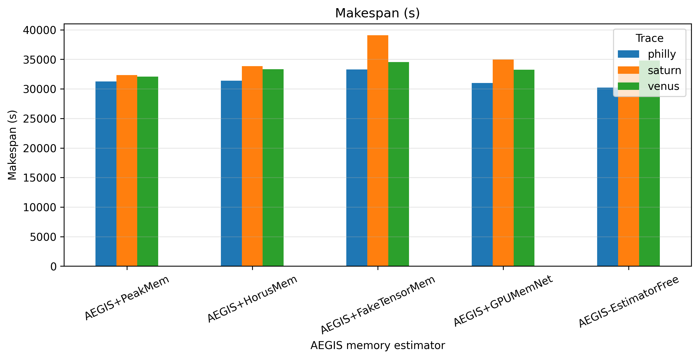

### Actual Mean Jct By Estimator

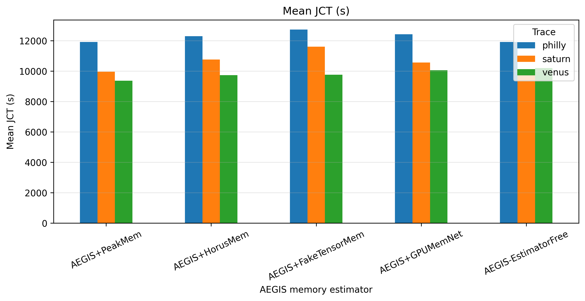

### Actual P95 Jct By Estimator

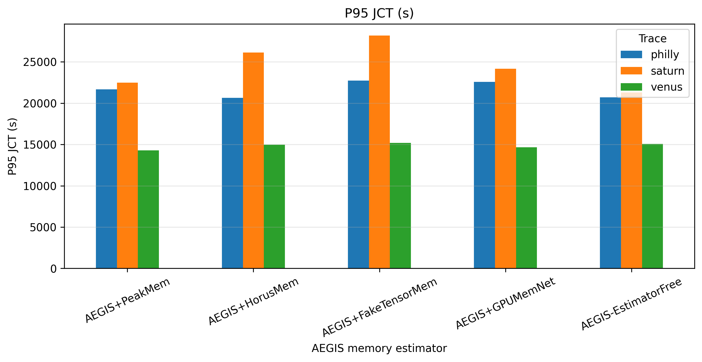

### Normalized Makespan By Estimator

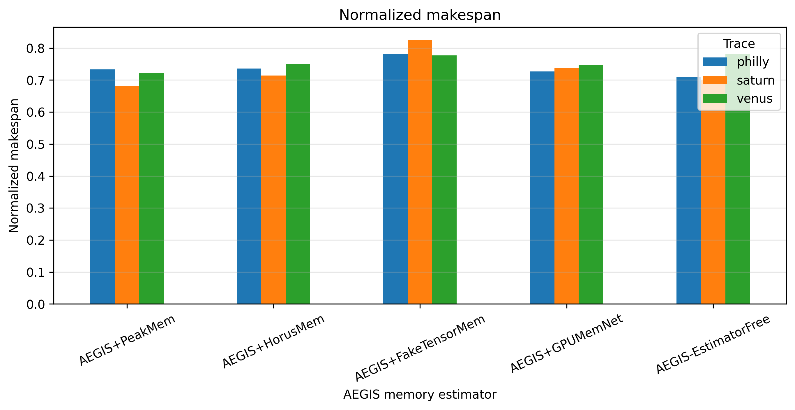

### Normalized Mean Jct By Estimator

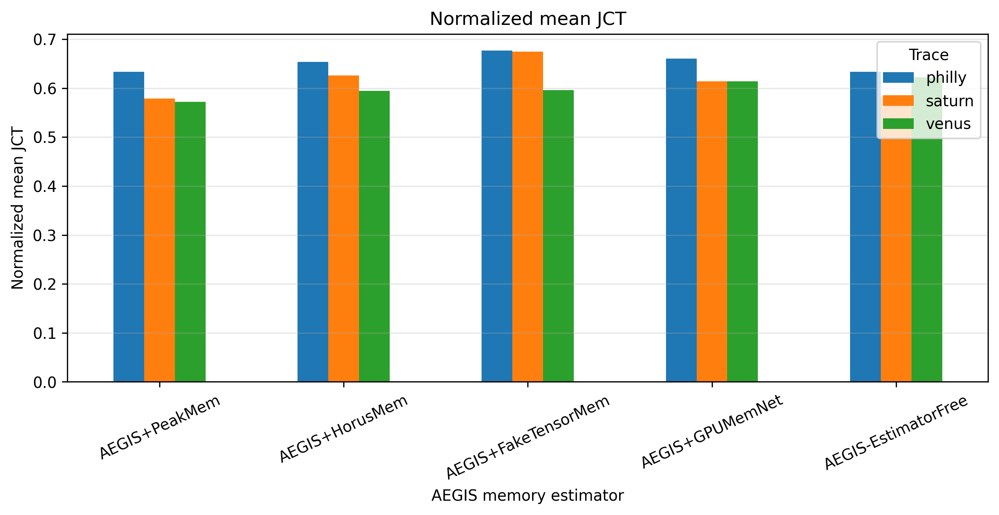

### Normalized P95 Jct By Estimator

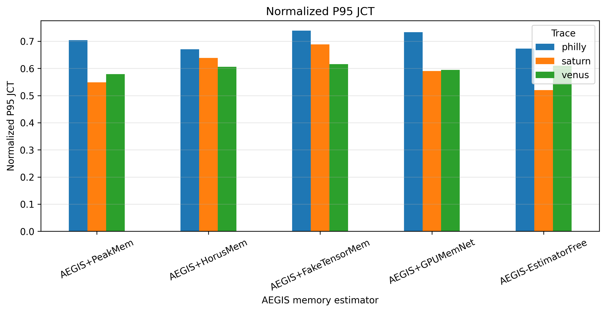

## Per-Trace Distribution Figures

These distribution figures are generated by `plot_policy_distributions.py`, matching the main evaluation plotting pipeline.

### philly

#### Normalized Jct Ecdf

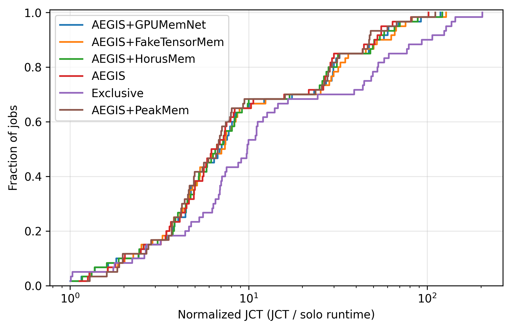

#### Jct Ecdf

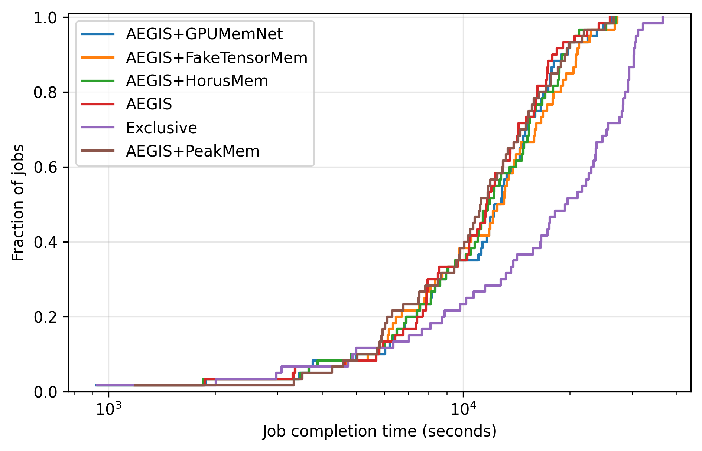

#### Queue Wait Ecdf

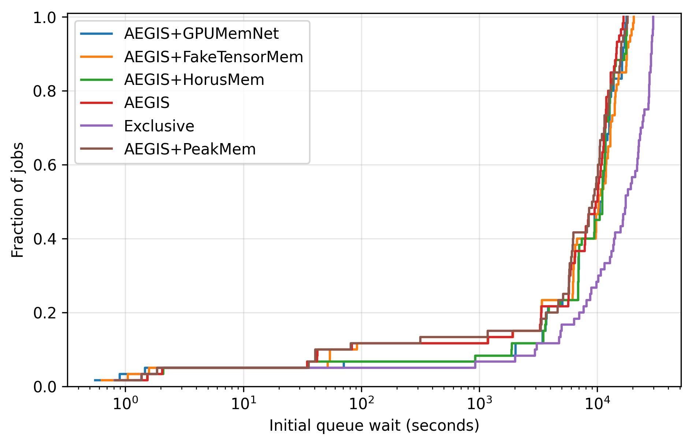

### saturn

#### Normalized Jct Ecdf

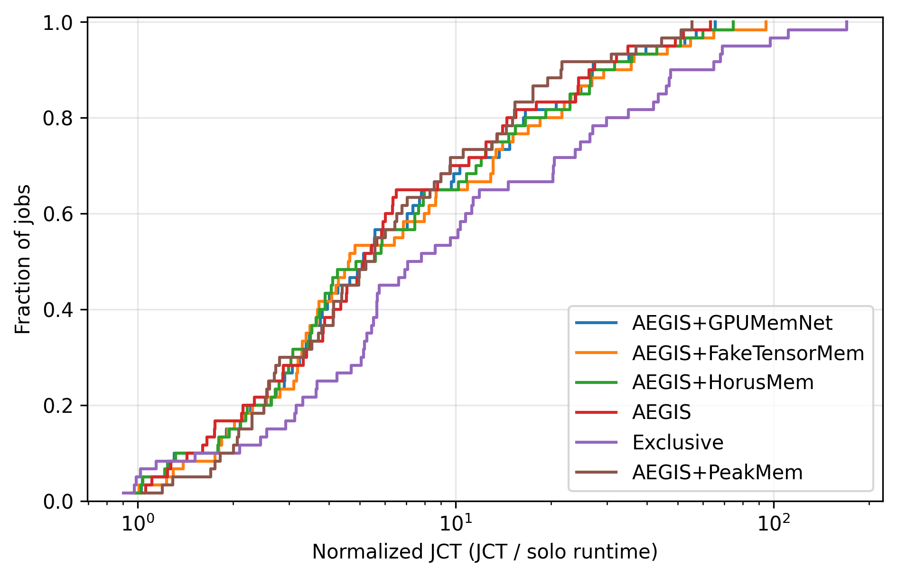

#### Jct Ecdf

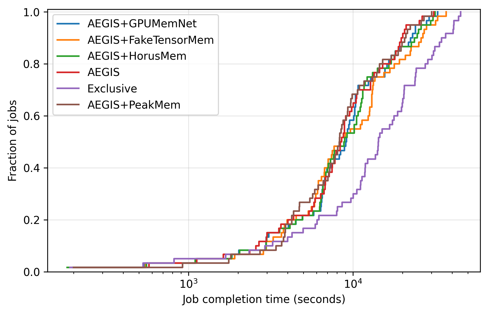

#### Queue Wait Ecdf

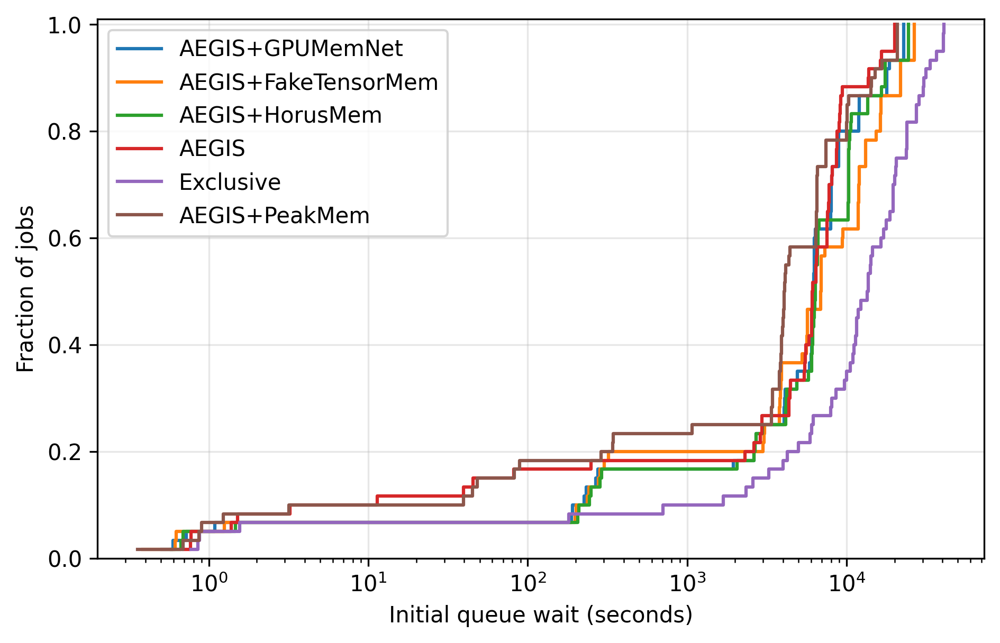

### venus

#### Normalized Jct Ecdf

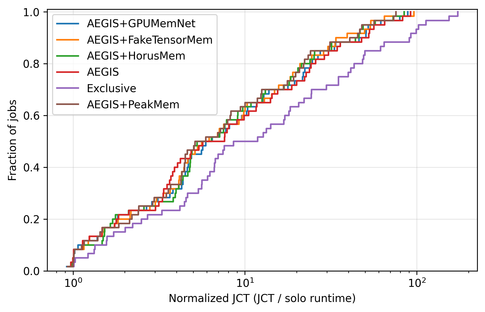

#### Jct Ecdf

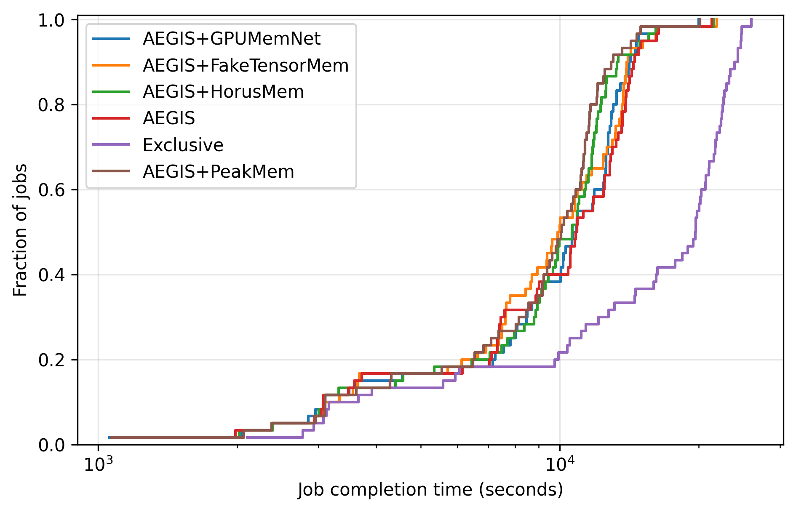

#### Queue Wait Ecdf

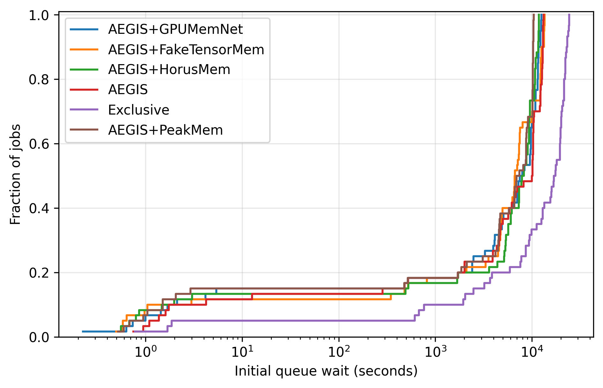

