# DCGMI resource and energy evidence

This report is secondary evidence and is not part of the main performance pipeline.

## Method

Important correction: `dcgmi_metrics.csv` reports `free_gpu_memory`, so used memory is computed as:

```text
used_gpu_memory_gb = (max_free_gpu_memory_for_that_gpu - free_gpu_memory) / 1024
```

The trace-window memory mean includes idle samples. The active memory mean/p95 only includes samples where the GPU appears active.

Energy is computed from the cumulative `energy` counter:

```text
energy_delta_j = (energy_last - energy_first) / 1000
total_gpu_energy_j = sum energy_delta_j over GPUs
```

## Numeric takeaway

- Across traces, `AEGIS-EstimatorFree` changes GPU energy-to-solution by **12.2% lower** relative to Exclusive on a geomean basis.
- Active used GPU memory mean is **71.0% higher** than Exclusive on a geomean basis; active used memory p95 is **10.5% higher**.
- Active GPU utilization is **23.3% higher** than Exclusive on a geomean basis.
- Active pressure indicators increase by **39.9% higher** for SMACT, **45.1% higher** for SMOCC, and **39.4% higher** for DRAMA on a geomean basis.
- Active power is **19.2% higher** than Exclusive on a geomean basis; this is why energy-to-solution is more informative than average power alone.

Per-trace AEGIS-EstimatorFree vs Exclusive:
- `philly`: energy-to-solution 14.4% lower, active memory mean 92.7% higher, active GPU utilization 26.3% higher, active SMACT 50.7% higher.
- `saturn`: energy-to-solution 13.0% lower, active memory mean 85.4% higher, active GPU utilization 26.8% higher, active SMACT 43.0% higher.
- `venus`: energy-to-solution 9.3% lower, active memory mean 40.0% higher, active GPU utilization 17.0% higher, active SMACT 27.0% higher.

## Absolute summary

| trace   | policy              |   active_row_fraction |   used_gpu_memory_trace_mean_gb |   used_gpu_memory_active_mean_gb |   used_gpu_memory_active_p95_gb |   gpu_utilization_active_mean_pct |   smact_active_mean |   smocc_active_mean |   drama_active_mean |   power_active_mean_w |   total_gpu_energy_j |   total_gpu_energy_j_vs_exclusive | window_source   |
|:--------|:--------------------|----------------------:|--------------------------------:|---------------------------------:|--------------------------------:|----------------------------------:|--------------------:|--------------------:|--------------------:|----------------------:|---------------------:|----------------------------------:|:----------------|
| philly  | Exclusive           |                0.923  |                           12.41 |                            13.44 |                           33.86 |                             75.32 |              0.4231 |              0.1927 |              0.2623 |                 218   |            2.635e+07 |                            1      | dcgmi_span      |
| philly  | Horus               |                0.8947 |                           13.98 |                            15.61 |                           33.86 |                             82.03 |              0.5184 |              0.2324 |              0.2936 |                 238.5 |            2.58e+07  |                            0.9791 | dcgmi_span      |
| philly  | Lucid               |                0.8801 |                           15.97 |                            18.13 |                           34.89 |                             87.92 |              0.7357 |              0.3362 |              0.3248 |                 252.4 |            2.481e+07 |                            0.9412 | dcgmi_span      |
| philly  | AEGIS+HorusMem      |                0.9273 |                           21.26 |                            22.91 |                           36.9  |                             92.61 |              0.5988 |              0.2817 |              0.3665 |                 259.1 |            2.312e+07 |                            0.8771 | dcgmi_span      |
| philly  | AEGIS+PeakMem       |                0.8749 |                           23.72 |                            27.09 |                           38.09 |                             97.06 |              0.6368 |              0.3058 |              0.3967 |                 266.9 |            2.261e+07 |                            0.858  | dcgmi_span      |
| philly  | AEGIS-EstimatorFree |                0.9293 |                           24.06 |                            25.89 |                           38.76 |                             95.11 |              0.6377 |              0.3022 |              0.3824 |                 262.6 |            2.256e+07 |                            0.856  | dcgmi_span      |
| saturn  | Exclusive           |                0.8571 |                           11.2  |                            13.03 |                           34.75 |                             74.74 |              0.4299 |              0.1937 |              0.2518 |                 212.9 |            2.745e+07 |                            1      | dcgmi_span      |
| saturn  | Horus               |                0.8443 |                           12.37 |                            14.61 |                           33.91 |                             81.12 |              0.4883 |              0.2185 |              0.2823 |                 232   |            2.688e+07 |                            0.9792 | dcgmi_span      |
| saturn  | Lucid               |                0.8517 |                           14.22 |                            16.66 |                           34.9  |                             84.54 |              0.6834 |              0.3088 |              0.2969 |                 241.9 |            2.626e+07 |                            0.9567 | dcgmi_span      |
| saturn  | AEGIS+HorusMem      |                0.8907 |                           19.59 |                            21.98 |                           35.11 |                             92.96 |              0.5892 |              0.2725 |              0.3521 |                 258.1 |            2.417e+07 |                            0.8806 | dcgmi_span      |
| saturn  | AEGIS+PeakMem       |                0.9163 |                           24.51 |                            26.75 |                           37.34 |                             94.51 |              0.5676 |              0.2714 |              0.3694 |                 260.4 |            2.356e+07 |                            0.8581 | dcgmi_span      |
| saturn  | AEGIS-EstimatorFree |                0.8923 |                           21.56 |                            24.16 |                           39.28 |                             94.76 |              0.6149 |              0.2877 |              0.366  |                 261.9 |            2.389e+07 |                            0.8703 | dcgmi_span      |
| venus   | Exclusive           |                0.8879 |                           12.64 |                            14.21 |                           34.7  |                             76.97 |              0.6052 |              0.2693 |              0.2646 |                 221.3 |            2.729e+07 |                            1      | dcgmi_span      |
| venus   | Horus               |                0.8633 |                           13.72 |                            15.86 |                           33.86 |                             82.19 |              0.4776 |              0.2153 |              0.293  |                 236.9 |            2.686e+07 |                            0.9844 | dcgmi_span      |
| venus   | Lucid               |                0.8669 |                           13.7  |                            15.78 |                           34.51 |                             84.34 |              0.4991 |              0.2244 |              0.3042 |                 244.2 |            2.666e+07 |                            0.9769 | dcgmi_span      |
| venus   | AEGIS+HorusMem      |                0.9226 |                           18.98 |                            20.57 |                           34.48 |                             90.9  |              0.5815 |              0.269  |              0.3491 |                 255.8 |            2.432e+07 |                            0.8912 | dcgmi_span      |
| venus   | AEGIS+PeakMem       |                0.9427 |                           21.83 |                            23.16 |                           34.88 |                             92.71 |              0.5915 |              0.275  |              0.3573 |                 257.3 |            2.399e+07 |                            0.8792 | dcgmi_span      |
| venus   | AEGIS-EstimatorFree |                0.909  |                           18.1  |                            19.9  |                           36.15 |                             90.02 |              0.7689 |              0.3531 |              0.3384 |                 252.7 |            2.475e+07 |                            0.907  | dcgmi_span      |

## Normalized to Exclusive

Values above 1 mean higher than Exclusive. For energy-to-solution, lower than 1 is better; for utilization/activity metrics, higher than 1 means more active GPU usage.

| trace   | policy              |   used_gpu_memory_active_mean_gb_vs_exclusive |   used_gpu_memory_active_p95_gb_vs_exclusive |   gpu_utilization_active_mean_pct_vs_exclusive |   smact_active_mean_vs_exclusive |   smocc_active_mean_vs_exclusive |   drama_active_mean_vs_exclusive |   power_active_mean_w_vs_exclusive |   total_gpu_energy_j_vs_exclusive |
|:--------|:--------------------|----------------------------------------------:|---------------------------------------------:|-----------------------------------------------:|---------------------------------:|---------------------------------:|---------------------------------:|-----------------------------------:|----------------------------------:|
| philly  | Exclusive           |                                         1     |                                       1      |                                          1     |                           1      |                           1      |                            1     |                              1     |                            1      |
| philly  | Horus               |                                         1.162 |                                       1      |                                          1.089 |                           1.225  |                           1.206  |                            1.119 |                              1.094 |                            0.9791 |
| philly  | Lucid               |                                         1.349 |                                       1.03   |                                          1.167 |                           1.739  |                           1.745  |                            1.238 |                              1.158 |                            0.9412 |
| philly  | AEGIS+HorusMem      |                                         1.705 |                                       1.09   |                                          1.23  |                           1.415  |                           1.462  |                            1.397 |                              1.188 |                            0.8771 |
| philly  | AEGIS+PeakMem       |                                         2.016 |                                       1.125  |                                          1.289 |                           1.505  |                           1.587  |                            1.512 |                              1.224 |                            0.858  |
| philly  | AEGIS-EstimatorFree |                                         1.927 |                                       1.145  |                                          1.263 |                           1.507  |                           1.568  |                            1.458 |                              1.204 |                            0.856  |
| saturn  | Exclusive           |                                         1     |                                       1      |                                          1     |                           1      |                           1      |                            1     |                              1     |                            1      |
| saturn  | Horus               |                                         1.121 |                                       0.9758 |                                          1.085 |                           1.136  |                           1.128  |                            1.121 |                              1.09  |                            0.9792 |
| saturn  | Lucid               |                                         1.278 |                                       1.004  |                                          1.131 |                           1.59   |                           1.594  |                            1.179 |                              1.136 |                            0.9567 |
| saturn  | AEGIS+HorusMem      |                                         1.687 |                                       1.01   |                                          1.244 |                           1.37   |                           1.407  |                            1.398 |                              1.213 |                            0.8806 |
| saturn  | AEGIS+PeakMem       |                                         2.052 |                                       1.075  |                                          1.265 |                           1.32   |                           1.401  |                            1.467 |                              1.223 |                            0.8581 |
| saturn  | AEGIS-EstimatorFree |                                         1.854 |                                       1.131  |                                          1.268 |                           1.43   |                           1.486  |                            1.453 |                              1.23  |                            0.8703 |
| venus   | Exclusive           |                                         1     |                                       1      |                                          1     |                           1      |                           1      |                            1     |                              1     |                            1      |
| venus   | Horus               |                                         1.117 |                                       0.9759 |                                          1.068 |                           0.7892 |                           0.7992 |                            1.107 |                              1.07  |                            0.9844 |
| venus   | Lucid               |                                         1.111 |                                       0.9945 |                                          1.096 |                           0.8248 |                           0.8332 |                            1.15  |                              1.103 |                            0.9769 |
| venus   | AEGIS+HorusMem      |                                         1.448 |                                       0.9937 |                                          1.181 |                           0.9609 |                           0.9987 |                            1.319 |                              1.156 |                            0.8912 |
| venus   | AEGIS+PeakMem       |                                         1.63  |                                       1.005  |                                          1.204 |                           0.9775 |                           1.021  |                            1.35  |                              1.163 |                            0.8792 |
| venus   | AEGIS-EstimatorFree |                                         1.4   |                                       1.042  |                                          1.17  |                           1.27   |                           1.311  |                            1.279 |                              1.142 |                            0.907  |

## Figures

### normalized energy to solution

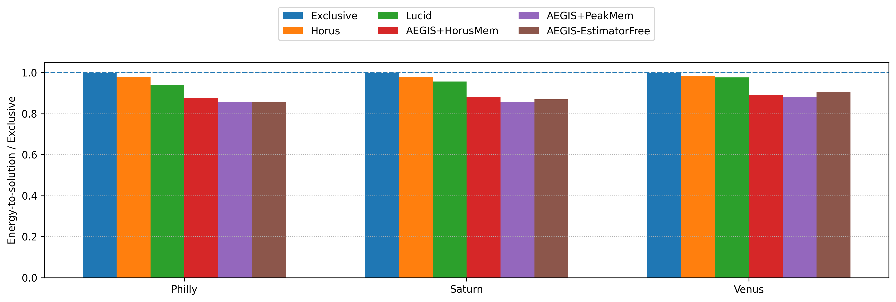

### active memory mean gb

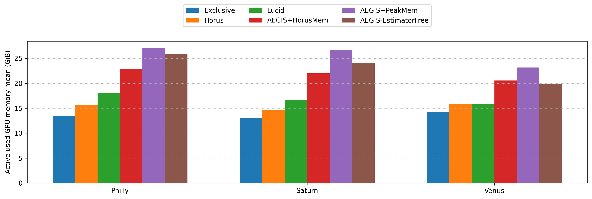

### active memory p95 gb

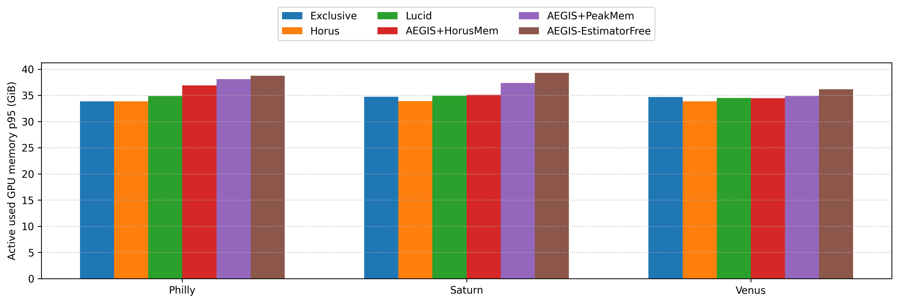

### active smact mean

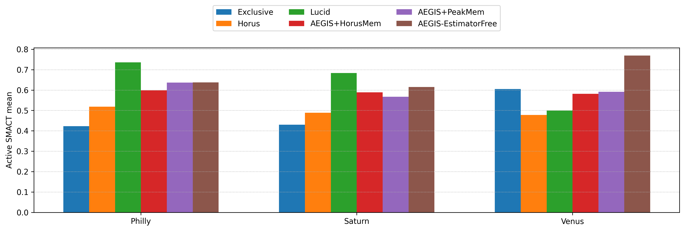

### active smocc mean

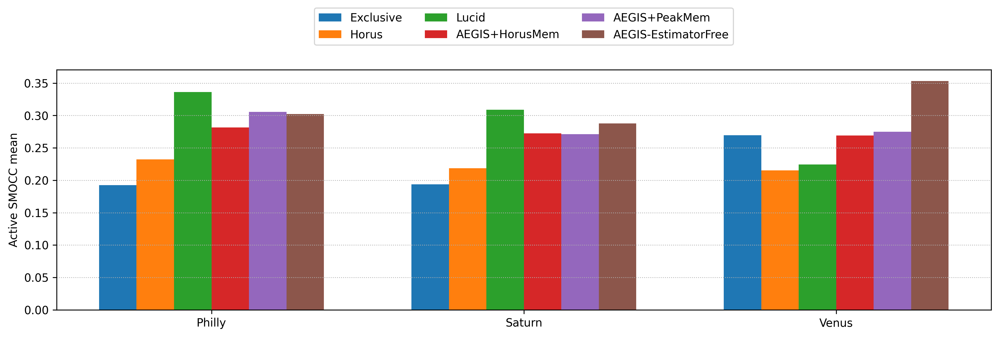

### active drama mean

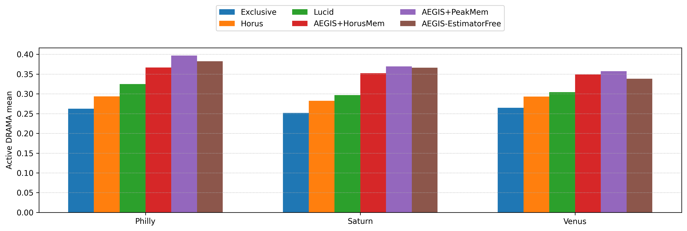

### memory timeline exclusive vs aegis philly

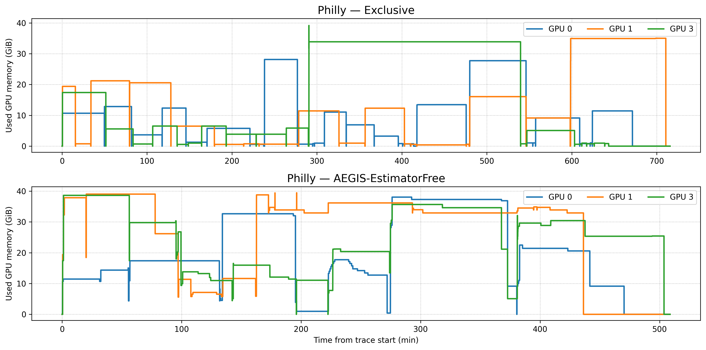

### memory timeline exclusive vs aegis saturn

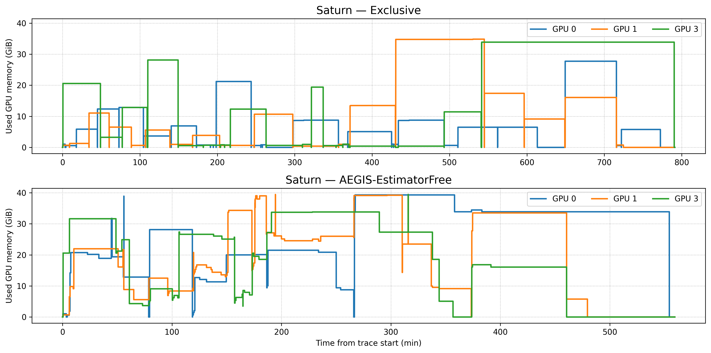

### memory timeline exclusive vs aegis venus

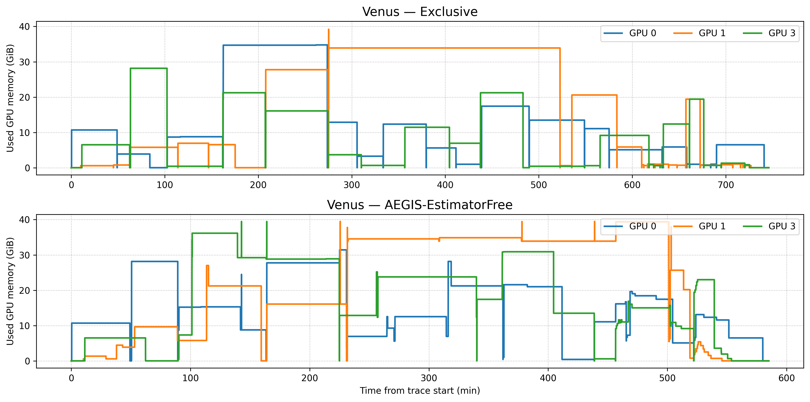

### normalized active drama

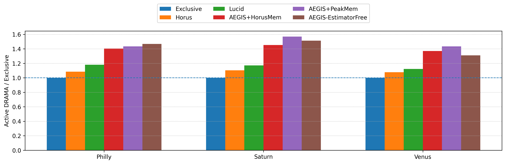

### normalized active smact

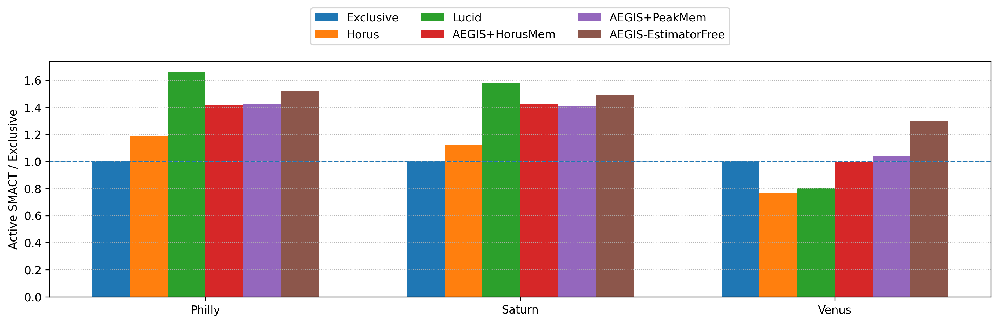

### normalized active smocc

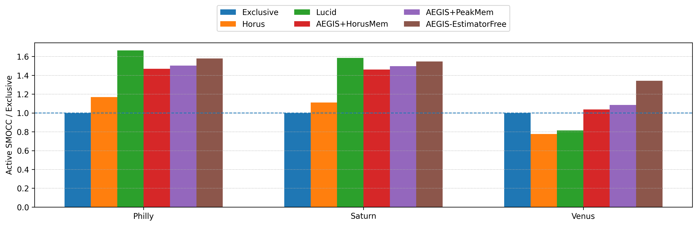
