# Final Representative Evaluation

This report is generated automatically by `analyze_evaluation_manifest.py`.

## Evaluation status

| trace_name   |   complete |
|:-------------|-----------:|
| philly       |          6 |
| saturn       |          6 |
| venus        |          6 |

## Cross-trace comparison

Each table reports every completed trace separately. GeoMean summarizes normalized ratios across traces; lower is better.

### Normalized makespan

| Policy                   |   Philly |   Saturn |   Venus |   GeoMean | Policy_display           |
|:-------------------------|---------:|---------:|--------:|----------:|:-------------------------|
| Exclusive                |    1     |    1     |   1     |     1     | Exclusive                |
| AEGIS + ProfiledPeakMem  |    0.733 |    0.682 |   0.721 |     0.712 | AEGIS + ProfiledPeakMem  |
| AEGIS - EstimatorFree    |    0.709 |    0.701 |   0.783 |     0.73  | AEGIS - EstimatorFree    |
| AEGIS + AnalyticalMemEst |    0.736 |    0.714 |   0.75  |     0.733 | AEGIS + AnalyticalMemEst |
| Horus                    |    0.916 |    0.912 |   0.945 |     0.924 | Horus                    |
| Lucid                    |    0.839 |    0.852 |   0.905 |     0.865 | Lucid                    |

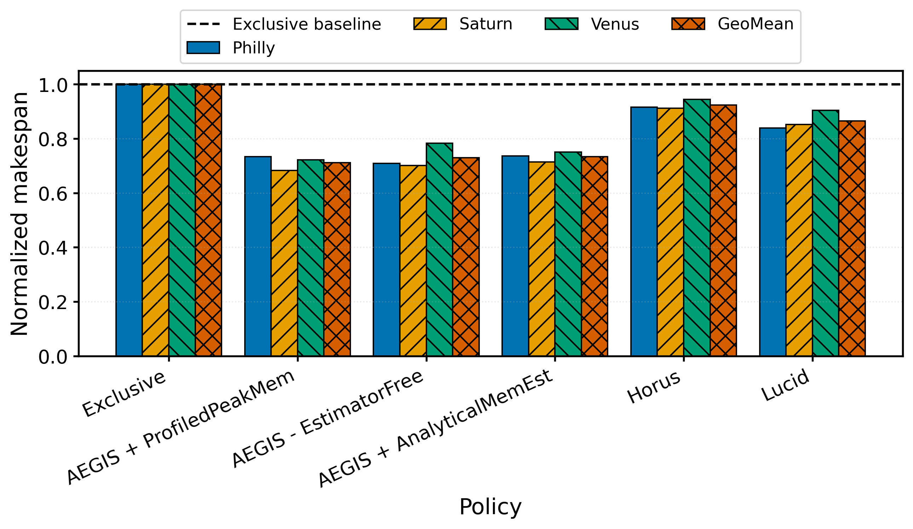

### Normalized mean JCT

| Policy                   |   Philly |   Saturn |   Venus |   GeoMean | Policy_display           |
|:-------------------------|---------:|---------:|--------:|----------:|:-------------------------|
| Exclusive                |    1     |    1     |   1     |     1     | Exclusive                |
| AEGIS + ProfiledPeakMem  |    0.634 |    0.579 |   0.572 |     0.594 | AEGIS + ProfiledPeakMem  |
| AEGIS - EstimatorFree    |    0.633 |    0.583 |   0.622 |     0.613 | AEGIS - EstimatorFree    |
| AEGIS + AnalyticalMemEst |    0.653 |    0.626 |   0.595 |     0.624 | AEGIS + AnalyticalMemEst |
| Horus                    |    0.865 |    0.838 |   0.914 |     0.872 | Horus                    |
| Lucid                    |    0.752 |    0.744 |   0.858 |     0.783 | Lucid                    |

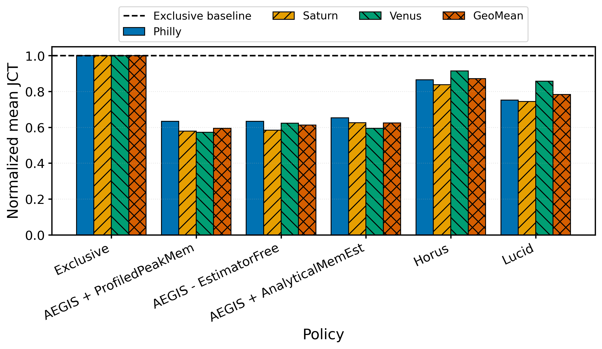

### Normalized P95 JCT

| Policy                   |   Philly |   Saturn |   Venus |   GeoMean | Policy_display           |
|:-------------------------|---------:|---------:|--------:|----------:|:-------------------------|
| Exclusive                |    1     |    1     |   1     |     1     | Exclusive                |
| AEGIS + ProfiledPeakMem  |    0.704 |    0.549 |   0.579 |     0.607 | AEGIS + ProfiledPeakMem  |
| AEGIS - EstimatorFree    |    0.673 |    0.52  |   0.61  |     0.598 | AEGIS - EstimatorFree    |
| AEGIS + AnalyticalMemEst |    0.671 |    0.639 |   0.606 |     0.638 | AEGIS + AnalyticalMemEst |
| Horus                    |    0.87  |    0.895 |   0.87  |     0.878 | Horus                    |
| Lucid                    |    0.781 |    0.763 |   0.816 |     0.786 | Lucid                    |

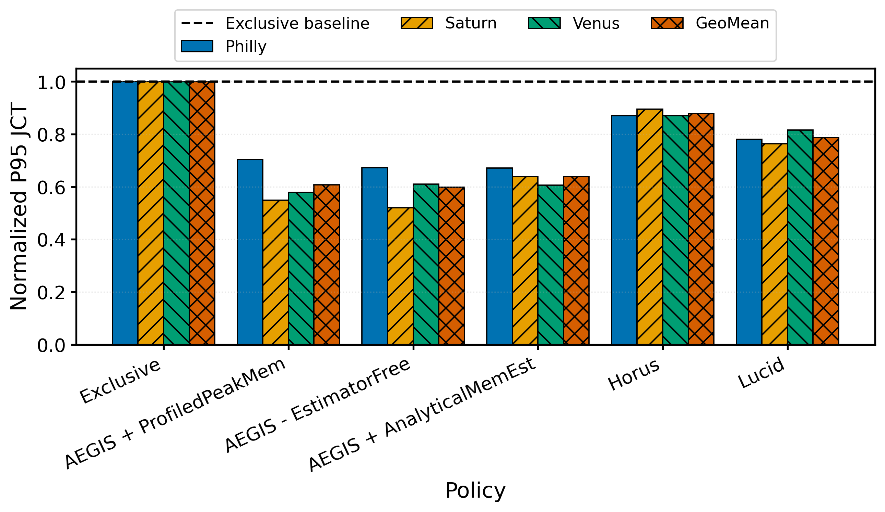

### Normalized mean total queue wait

| Policy                   |   Philly |   Saturn |   Venus |   GeoMean | Policy_display           |
|:-------------------------|---------:|---------:|--------:|----------:|:-------------------------|
| Exclusive                |    1     |    1     |   1     |     1     | Exclusive                |
| AEGIS + ProfiledPeakMem  |    0.505 |    0.389 |   0.44  |     0.442 | AEGIS + ProfiledPeakMem  |
| AEGIS - EstimatorFree    |    0.513 |    0.439 |   0.534 |     0.494 | AEGIS - EstimatorFree    |
| AEGIS + AnalyticalMemEst |    0.561 |    0.517 |   0.485 |     0.52  | AEGIS + AnalyticalMemEst |
| Horus                    |    0.846 |    0.814 |   0.899 |     0.852 | Horus                    |
| Lucid                    |    0.71  |    0.7   |   0.83  |     0.745 | Lucid                    |

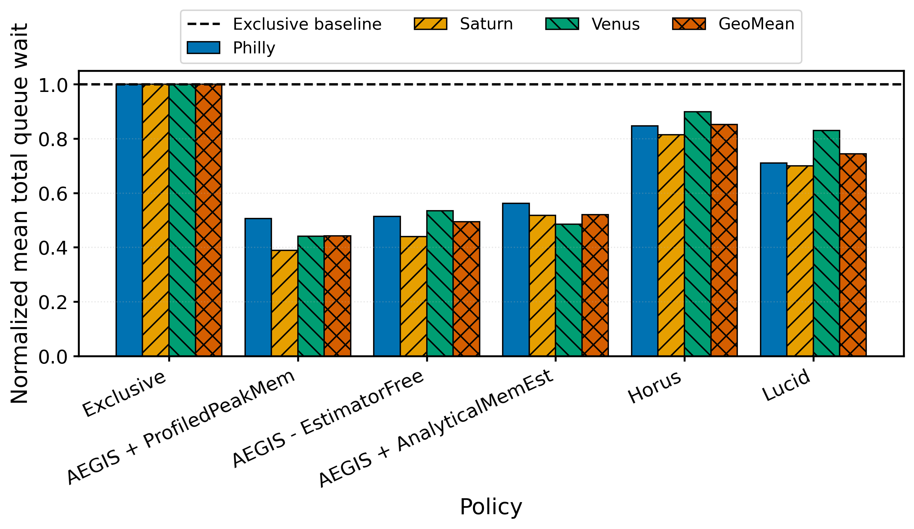

### Normalized P95 total queue wait

| Policy                   |   Philly |   Saturn |   Venus |   GeoMean | Policy_display           |
|:-------------------------|---------:|---------:|--------:|----------:|:-------------------------|
| Exclusive                |    1     |    1     |   1     |     1     | Exclusive                |
| AEGIS + ProfiledPeakMem  |    0.571 |    0.566 |   0.434 |     0.52  | AEGIS + ProfiledPeakMem  |
| AEGIS - EstimatorFree    |    0.546 |    0.544 |   0.549 |     0.546 | AEGIS - EstimatorFree    |
| AEGIS + AnalyticalMemEst |    0.609 |    0.665 |   0.493 |     0.584 | AEGIS + AnalyticalMemEst |
| Horus                    |    0.857 |    0.883 |   0.86  |     0.867 | Horus                    |
| Lucid                    |    0.762 |    0.805 |   0.795 |     0.787 | Lucid                    |

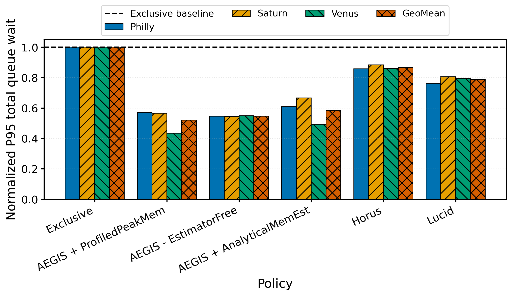

### Normalized mean total execution time

| Policy                   |   Philly |   Saturn |   Venus |   GeoMean | Policy_display           |
|:-------------------------|---------:|---------:|--------:|----------:|:-------------------------|
| Exclusive                |    1     |    1     |   1     |     1     | Exclusive                |
| AEGIS + ProfiledPeakMem  |    1.778 |    2.055 |   1.558 |     1.785 | AEGIS + ProfiledPeakMem  |
| AEGIS - EstimatorFree    |    1.704 |    1.699 |   1.285 |     1.55  | AEGIS - EstimatorFree    |
| AEGIS + AnalyticalMemEst |    1.479 |    1.465 |   1.416 |     1.453 | AEGIS + AnalyticalMemEst |
| Horus                    |    1.032 |    1.019 |   1.032 |     1.028 | Horus                    |
| Lucid                    |    1.13  |    1.088 |   1.062 |     1.093 | Lucid                    |

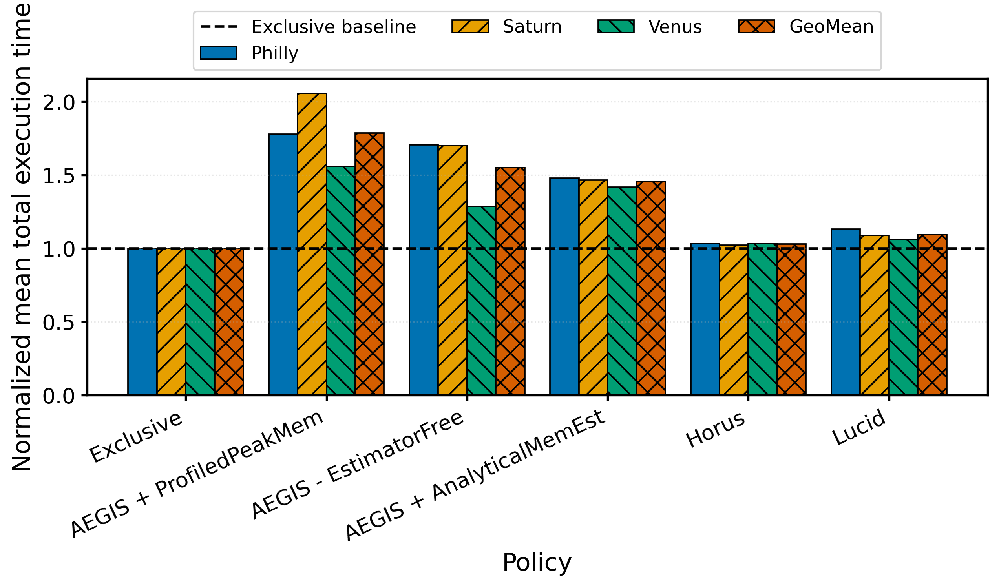

### Normalized P95 total execution time

| Policy                   |   Philly |   Saturn |   Venus |   GeoMean | Policy_display           |
|:-------------------------|---------:|---------:|--------:|----------:|:-------------------------|
| Exclusive                |    1     |    1     |   1     |     1     | Exclusive                |
| AEGIS + ProfiledPeakMem  |    2.126 |    2.241 |   1.972 |     2.11  | AEGIS + ProfiledPeakMem  |
| AEGIS - EstimatorFree    |    2.114 |    2.554 |   1.418 |     1.971 | AEGIS - EstimatorFree    |
| AEGIS + AnalyticalMemEst |    1.956 |    1.959 |   1.977 |     1.964 | AEGIS + AnalyticalMemEst |
| Horus                    |    1.157 |    1.027 |   1.139 |     1.106 | Horus                    |
| Lucid                    |    1.186 |    1.153 |   1.126 |     1.155 | Lucid                    |

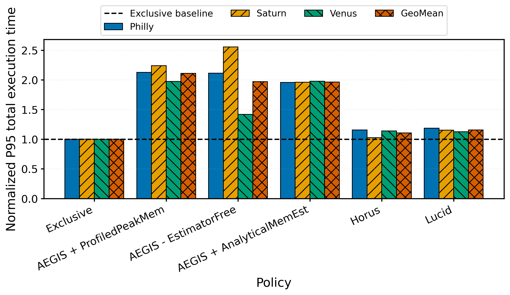

## Cross-trace queue and execution-time summary

Total queue time is initial queue wait plus recovery queue wait. Total execution time is the sum of all attempt runtimes, including failed attempts before recovery.

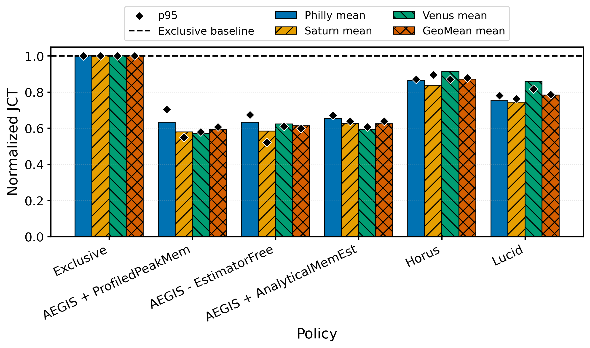

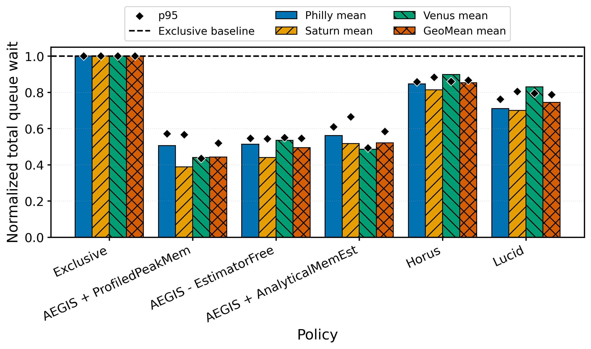

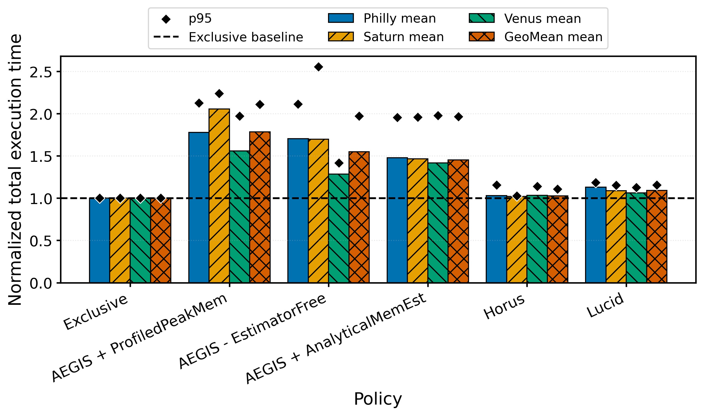

---

## Trace: philly

Results below contain only runs from this trace.

### Raw performance summary

| Policy                   |   Completion |   Makespan (s) |   Mean total wait (s) |   P95 total wait (s) |   Mean JCT (s) |   P95 JCT (s) |   Mean total execution time (s) |   P95 total execution time (s) |   Mean successful runtime (s) |   Failed attempts |   Recovered attempts |
|:-------------------------|-------------:|---------------:|----------------------:|---------------------:|---------------:|--------------:|--------------------------------:|-------------------------------:|------------------------------:|------------------:|---------------------:|
| AEGIS - EstimatorFree    |            1 |        30208.2 |               8686.46 |              15885.2 |        11915.9 |       20698.9 |                         3229.45 |                        7443.16 |                       3228.94 |                 3 |                    3 |
| AEGIS + AnalyticalMemEst |            1 |        31379.9 |               9499    |              17738.5 |        12300.9 |       20643.2 |                         2801.82 |                        6887.26 |                       2801.36 |                 1 |                    1 |
| Exclusive                |            1 |        42633.5 |              16928.3  |              29115.1 |        18823.2 |       30761.5 |                         1894.81 |                        3520.2  |                       1894.81 |                 0 |                    0 |
| Horus                    |            1 |        39040.8 |              14325.2  |              24965.3 |        16280.5 |       26776.4 |                         1955.25 |                        4073.2  |                       1955.25 |                 0 |                    0 |
| Lucid                    |            1 |        35789.9 |              12018    |              22176.2 |        14159.9 |       24026   |                         2141.83 |                        4175.81 |                       2141.83 |                 0 |                    0 |
| AEGIS + ProfiledPeakMem  |            1 |        31257.6 |               8555.88 |              16628.4 |        11924.6 |       21659.9 |                         3368.69 |                        7485.58 |                       3368.69 |                 0 |                    0 |

### Normalized performance summary

All ratios use Exclusive = 1.0 for this trace. Lower is better.

| Policy                   |   Makespan / Exclusive |   Makespan reduction (%) |   Mean JCT / Exclusive |   P95 JCT / Exclusive |   Mean wait / Exclusive |   P95 wait / Exclusive |   Mean total execution time / Exclusive |   P95 total execution time / Exclusive |
|:-------------------------|-----------------------:|-------------------------:|-----------------------:|----------------------:|------------------------:|-----------------------:|----------------------------------------:|---------------------------------------:|
| AEGIS - EstimatorFree    |                  0.709 |                   29.144 |                  0.633 |                 0.673 |                   0.513 |                  0.546 |                                   1.704 |                                  2.114 |
| AEGIS + AnalyticalMemEst |                  0.736 |                   26.396 |                  0.653 |                 0.671 |                   0.561 |                  0.609 |                                   1.479 |                                  1.956 |
| Exclusive                |                  1     |                    0     |                  1     |                 1     |                   1     |                  1     |                                   1     |                                  1     |
| Horus                    |                  0.916 |                    8.427 |                  0.865 |                 0.87  |                   0.846 |                  0.857 |                                   1.032 |                                  1.157 |
| Lucid                    |                  0.839 |                   16.052 |                  0.752 |                 0.781 |                   0.71  |                  0.762 |                                   1.13  |                                  1.186 |
| AEGIS + ProfiledPeakMem  |                  0.733 |                   26.683 |                  0.634 |                 0.704 |                   0.505 |                  0.571 |                                   1.778 |                                  2.126 |

### Normalized makespan by policy

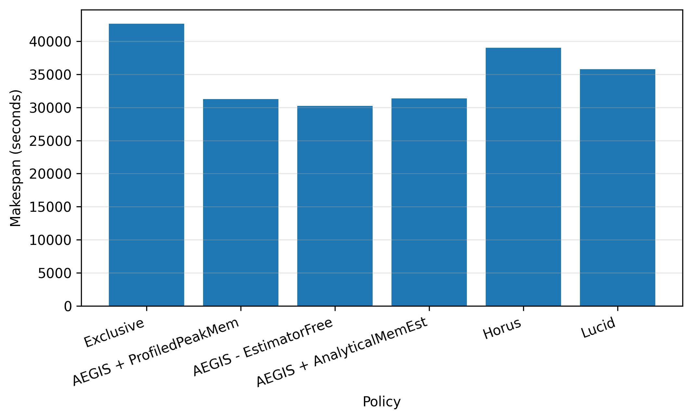

### Job completion time by policy

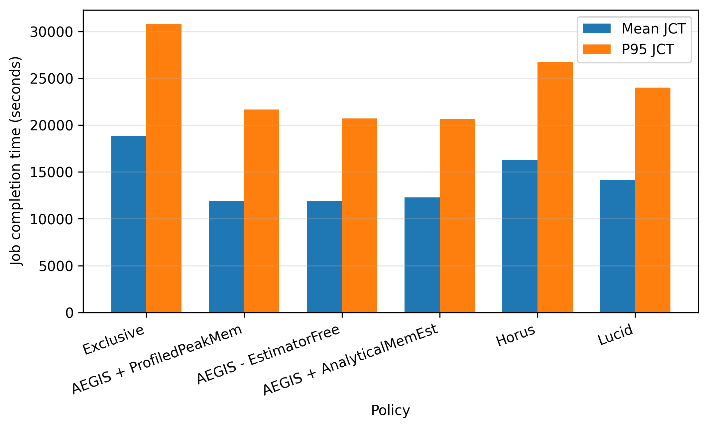

### Queueing time by policy

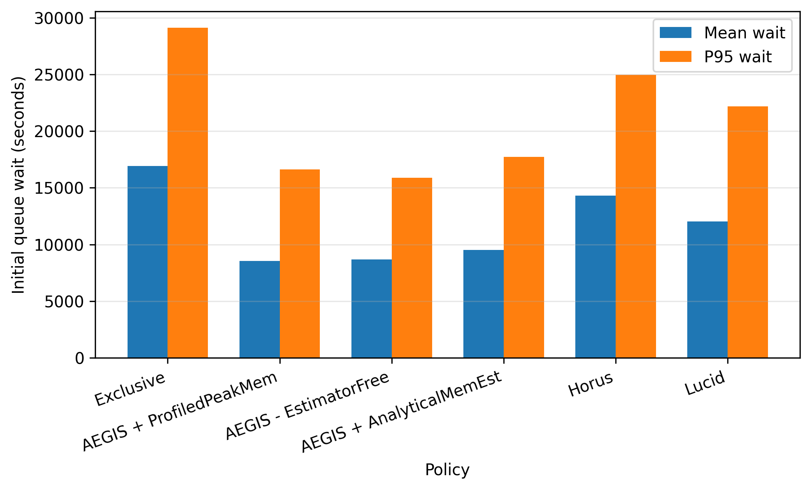

### Execution time by policy

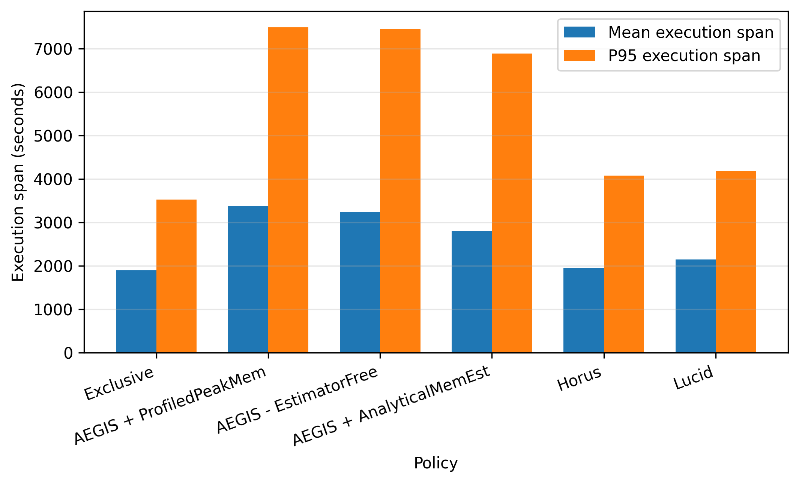

### Per-job normalized JCT distribution

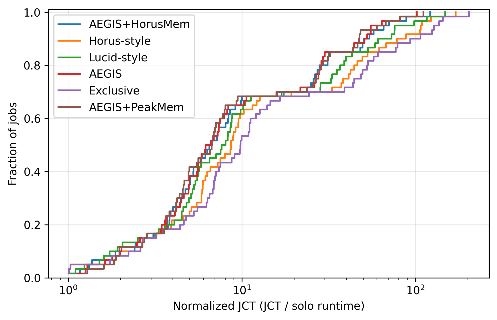

### Trace completion progress

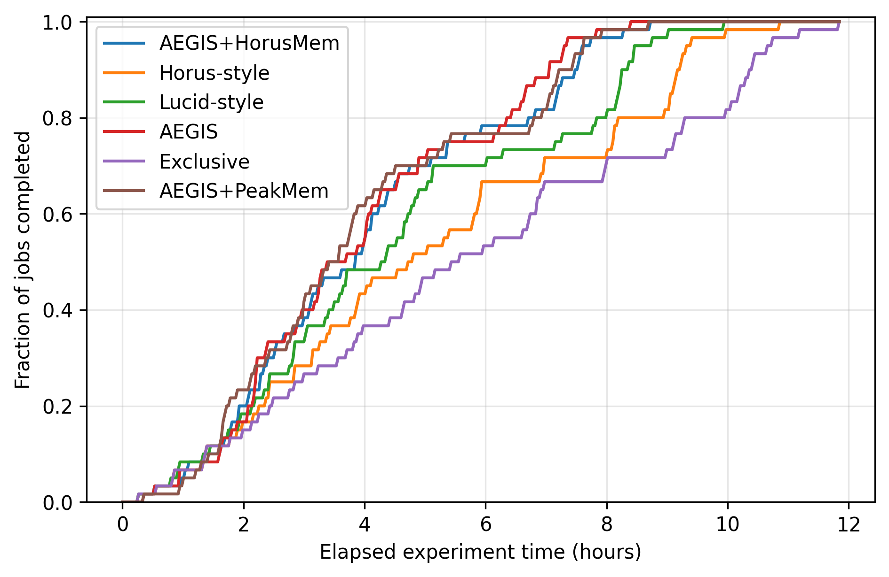

### Recovery cost

| Policy                   |   Jobs with failures |   Recovered jobs |   Recovery stopped |   Failed attempts |   Mean recovery wait (s) |   P95 recovery wait (s) |   Max recovery wait (s) |   Lost runtime (s) |   Failure-to-relaunch gap (s) |   Total recovery overhead (s) |
|:-------------------------|---------------------:|-----------------:|-------------------:|------------------:|-------------------------:|------------------------:|------------------------:|-------------------:|------------------------------:|------------------------------:|
| AEGIS + AnalyticalMemEst |                    1 |                1 |                  0 |                 1 |                  4108.16 |                 4108.16 |                 4108.16 |             27.594 |                       4108.19 |                       4135.79 |
| Horus                    |                    0 |                0 |                  0 |                 0 |                     0    |                    0    |                    0    |              0     |                          0    |                          0    |
| Lucid                    |                    0 |                0 |                  0 |                 0 |                     0    |                    0    |                    0    |              0     |                          0    |                          0    |
| AEGIS - EstimatorFree    |                    3 |                3 |                  0 |                 3 |                  2608.29 |                 4822.69 |                 5184.11 |             30.435 |                       7824.95 |                       7855.39 |
| Exclusive                |                    0 |                0 |                  0 |                 0 |                     0    |                    0    |                    0    |              0     |                          0    |                          0    |
| AEGIS + ProfiledPeakMem  |                    0 |                0 |                  0 |                 0 |                     0    |                    0    |                    0    |              0     |                          0    |                          0    |

#### Recovered-job cost breakdown

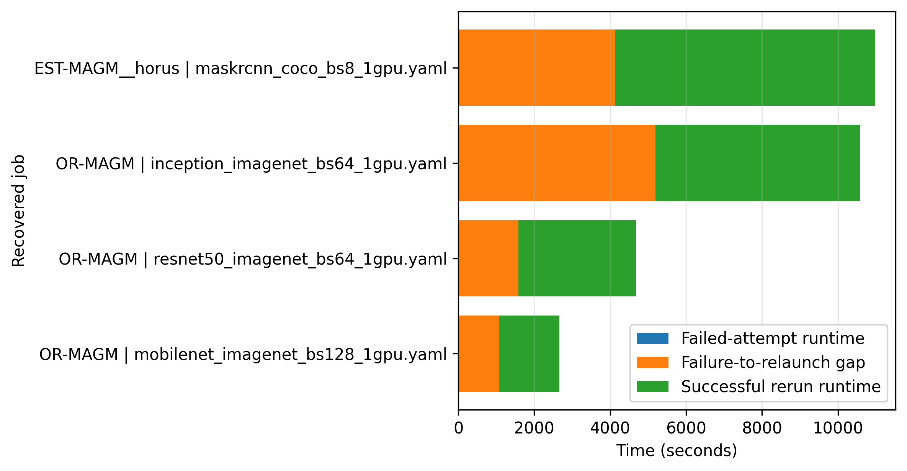

#### Policy recovery cost

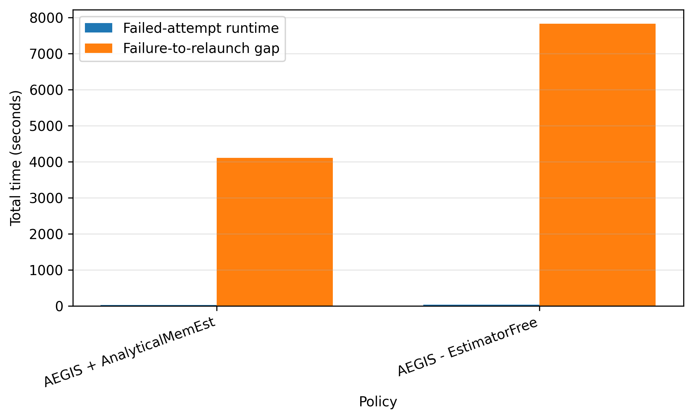

---

## Trace: saturn

Results below contain only runs from this trace.

### Raw performance summary

| Policy                   |   Completion |   Makespan (s) |   Mean total wait (s) |   P95 total wait (s) |   Mean JCT (s) |   P95 JCT (s) |   Mean total execution time (s) |   P95 total execution time (s) |   Mean successful runtime (s) |   Failed attempts |   Recovered attempts |
|:-------------------------|-------------:|---------------:|----------------------:|---------------------:|---------------:|--------------:|--------------------------------:|-------------------------------:|------------------------------:|------------------:|---------------------:|
| AEGIS - EstimatorFree    |            1 |        33248.6 |               6696.88 |              20007.3 |       10037.9  |       21282.5 |                         3341.03 |                        9147.41 |                       3338.93 |                 3 |                    3 |
| AEGIS + AnalyticalMemEst |            1 |        33852   |               7884.15 |              24489.2 |       10764.9  |       26126.3 |                         2880.68 |                        7015.05 |                       2879.93 |                 2 |                    2 |
| Exclusive                |            1 |        47406.4 |              15241.4  |              36809.2 |       17207.5  |       40915.9 |                         1966.07 |                        3581.06 |                       1966.07 |                 0 |                    0 |
| Horus                    |            1 |        43228.1 |              12408.9  |              32507.3 |       14413.1  |       36628.7 |                         2004.25 |                        3678.64 |                       2004.03 |                 1 |                    1 |
| Lucid                    |            1 |        40385.7 |              10669.5  |              29630.5 |       12808.5  |       31216.5 |                         2138.91 |                        4127.68 |                       2138.91 |                 0 |                    0 |
| AEGIS + ProfiledPeakMem  |            1 |        32342.8 |               5922.94 |              20841.6 |        9963.53 |       22467.2 |                         4040.57 |                        8024.74 |                       4040.57 |                 0 |                    0 |

### Normalized performance summary

All ratios use Exclusive = 1.0 for this trace. Lower is better.

| Policy                   |   Makespan / Exclusive |   Makespan reduction (%) |   Mean JCT / Exclusive |   P95 JCT / Exclusive |   Mean wait / Exclusive |   P95 wait / Exclusive |   Mean total execution time / Exclusive |   P95 total execution time / Exclusive |
|:-------------------------|-----------------------:|-------------------------:|-----------------------:|----------------------:|------------------------:|-----------------------:|----------------------------------------:|---------------------------------------:|
| AEGIS - EstimatorFree    |                  0.701 |                   29.865 |                  0.583 |                 0.52  |                   0.439 |                  0.544 |                                   1.699 |                                  2.554 |
| AEGIS + AnalyticalMemEst |                  0.714 |                   28.592 |                  0.626 |                 0.639 |                   0.517 |                  0.665 |                                   1.465 |                                  1.959 |
| Exclusive                |                  1     |                    0     |                  1     |                 1     |                   1     |                  1     |                                   1     |                                  1     |
| Horus                    |                  0.912 |                    8.814 |                  0.838 |                 0.895 |                   0.814 |                  0.883 |                                   1.019 |                                  1.027 |
| Lucid                    |                  0.852 |                   14.81  |                  0.744 |                 0.763 |                   0.7   |                  0.805 |                                   1.088 |                                  1.153 |
| AEGIS + ProfiledPeakMem  |                  0.682 |                   31.775 |                  0.579 |                 0.549 |                   0.389 |                  0.566 |                                   2.055 |                                  2.241 |

### Normalized makespan by policy

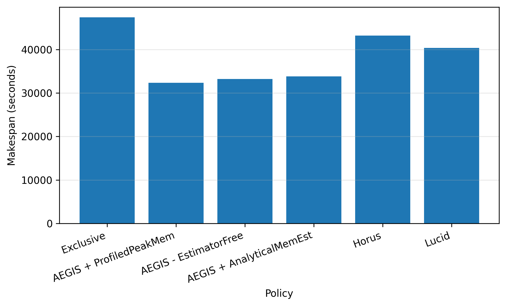

### Job completion time by policy

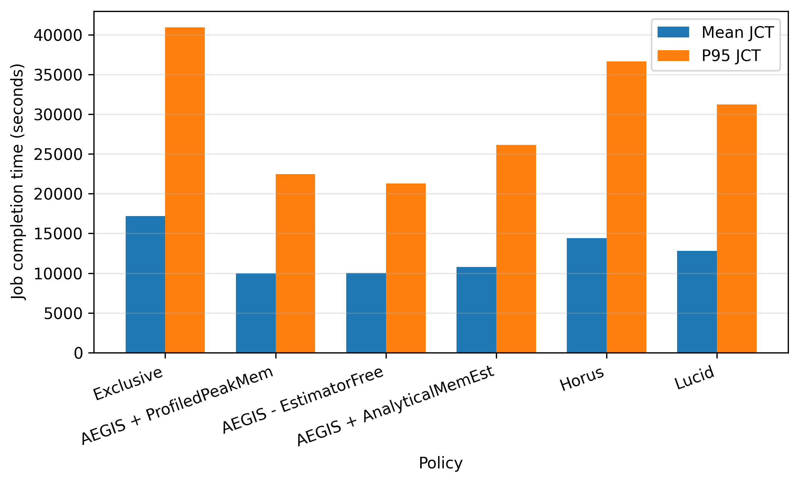

### Queueing time by policy

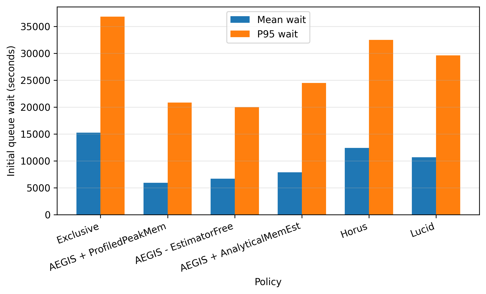

### Execution time by policy

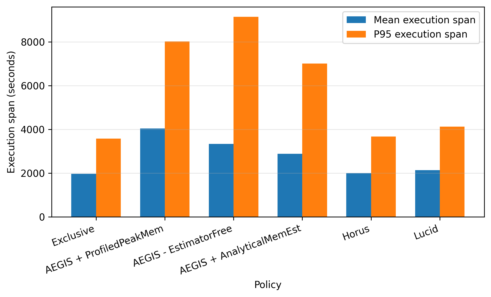

### Per-job normalized JCT distribution

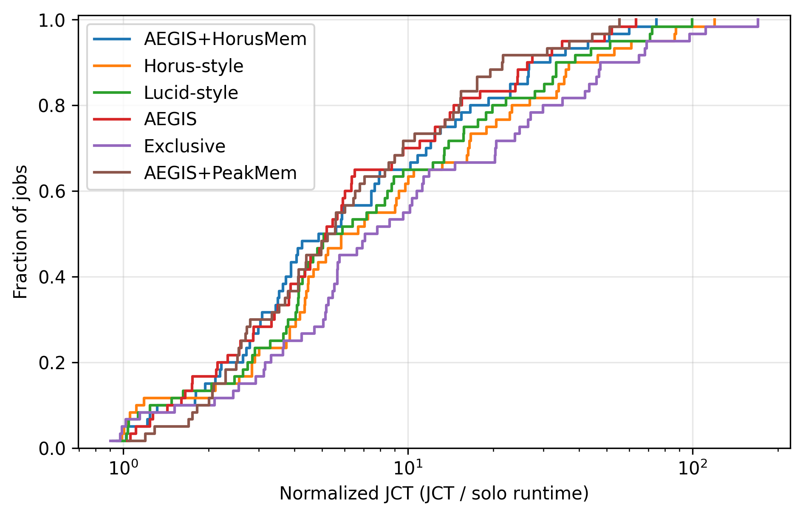

### Trace completion progress

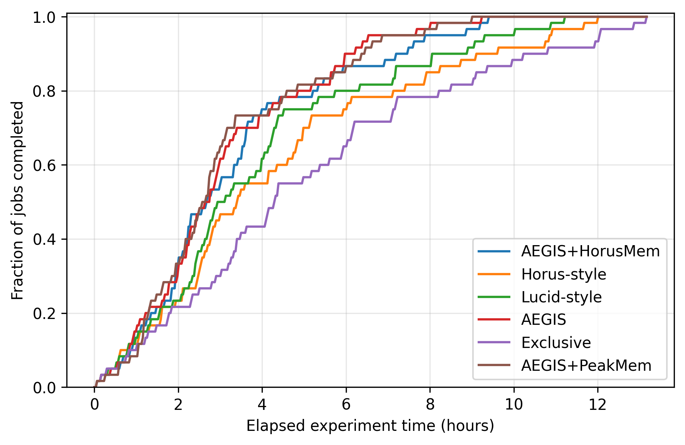

### Recovery cost

| Policy                   |   Jobs with failures |   Recovered jobs |   Recovery stopped |   Failed attempts |   Mean recovery wait (s) |   P95 recovery wait (s) |   Max recovery wait (s) |   Lost runtime (s) |   Failure-to-relaunch gap (s) |   Total recovery overhead (s) |
|:-------------------------|---------------------:|-----------------:|-------------------:|------------------:|-------------------------:|------------------------:|------------------------:|-------------------:|------------------------------:|------------------------------:|
| AEGIS + AnalyticalMemEst |                    2 |                2 |                  0 |                 2 |                 2156.86  |                3666.98  |                3834.77  |             45.345 |                      4313.78  |                      4359.13  |
| Horus                    |                    1 |                1 |                  0 |                 1 |                  196.496 |                 196.496 |                 196.496 |             12.906 |                       196.521 |                       209.427 |
| Lucid                    |                    0 |                0 |                  0 |                 0 |                    0     |                   0     |                   0     |              0     |                         0     |                         0     |
| AEGIS - EstimatorFree    |                    3 |                3 |                  0 |                 3 |                 3035.8   |                4209.92  |                4293.59  |            126.047 |                      9107.49  |                      9233.54  |
| Exclusive                |                    0 |                0 |                  0 |                 0 |                    0     |                   0     |                   0     |              0     |                         0     |                         0     |
| AEGIS + ProfiledPeakMem  |                    0 |                0 |                  0 |                 0 |                    0     |                   0     |                   0     |              0     |                         0     |                         0     |

#### Recovered-job cost breakdown

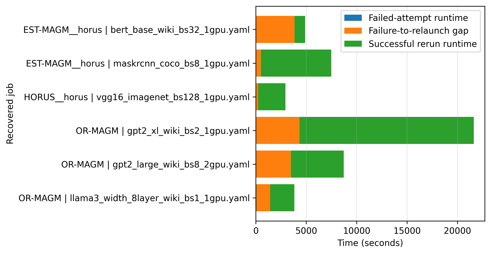

#### Policy recovery cost

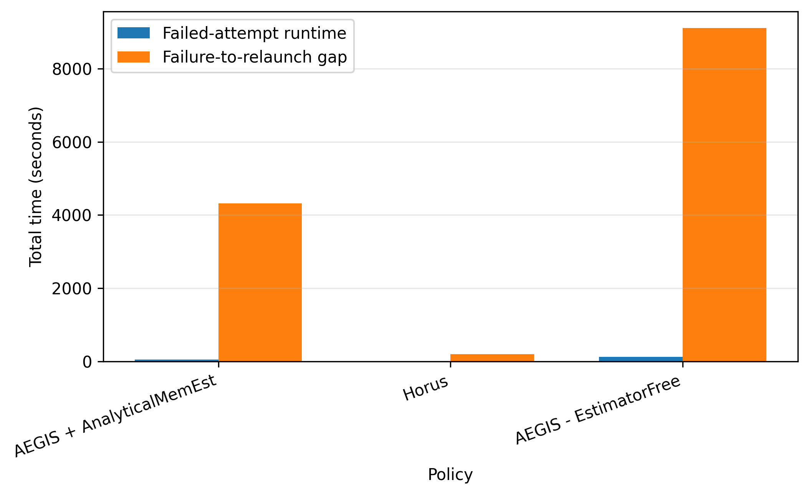

---

## Trace: venus

Results below contain only runs from this trace.

### Raw performance summary

| Policy                   |   Completion |   Makespan (s) |   Mean total wait (s) |   P95 total wait (s) |   Mean JCT (s) |   P95 JCT (s) |   Mean total execution time (s) |   P95 total execution time (s) |   Mean successful runtime (s) |   Failed attempts |   Recovered attempts |
|:-------------------------|-------------:|---------------:|----------------------:|---------------------:|---------------:|--------------:|--------------------------------:|-------------------------------:|------------------------------:|------------------:|---------------------:|
| AEGIS - EstimatorFree    |            1 |        34787.7 |               7725.67 |              13097.8 |       10202.9  |       15059.7 |                         2477.25 |                        5096.02 |                       2475.34 |                 6 |                    6 |
| AEGIS + AnalyticalMemEst |            1 |        33331.2 |               7015.9  |              11746.5 |        9745.8  |       14959.2 |                         2729.88 |                        7105.89 |                       2729.88 |                 0 |                    0 |
| Exclusive                |            1 |        44446.8 |              14463.7  |              23847.2 |       16391.2  |       24677.9 |                         1927.51 |                        3593.68 |                       1927.51 |                 0 |                    0 |
| Horus                    |            1 |        42002.2 |              12998    |              20515.4 |       14987.8  |       21470.3 |                         1989.74 |                        4094.07 |                       1989.74 |                 0 |                    0 |
| Lucid                    |            1 |        40207.4 |              12010.3  |              18959.6 |       14056.7  |       20135   |                         2046.3  |                        4045.28 |                       2046.3  |                 0 |                    0 |
| AEGIS + ProfiledPeakMem  |            1 |        32064.3 |               6369.1  |              10359.3 |        9371.44 |       14291   |                         3002.32 |                        7087.05 |                       3002.32 |                 0 |                    0 |

### Normalized performance summary

All ratios use Exclusive = 1.0 for this trace. Lower is better.

| Policy                   |   Makespan / Exclusive |   Makespan reduction (%) |   Mean JCT / Exclusive |   P95 JCT / Exclusive |   Mean wait / Exclusive |   P95 wait / Exclusive |   Mean total execution time / Exclusive |   P95 total execution time / Exclusive |
|:-------------------------|-----------------------:|-------------------------:|-----------------------:|----------------------:|------------------------:|-----------------------:|----------------------------------------:|---------------------------------------:|
| AEGIS - EstimatorFree    |                  0.783 |                   21.732 |                  0.622 |                 0.61  |                   0.534 |                  0.549 |                                   1.285 |                                  1.418 |
| AEGIS + AnalyticalMemEst |                  0.75  |                   25.009 |                  0.595 |                 0.606 |                   0.485 |                  0.493 |                                   1.416 |                                  1.977 |
| Exclusive                |                  1     |                    0     |                  1     |                 1     |                   1     |                  1     |                                   1     |                                  1     |
| Horus                    |                  0.945 |                    5.5   |                  0.914 |                 0.87  |                   0.899 |                  0.86  |                                   1.032 |                                  1.139 |
| Lucid                    |                  0.905 |                    9.538 |                  0.858 |                 0.816 |                   0.83  |                  0.795 |                                   1.062 |                                  1.126 |
| AEGIS + ProfiledPeakMem  |                  0.721 |                   27.859 |                  0.572 |                 0.579 |                   0.44  |                  0.434 |                                   1.558 |                                  1.972 |

### Normalized makespan by policy

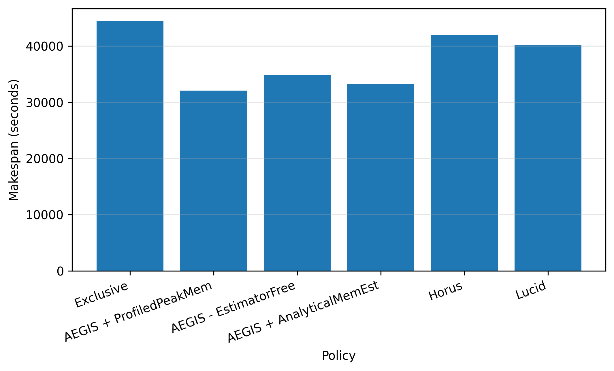

### Job completion time by policy

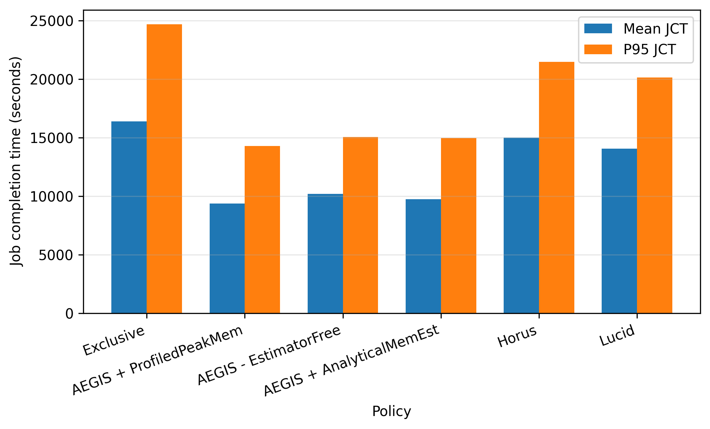

### Queueing time by policy

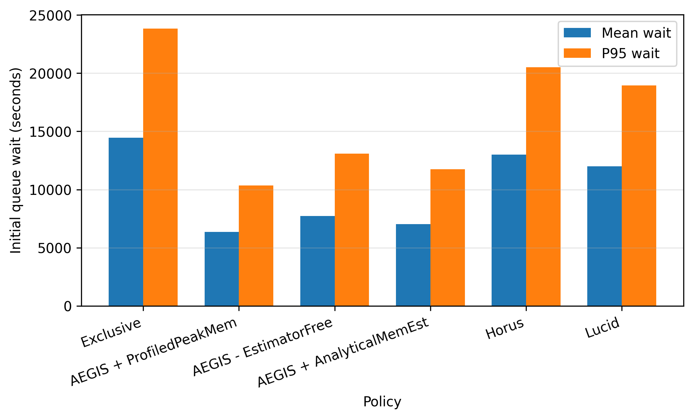

### Execution time by policy

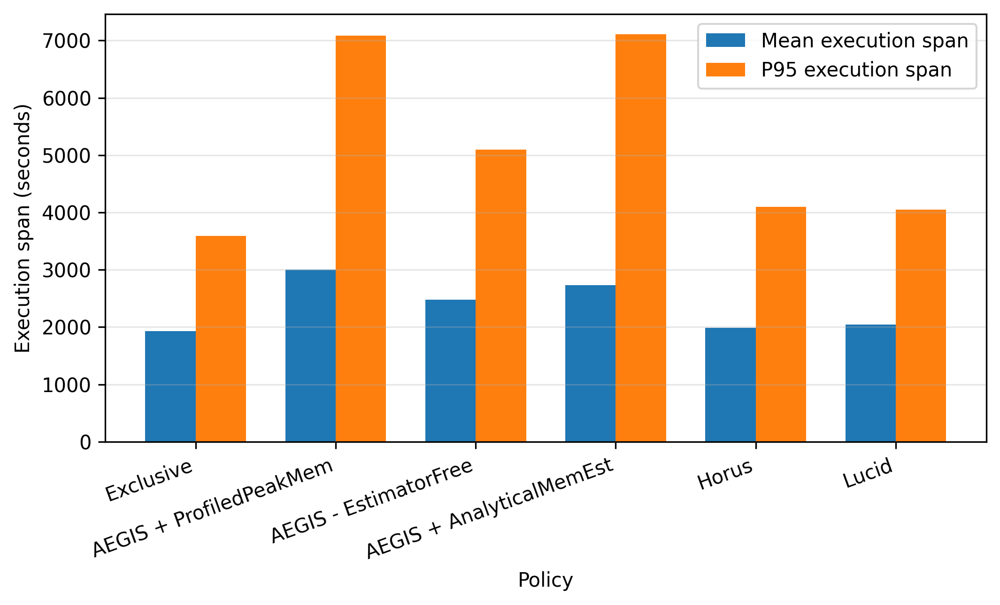

### Per-job normalized JCT distribution

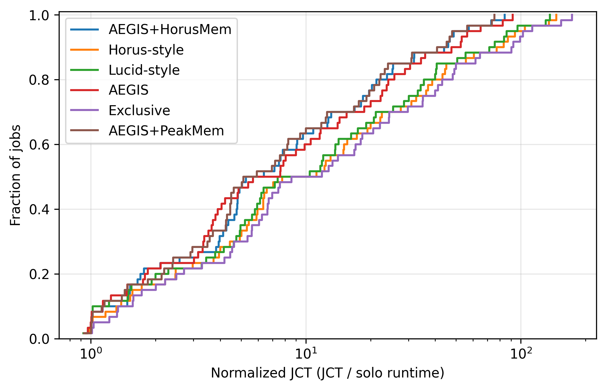

### Trace completion progress

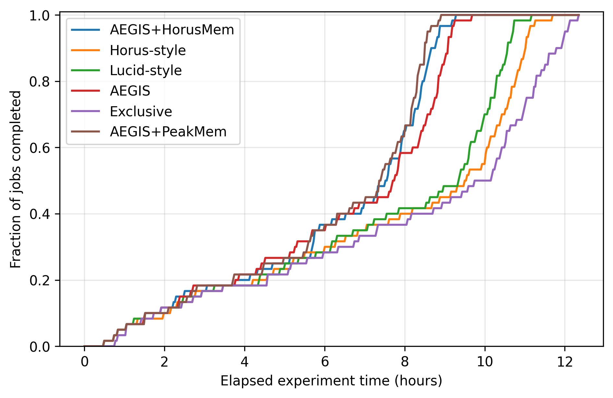

### Recovery cost

| Policy                   |   Jobs with failures |   Recovered jobs |   Recovery stopped |   Failed attempts |   Mean recovery wait (s) |   P95 recovery wait (s) |   Max recovery wait (s) |   Lost runtime (s) |   Failure-to-relaunch gap (s) |   Total recovery overhead (s) |
|:-------------------------|---------------------:|-----------------:|-------------------:|------------------:|-------------------------:|------------------------:|------------------------:|-------------------:|------------------------------:|------------------------------:|
| AEGIS + AnalyticalMemEst |                    0 |                0 |                  0 |                 0 |                     0    |                    0    |                    0    |              0     |                           0   |                           0   |
| Horus                    |                    0 |                0 |                  0 |                 0 |                     0    |                    0    |                    0    |              0     |                           0   |                           0   |
| Lucid                    |                    0 |                0 |                  0 |                 0 |                     0    |                    0    |                    0    |              0     |                           0   |                           0   |
| AEGIS - EstimatorFree    |                    6 |                6 |                  0 |                 6 |                  1838.28 |                 3647.29 |                 3651.97 |            114.588 |                       11029.9 |                       11144.5 |
| Exclusive                |                    0 |                0 |                  0 |                 0 |                     0    |                    0    |                    0    |              0     |                           0   |                           0   |
| AEGIS + ProfiledPeakMem  |                    0 |                0 |                  0 |                 0 |                     0    |                    0    |                    0    |              0     |                           0   |                           0   |

#### Recovered-job cost breakdown

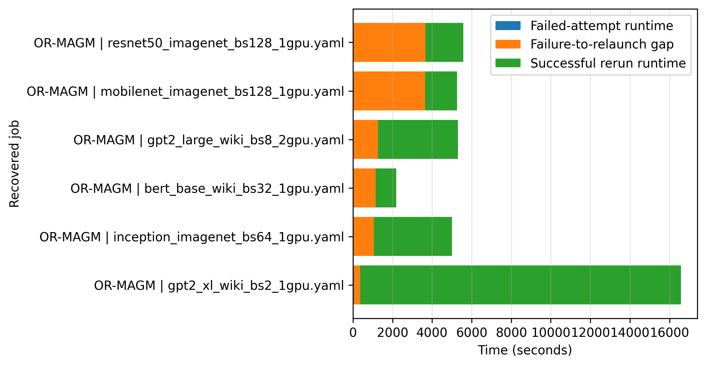

#### Policy recovery cost

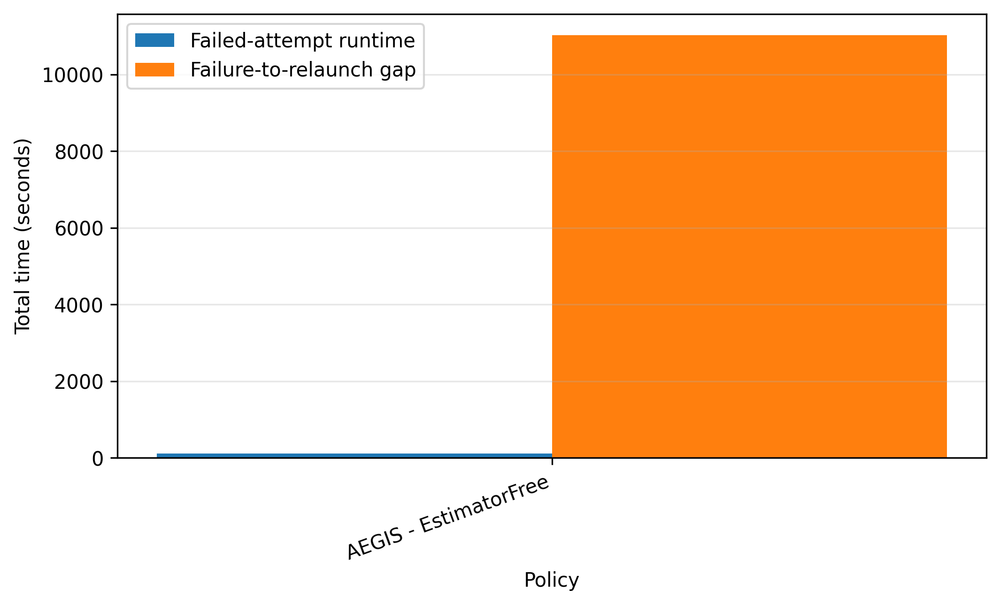
