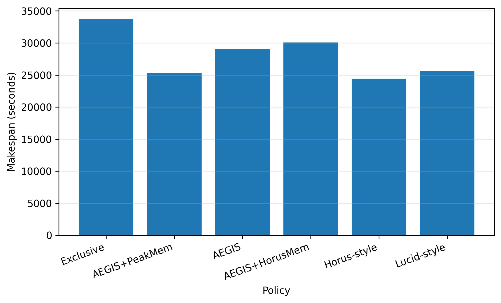
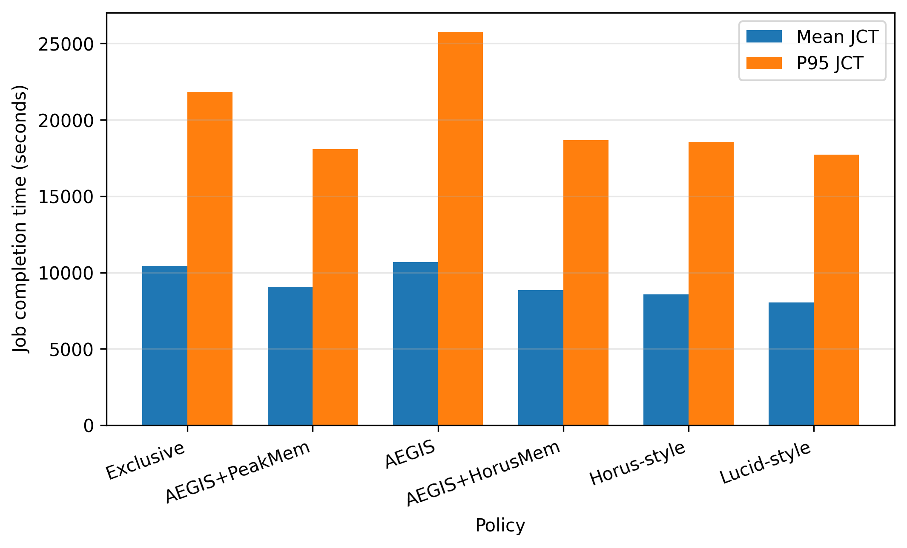
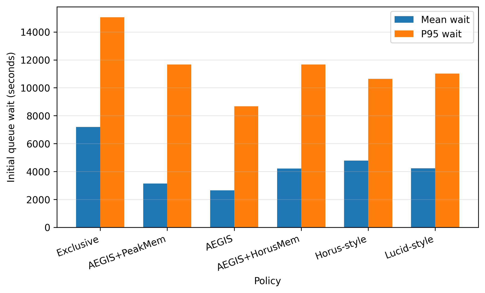
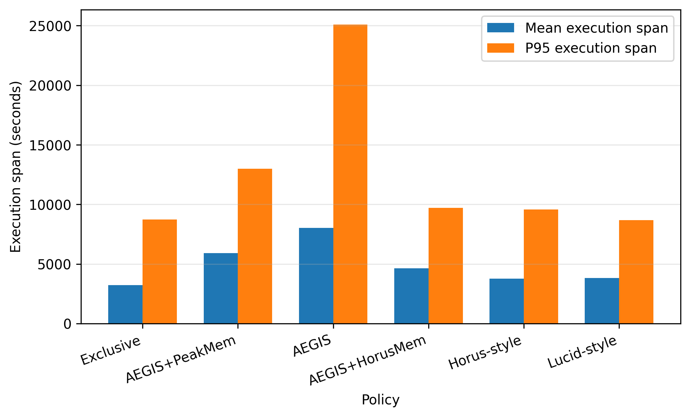
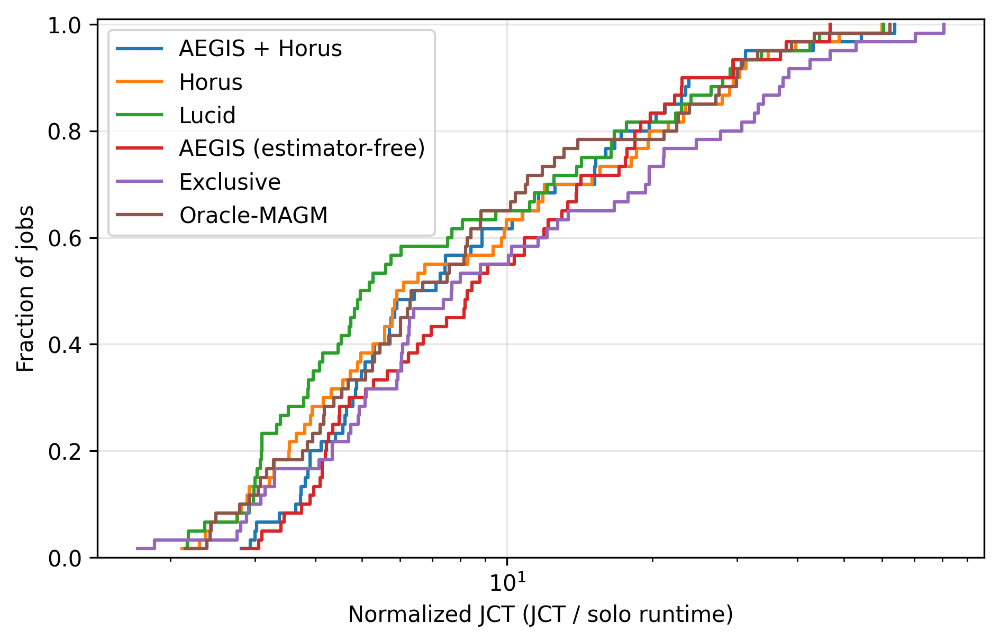
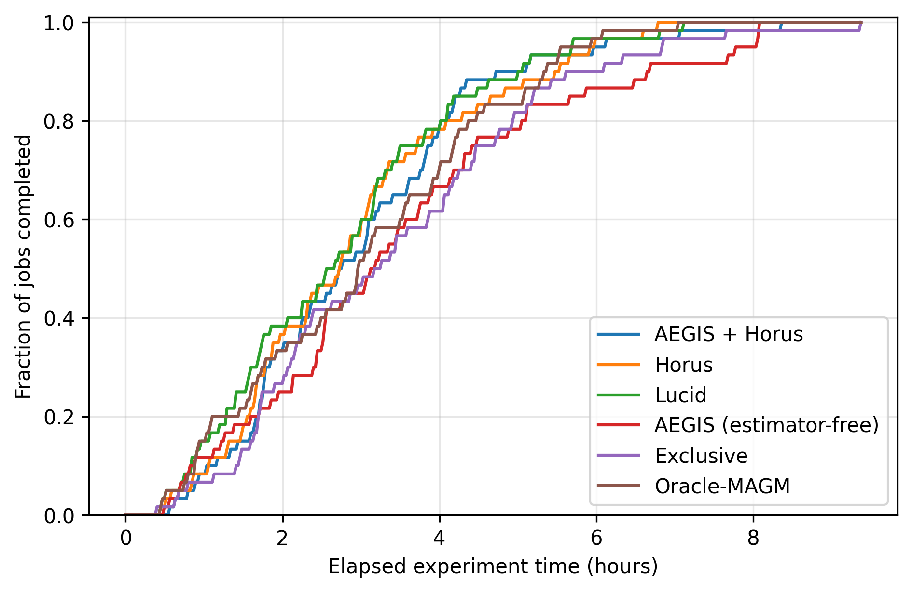

# Final Representative Evaluation

This report is generated automatically by `analyze_evaluation_manifest.py`.

## Evaluation status

| trace_name    |   complete |
|:--------------|-----------:|
| saturn_legacy |          6 |

## Cross-trace comparison

Cross-trace aggregation is not shown because only 1 trace is complete.

See the trace-specific raw and normalized results below.

---

## Trace: saturn_legacy

Results below contain only runs from this trace.

### Raw performance summary

| Policy         |   Completion |   Makespan (s) |   Mean wait (s) |   P95 wait (s) |   Mean JCT (s) |   P95 JCT (s) |   Mean execution span (s) |   P95 execution span (s) |   Mean successful runtime (s) |   Failed attempts |   Recovered attempts |
|:---------------|-------------:|---------------:|----------------:|---------------:|---------------:|--------------:|--------------------------:|-------------------------:|------------------------------:|------------------:|---------------------:|
| AEGIS          |            1 |        29084.4 |         2657.94 |        8680.03 |       10697.7  |       25738.4 |                   8034.53 |                 25097.5  |                       8034.53 |                 0 |                    0 |
| AEGIS+HorusMem |            1 |        30083.2 |         4213.46 |       11674.6  |        8854.08 |       18680.7 |                   4637.48 |                  9700.2  |                       4637.48 |                 0 |                    0 |
| Exclusive      |            1 |        33744   |         7197.59 |       15054.1  |       10427.6  |       21829.3 |                   3227.54 |                  8747.97 |                       3227.54 |                 0 |                    0 |
| Horus-style    |            1 |        24439.4 |         4792.06 |       10645.4  |        8576.57 |       18559.4 |                   3781.68 |                  9577.05 |                       3781.68 |                 0 |                    0 |
| Lucid-style    |            1 |        25557.5 |         4236.7  |       11020.9  |        8052.84 |       17726.9 |                   3813.35 |                  8692.76 |                       3813.35 |                 0 |                    0 |
| AEGIS+PeakMem  |            1 |        25291.5 |         3147.5  |       11661.7  |        9062.84 |       18073.3 |                   5911.25 |                 12995.6  |                       5911.25 |                 0 |                    0 |

### Normalized performance summary

All ratios use Exclusive = 1.0 for this trace. Lower is better.

| Policy         |   Makespan / Exclusive |   Makespan reduction (%) |   Mean JCT / Exclusive |   P95 JCT / Exclusive |   Mean wait / Exclusive |   P95 wait / Exclusive |   Mean execution span / Exclusive |   P95 execution span / Exclusive |
|:---------------|-----------------------:|-------------------------:|-----------------------:|----------------------:|------------------------:|-----------------------:|----------------------------------:|---------------------------------:|
| AEGIS          |                  0.862 |                   13.809 |                  1.026 |                 1.179 |                   0.369 |                  0.577 |                             2.489 |                            2.869 |
| AEGIS+HorusMem |                  0.892 |                   10.849 |                  0.849 |                 0.856 |                   0.585 |                  0.776 |                             1.437 |                            1.109 |
| Exclusive      |                  1     |                    0     |                  1     |                 1     |                   1     |                  1     |                             1     |                            1     |
| Horus-style    |                  0.724 |                   27.574 |                  0.822 |                 0.85  |                   0.666 |                  0.707 |                             1.172 |                            1.095 |
| Lucid-style    |                  0.757 |                   24.26  |                  0.772 |                 0.812 |                   0.589 |                  0.732 |                             1.182 |                            0.994 |
| AEGIS+PeakMem  |                  0.75  |                   25.049 |                  0.869 |                 0.828 |                   0.437 |                  0.775 |                             1.832 |                            1.486 |

### Normalized makespan by policy

### Job completion time by policy

### Queueing time by policy

### Execution time by policy

### Per-job normalized JCT distribution

### Trace completion progress

### Recovery cost

| Policy         |   Jobs with failures |   Recovered jobs |   Recovery stopped |   Failed attempts |   Mean recovery wait (s) |   P95 recovery wait (s) |   Max recovery wait (s) |   Lost runtime (s) |   Failure-to-relaunch gap (s) |   Total recovery overhead (s) |
|:---------------|---------------------:|-----------------:|-------------------:|------------------:|-------------------------:|------------------------:|------------------------:|-------------------:|------------------------------:|------------------------------:|
| AEGIS+HorusMem |                    0 |                0 |                  0 |                 0 |                        0 |                       0 |                       0 |                  0 |                             0 |                             0 |
| Horus-style    |                    0 |                0 |                  0 |                 0 |                        0 |                       0 |                       0 |                  0 |                             0 |                             0 |
| Lucid-style    |                    0 |                0 |                  0 |                 0 |                        0 |                       0 |                       0 |                  0 |                             0 |                             0 |
| AEGIS          |                    0 |                0 |                  0 |                 0 |                        0 |                       0 |                       0 |                  0 |                             0 |                             0 |
| Exclusive      |                    0 |                0 |                  0 |                 0 |                        0 |                       0 |                       0 |                  0 |                             0 |                             0 |
| AEGIS+PeakMem  |                    0 |                0 |                  0 |                 0 |                        0 |                       0 |                       0 |                  0 |                             0 |                             0 |
