# Final Representative Evaluation

This report is generated automatically by `analyze_evaluation_manifest.py`.

## Evaluation status

| trace_name    |   complete |   missing |
|:--------------|-----------:|----------:|
| philly_legacy |          5 |         3 |
| saturn_legacy |          8 |         0 |

## Cross-trace comparison

Each table reports every completed trace separately. GeoMean summarizes normalized ratios across traces; lower is better.

### Normalized makespan

| Policy      | Philly_legacy   |   Saturn_legacy |   GeoMean | Policy_display   |
|:------------|:----------------|----------------:|----------:|:-----------------|
| Exclusive   | 1.000           |           1     |     1     | Exclusive        |
| Memory-only | 1.102           |           0.862 |     0.974 | Memory-only      |
| AEGIS-SMI80 | 0.987           |           0.737 |     0.853 | AEGIS-SMI80      |
| AEGIS-SMI70 | 0.968           |           0.704 |     0.825 | AEGIS-SMI70      |
| AEGIS-SMI60 | 0.928           |           0.744 |     0.831 | AEGIS-SMI60      |
| AEGIS-SMI50 |                 |           0.861 |     0.861 | AEGIS-SMI50      |
| Horus       |                 |           0.724 |     0.724 | Horus            |
| Lucid       |                 |           0.757 |     0.757 | Lucid            |

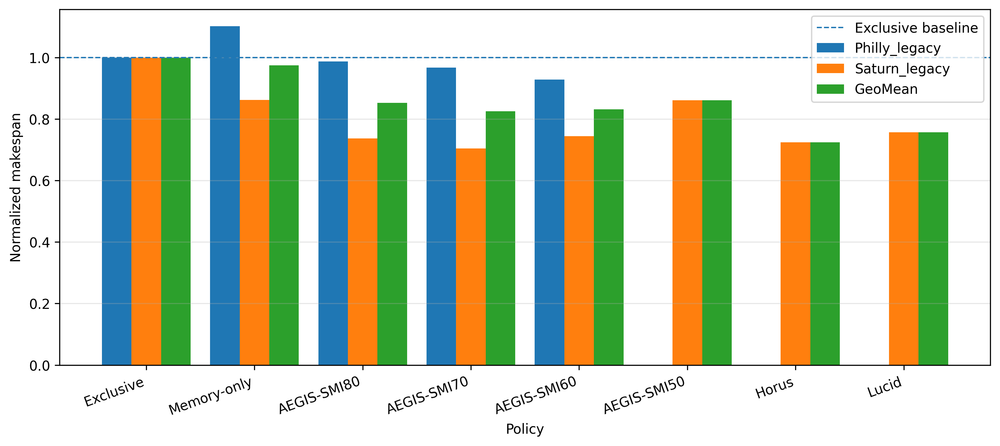

### Normalized mean JCT

| Policy      | Philly_legacy   |   Saturn_legacy |   GeoMean | Policy_display   |
|:------------|:----------------|----------------:|----------:|:-----------------|
| Exclusive   | 1.000           |           1     |     1     | Exclusive        |
| Memory-only | 1.011           |           1.026 |     1.019 | Memory-only      |
| AEGIS-SMI80 | 0.975           |           0.813 |     0.891 | AEGIS-SMI80      |
| AEGIS-SMI70 | 0.968           |           0.825 |     0.894 | AEGIS-SMI70      |
| AEGIS-SMI60 | 0.946           |           0.829 |     0.886 | AEGIS-SMI60      |
| AEGIS-SMI50 |                 |           0.838 |     0.838 | AEGIS-SMI50      |
| Horus       |                 |           0.822 |     0.822 | Horus            |
| Lucid       |                 |           0.772 |     0.772 | Lucid            |

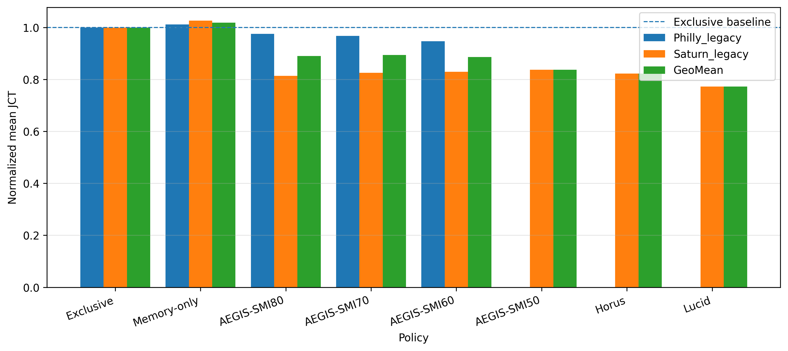

### Normalized P95 JCT

| Policy      | Philly_legacy   |   Saturn_legacy |   GeoMean | Policy_display   |
|:------------|:----------------|----------------:|----------:|:-----------------|
| Exclusive   | 1.000           |           1     |     1     | Exclusive        |
| Memory-only | 1.002           |           1.179 |     1.087 | Memory-only      |
| AEGIS-SMI80 | 0.914           |           0.79  |     0.849 | AEGIS-SMI80      |
| AEGIS-SMI70 | 0.900           |           0.904 |     0.902 | AEGIS-SMI70      |
| AEGIS-SMI60 | 0.847           |           0.806 |     0.826 | AEGIS-SMI60      |
| AEGIS-SMI50 |                 |           0.817 |     0.817 | AEGIS-SMI50      |
| Horus       |                 |           0.85  |     0.85  | Horus            |
| Lucid       |                 |           0.812 |     0.812 | Lucid            |

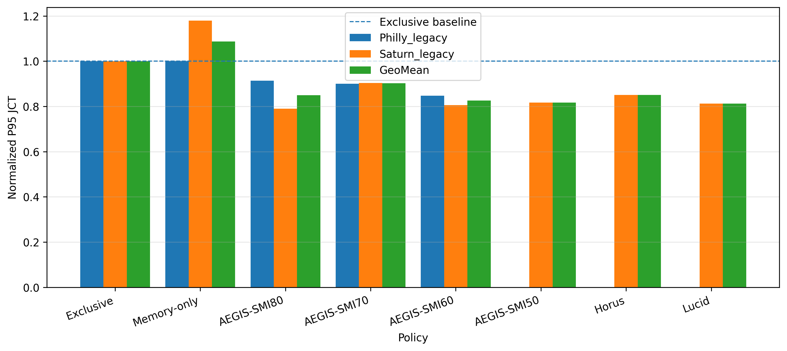

### Normalized mean queue wait

| Policy      | Philly_legacy   |   Saturn_legacy |   GeoMean | Policy_display   |
|:------------|:----------------|----------------:|----------:|:-----------------|
| Exclusive   | 1.000           |           1     |     1     | Exclusive        |
| Memory-only | 0.399           |           0.369 |     0.384 | Memory-only      |
| AEGIS-SMI80 | 0.558           |           0.644 |     0.599 | AEGIS-SMI80      |
| AEGIS-SMI70 | 0.598           |           0.658 |     0.627 | AEGIS-SMI70      |
| AEGIS-SMI60 | 0.584           |           0.703 |     0.641 | AEGIS-SMI60      |
| AEGIS-SMI50 |                 |           0.723 |     0.723 | AEGIS-SMI50      |
| Horus       |                 |           0.666 |     0.666 | Horus            |
| Lucid       |                 |           0.589 |     0.589 | Lucid            |

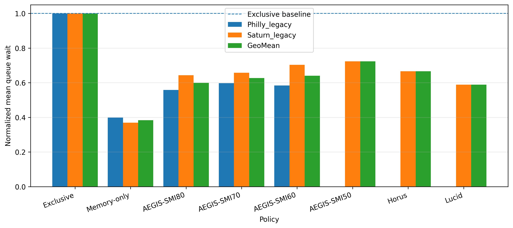

### Normalized P95 queue wait

| Policy      | Philly_legacy   |   Saturn_legacy |   GeoMean | Policy_display   |
|:------------|:----------------|----------------:|----------:|:-----------------|
| Exclusive   | 1.000           |           1     |     1     | Exclusive        |
| Memory-only | 0.589           |           0.577 |     0.583 | Memory-only      |
| AEGIS-SMI80 | 0.620           |           0.798 |     0.703 | AEGIS-SMI80      |
| AEGIS-SMI70 | 0.610           |           0.809 |     0.703 | AEGIS-SMI70      |
| AEGIS-SMI60 | 0.620           |           0.806 |     0.707 | AEGIS-SMI60      |
| AEGIS-SMI50 |                 |           0.832 |     0.832 | AEGIS-SMI50      |
| Horus       |                 |           0.707 |     0.707 | Horus            |
| Lucid       |                 |           0.732 |     0.732 | Lucid            |

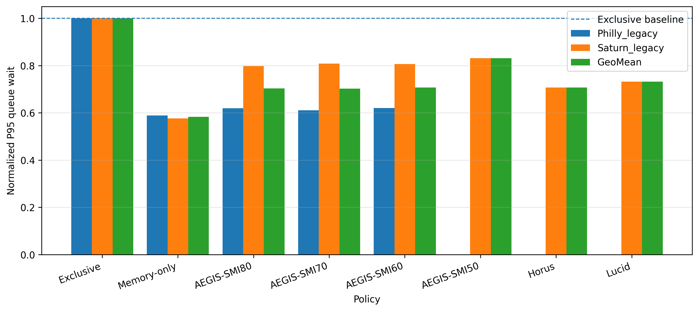

### Normalized mean execution span

| Policy      | Philly_legacy   |   Saturn_legacy |   GeoMean | Policy_display   |
|:------------|:----------------|----------------:|----------:|:-----------------|
| Exclusive   | 1.000           |           1     |     1     | Exclusive        |
| Memory-only | 1.517           |           2.489 |     1.943 | Memory-only      |
| AEGIS-SMI80 | 1.320           |           1.192 |     1.254 | AEGIS-SMI80      |
| AEGIS-SMI70 | 1.273           |           1.198 |     1.235 | AEGIS-SMI70      |
| AEGIS-SMI60 | 1.246           |           1.11  |     1.176 | AEGIS-SMI60      |
| AEGIS-SMI50 |                 |           1.092 |     1.092 | AEGIS-SMI50      |
| Horus       |                 |           1.172 |     1.172 | Horus            |
| Lucid       |                 |           1.182 |     1.182 | Lucid            |

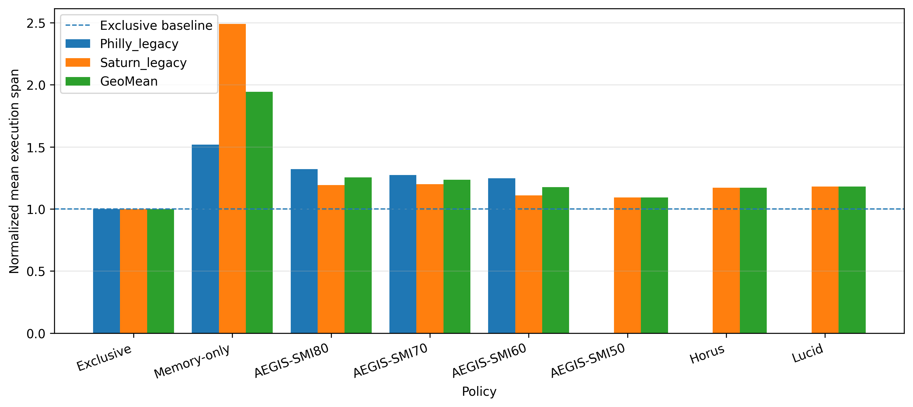

---

## Trace: philly_legacy

Results below contain only runs from this trace.

### Raw performance summary

| Policy      |   Completion |   Makespan (s) |   Mean wait (s) |   P95 wait (s) |   Mean JCT (s) |   P95 JCT (s) |   Mean execution span (s) |   P95 execution span (s) |   Mean successful runtime (s) |   Failed attempts |   Recovered attempts |
|:------------|-------------:|---------------:|----------------:|---------------:|---------------:|--------------:|--------------------------:|-------------------------:|------------------------------:|------------------:|---------------------:|
| Exclusive   |            1 |        30774.7 |        2482.51  |       10697    |        5487.91 |       16874.4 |                   3003.38 |                  8435.66 |                       3003.38 |                 0 |                    0 |
| AEGIS-SMI60 |            1 |        28567.1 |        1449.38  |        6635.16 |        5194.3  |       14290.9 |                   3742.58 |                 10978.6  |                       3742.58 |                 0 |                    0 |
| AEGIS-SMI70 |            1 |        29777.8 |        1484.1   |        6529.57 |        5310.98 |       15189.6 |                   3824.57 |                 11070.1  |                       3824.57 |                 0 |                    0 |
| AEGIS-SMI80 |            1 |        30369.7 |        1385.04  |        6630.05 |        5351.65 |       15418.7 |                   3964.21 |                 11080.9  |                       3964.21 |                 0 |                    0 |
| Memory-only |            1 |        33900.5 |         990.833 |        6297.62 |        5549.61 |       16901.9 |                   4556.11 |                 16622.3  |                       4458.52 |                 1 |                    1 |

### Normalized performance summary

All ratios use Exclusive = 1.0 for this trace. Lower is better.

| Policy      |   Makespan / Exclusive |   Makespan reduction (%) |   Mean JCT / Exclusive |   P95 JCT / Exclusive |   Mean wait / Exclusive |   P95 wait / Exclusive |   Mean execution span / Exclusive |   P95 execution span / Exclusive |
|:------------|-----------------------:|-------------------------:|-----------------------:|----------------------:|------------------------:|-----------------------:|----------------------------------:|---------------------------------:|
| Exclusive   |                  1     |                    0     |                  1     |                 1     |                   1     |                  1     |                             1     |                            1     |
| AEGIS-SMI60 |                  0.928 |                    7.174 |                  0.946 |                 0.847 |                   0.584 |                  0.62  |                             1.246 |                            1.301 |
| AEGIS-SMI70 |                  0.968 |                    3.239 |                  0.968 |                 0.9   |                   0.598 |                  0.61  |                             1.273 |                            1.312 |
| AEGIS-SMI80 |                  0.987 |                    1.316 |                  0.975 |                 0.914 |                   0.558 |                  0.62  |                             1.32  |                            1.314 |
| Memory-only |                  1.102 |                  -10.157 |                  1.011 |                 1.002 |                   0.399 |                  0.589 |                             1.517 |                            1.97  |

### Normalized makespan by policy

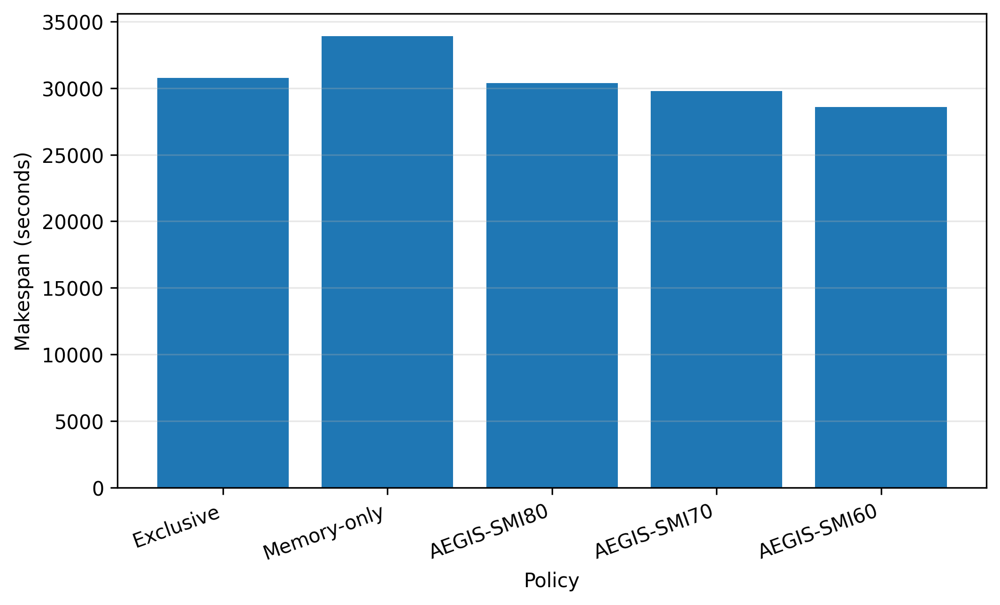

### Job completion time by policy

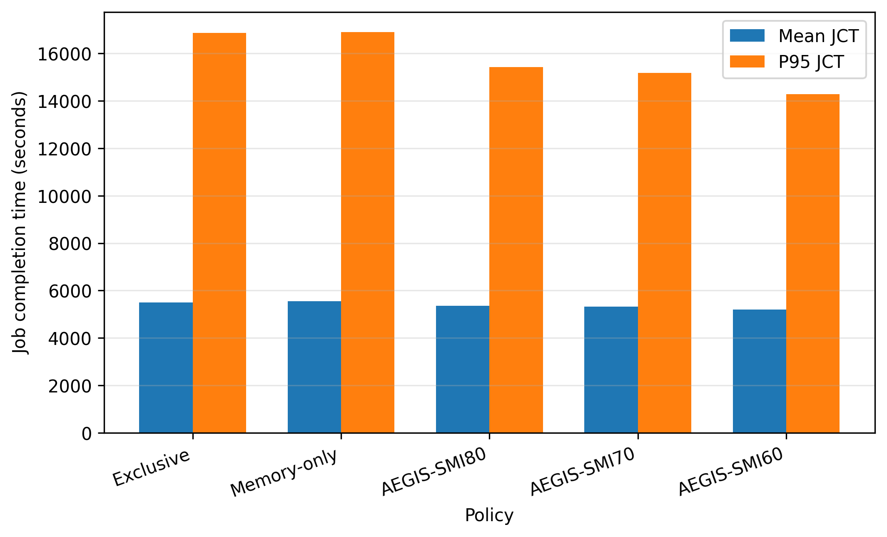

### Queueing time by policy

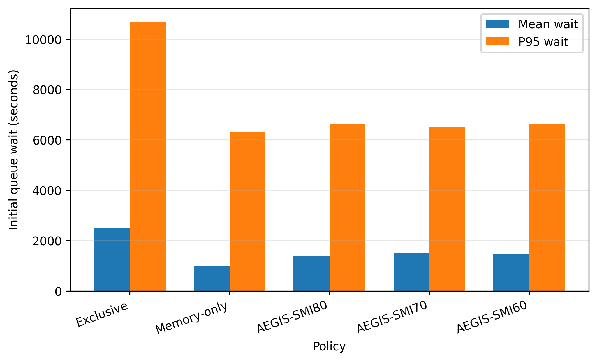

### Execution time by policy

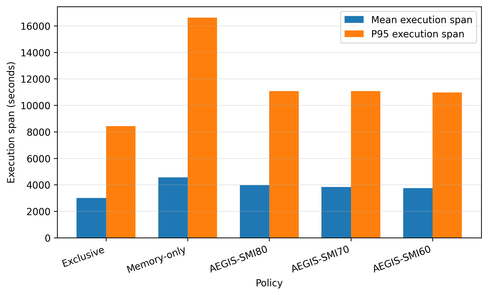

### Per-job normalized JCT distribution

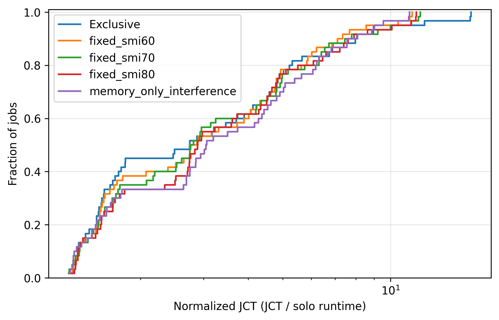

### Trace completion progress

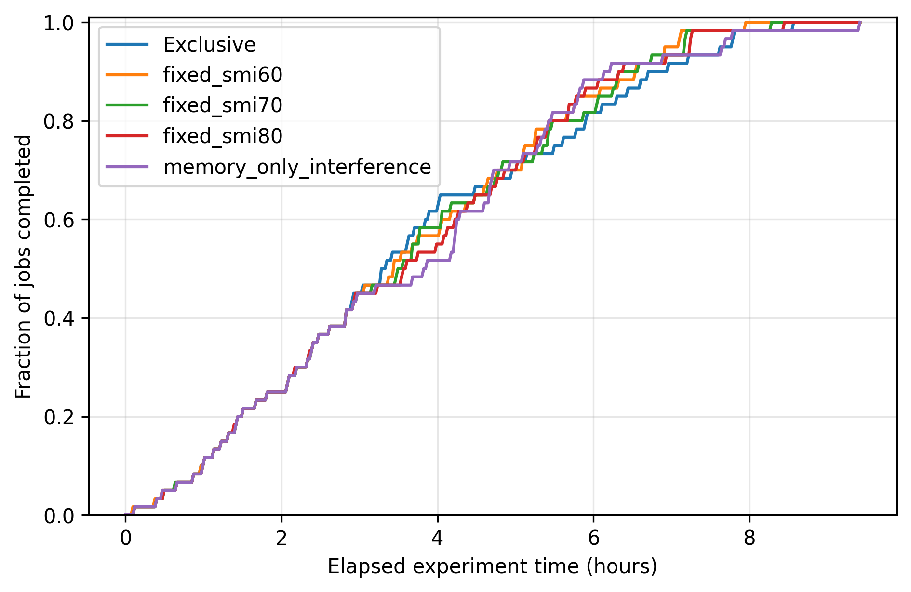

### Recovery cost

| Policy      |   Jobs with failures |   Recovered jobs |   Recovery stopped |   Failed attempts |   Mean recovery wait (s) |   P95 recovery wait (s) |   Max recovery wait (s) |   Lost runtime (s) |   Failure-to-relaunch gap (s) |   Total recovery overhead (s) |
|:------------|---------------------:|-----------------:|-------------------:|------------------:|-------------------------:|------------------------:|------------------------:|-------------------:|------------------------------:|------------------------------:|
| Exclusive   |                    0 |                0 |                  0 |                 0 |                     0    |                    0    |                    0    |              0     |                          0    |                          0    |
| AEGIS-SMI60 |                    0 |                0 |                  0 |                 0 |                     0    |                    0    |                    0    |              0     |                          0    |                          0    |
| AEGIS-SMI70 |                    0 |                0 |                  0 |                 0 |                     0    |                    0    |                    0    |              0     |                          0    |                          0    |
| AEGIS-SMI80 |                    0 |                0 |                  0 |                 0 |                     0    |                    0    |                    0    |              0     |                          0    |                          0    |
| Memory-only |                    1 |                1 |                  0 |                 1 |                  5805.78 |                 5805.78 |                 5805.78 |             47.654 |                       5807.98 |                       5855.63 |

#### Recovered-job cost breakdown

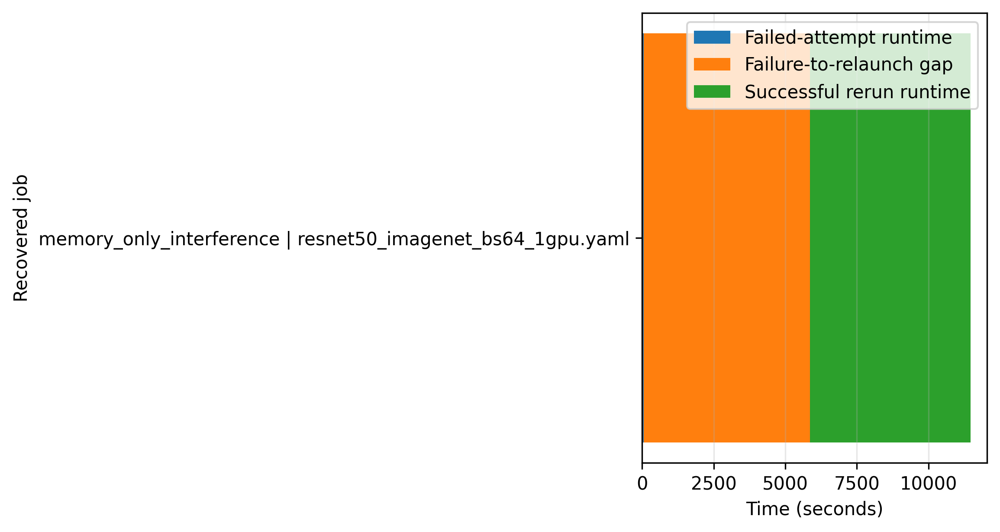

#### Policy recovery cost

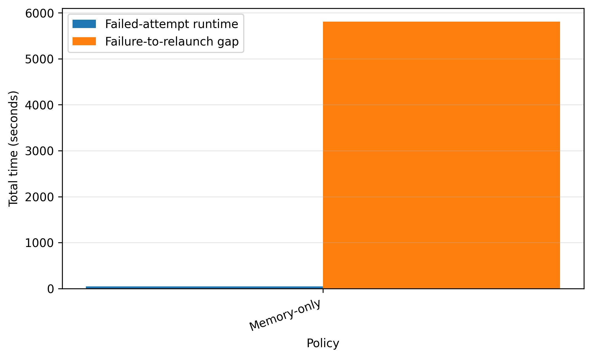

---

## Trace: saturn_legacy

Results below contain only runs from this trace.

### Raw performance summary

| Policy      |   Completion |   Makespan (s) |   Mean wait (s) |   P95 wait (s) |   Mean JCT (s) |   P95 JCT (s) |   Mean execution span (s) |   P95 execution span (s) |   Mean successful runtime (s) |   Failed attempts |   Recovered attempts |
|:------------|-------------:|---------------:|----------------:|---------------:|---------------:|--------------:|--------------------------:|-------------------------:|------------------------------:|------------------:|---------------------:|
| Exclusive   |            1 |        33744   |         7197.59 |       15054.1  |       10427.6  |       21829.3 |                   3227.54 |                  8747.97 |                       3227.54 |                 0 |                    0 |
| AEGIS-SMI50 |            1 |        29050.2 |         5207.18 |       12522.5  |        8734.09 |       17831.6 |                   3524.3  |                  9276.6  |                       3524.3  |                 0 |                    0 |
| AEGIS-SMI60 |            1 |        25113.2 |         5059.95 |       12137.1  |        8644.44 |       17592.3 |                   3581.71 |                  9132.03 |                       3581.71 |                 0 |                    0 |
| AEGIS-SMI70 |            1 |        23758.2 |         4733.02 |       12173.7  |        8603.78 |       19732   |                   3867.84 |                 10847.1  |                       3867.84 |                 0 |                    0 |
| AEGIS-SMI80 |            1 |        24867.5 |         4632.05 |       12013.4  |        8481.52 |       17238.1 |                   3846.45 |                  8982.28 |                       3846.45 |                 0 |                    0 |
| Horus       |            1 |        24439.4 |         4792.06 |       10645.4  |        8576.57 |       18559.4 |                   3781.68 |                  9577.05 |                       3781.68 |                 0 |                    0 |
| Lucid       |            1 |        25557.5 |         4236.7  |       11020.9  |        8052.84 |       17726.9 |                   3813.35 |                  8692.76 |                       3813.35 |                 0 |                    0 |
| Memory-only |            1 |        29084.4 |         2657.94 |        8680.03 |       10697.7  |       25738.4 |                   8034.53 |                 25097.5  |                       8034.53 |                 0 |                    0 |

### Normalized performance summary

All ratios use Exclusive = 1.0 for this trace. Lower is better.

| Policy      |   Makespan / Exclusive |   Makespan reduction (%) |   Mean JCT / Exclusive |   P95 JCT / Exclusive |   Mean wait / Exclusive |   P95 wait / Exclusive |   Mean execution span / Exclusive |   P95 execution span / Exclusive |
|:------------|-----------------------:|-------------------------:|-----------------------:|----------------------:|------------------------:|-----------------------:|----------------------------------:|---------------------------------:|
| Exclusive   |                  1     |                    0     |                  1     |                 1     |                   1     |                  1     |                             1     |                            1     |
| AEGIS-SMI50 |                  0.861 |                   13.91  |                  0.838 |                 0.817 |                   0.723 |                  0.832 |                             1.092 |                            1.06  |
| AEGIS-SMI60 |                  0.744 |                   25.577 |                  0.829 |                 0.806 |                   0.703 |                  0.806 |                             1.11  |                            1.044 |
| AEGIS-SMI70 |                  0.704 |                   29.593 |                  0.825 |                 0.904 |                   0.658 |                  0.809 |                             1.198 |                            1.24  |
| AEGIS-SMI80 |                  0.737 |                   26.305 |                  0.813 |                 0.79  |                   0.644 |                  0.798 |                             1.192 |                            1.027 |
| Horus       |                  0.724 |                   27.574 |                  0.822 |                 0.85  |                   0.666 |                  0.707 |                             1.172 |                            1.095 |
| Lucid       |                  0.757 |                   24.26  |                  0.772 |                 0.812 |                   0.589 |                  0.732 |                             1.182 |                            0.994 |
| Memory-only |                  0.862 |                   13.809 |                  1.026 |                 1.179 |                   0.369 |                  0.577 |                             2.489 |                            2.869 |

### Normalized makespan by policy

### Job completion time by policy

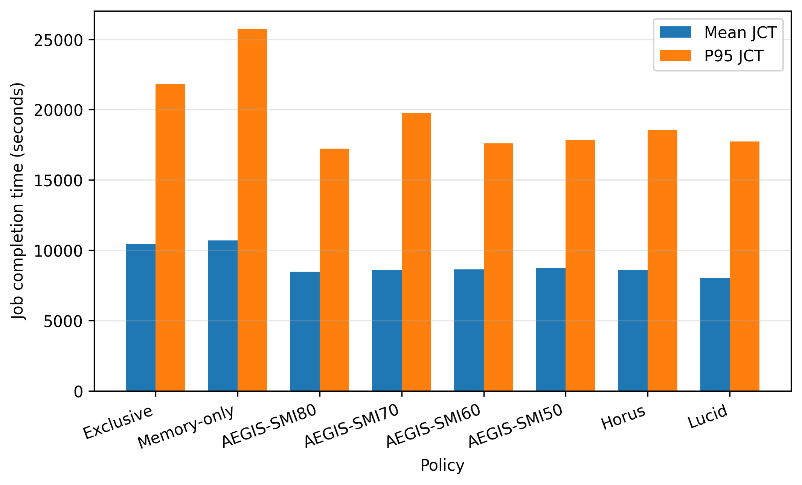

### Queueing time by policy

### Execution time by policy

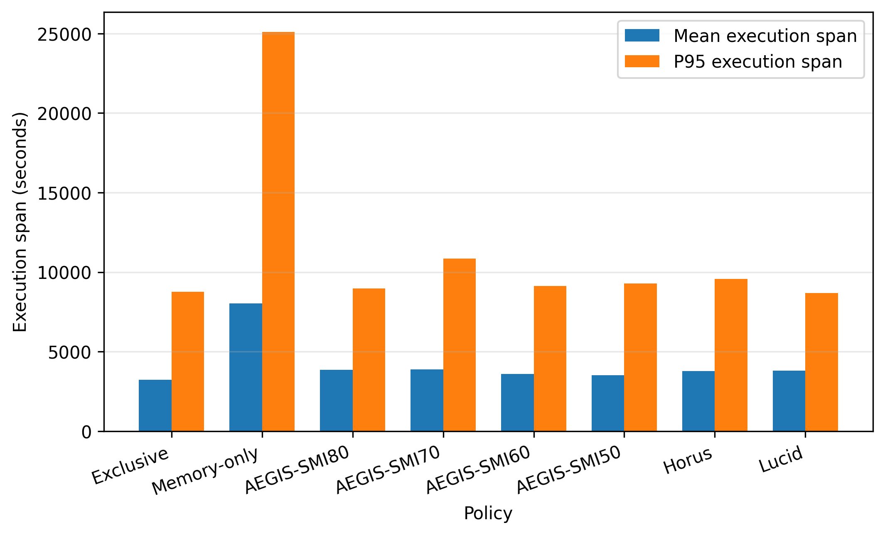

### Per-job normalized JCT distribution

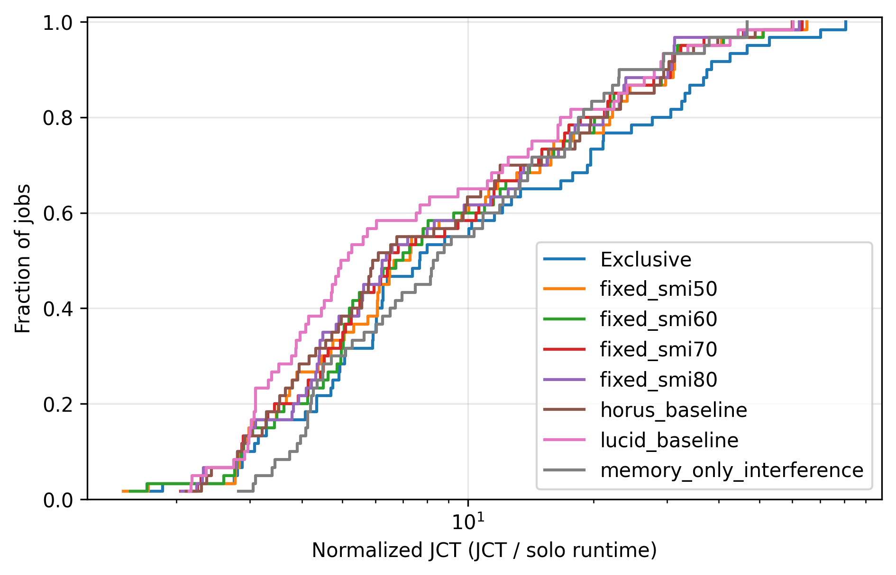

### Trace completion progress

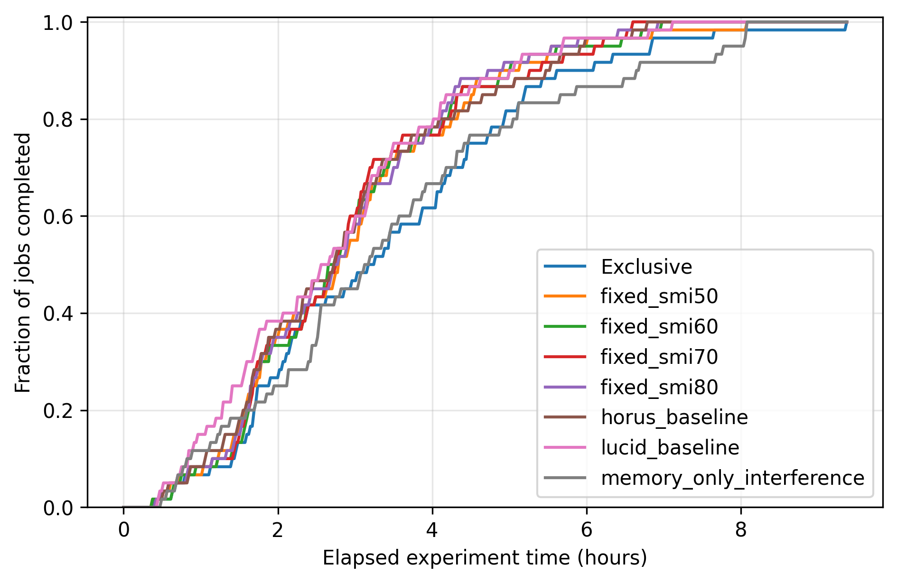

### Recovery cost

| Policy      |   Jobs with failures |   Recovered jobs |   Recovery stopped |   Failed attempts |   Mean recovery wait (s) |   P95 recovery wait (s) |   Max recovery wait (s) |   Lost runtime (s) |   Failure-to-relaunch gap (s) |   Total recovery overhead (s) |
|:------------|---------------------:|-----------------:|-------------------:|------------------:|-------------------------:|------------------------:|------------------------:|-------------------:|------------------------------:|------------------------------:|
| Exclusive   |                    0 |                0 |                  0 |                 0 |                        0 |                       0 |                       0 |                  0 |                             0 |                             0 |
| AEGIS-SMI50 |                    0 |                0 |                  0 |                 0 |                        0 |                       0 |                       0 |                  0 |                             0 |                             0 |
| AEGIS-SMI60 |                    0 |                0 |                  0 |                 0 |                        0 |                       0 |                       0 |                  0 |                             0 |                             0 |
| AEGIS-SMI70 |                    0 |                0 |                  0 |                 0 |                        0 |                       0 |                       0 |                  0 |                             0 |                             0 |
| AEGIS-SMI80 |                    0 |                0 |                  0 |                 0 |                        0 |                       0 |                       0 |                  0 |                             0 |                             0 |
| Horus       |                    0 |                0 |                  0 |                 0 |                        0 |                       0 |                       0 |                  0 |                             0 |                             0 |
| Lucid       |                    0 |                0 |                  0 |                 0 |                        0 |                       0 |                       0 |                  0 |                             0 |                             0 |
| Memory-only |                    0 |                0 |                  0 |                 0 |                        0 |                       0 |                       0 |                  0 |                             0 |                             0 |

## Pending or unsuccessful runs

| Trace         | Configuration   | Status   | Return code   | Timed out   |
|:--------------|:----------------|:---------|:--------------|:------------|
| philly_legacy | fixed_smi50     | missing  |               |             |
| philly_legacy | horus_baseline  | missing  |               |             |
| philly_legacy | lucid_baseline  | missing  |               |             |
