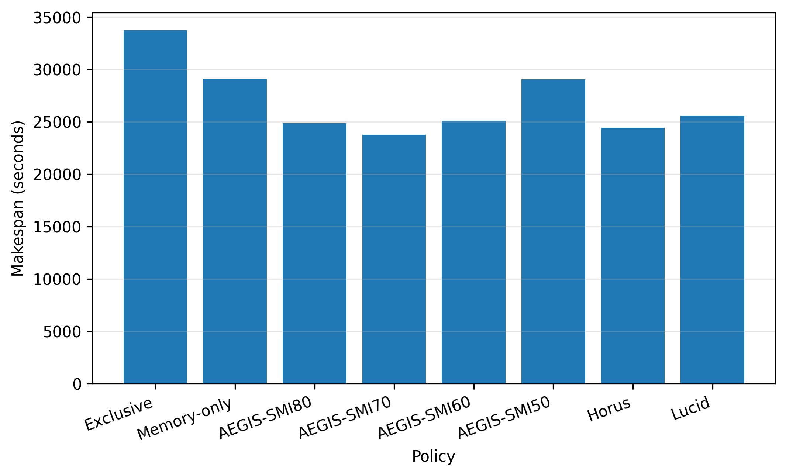
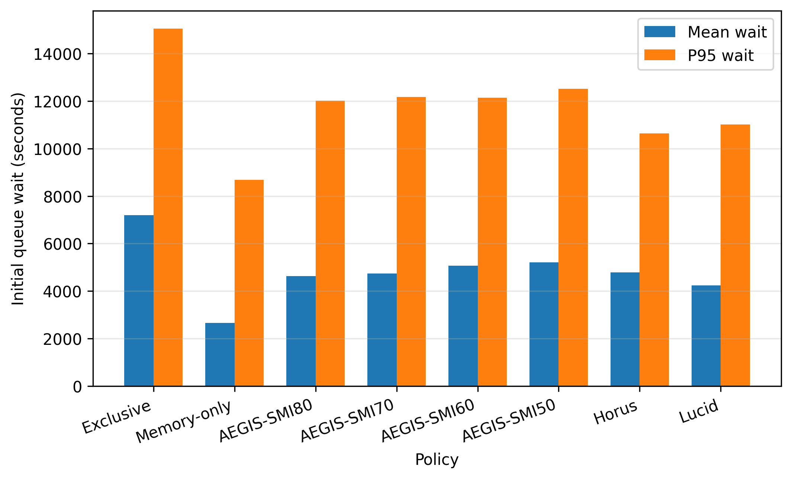

# Final Representative Evaluation

This report is generated automatically by `analyze_evaluation_manifest.py`.

## Evaluation status

| trace_name    |   complete |
|:--------------|-----------:|
| saturn_legacy |          8 |

## Cross-trace comparison

Cross-trace aggregation is not shown because only 1 trace is complete.

See the trace-specific raw and normalized results below.

---

## Trace: saturn_legacy

Results below contain only runs from this trace.

### Raw performance summary

| Policy      |   Completion |   Makespan (s) |   Mean wait (s) |   P95 wait (s) |   Mean JCT (s) |   P95 JCT (s) |   Mean execution span (s) |   P95 execution span (s) |   Mean successful runtime (s) |   Failed attempts |   Recovered attempts |
|:------------|-------------:|---------------:|----------------:|---------------:|---------------:|--------------:|--------------------------:|-------------------------:|------------------------------:|------------------:|---------------------:|
| Exclusive   |            1 |        33744   |         7197.59 |       15054.1  |       10427.6  |       21829.3 |                   3227.54 |                  8747.97 |                       3227.54 |                 0 |                    0 |
| AEGIS-SMI50 |            1 |        29050.2 |         5207.18 |       12522.5  |        8734.09 |       17831.6 |                   3524.3  |                  9276.6  |                       3524.3  |                 0 |                    0 |
| AEGIS-SMI60 |            1 |        25113.2 |         5059.95 |       12137.1  |        8644.44 |       17592.3 |                   3581.71 |                  9132.03 |                       3581.71 |                 0 |                    0 |
| AEGIS-SMI70 |            1 |        23758.2 |         4733.02 |       12173.7  |        8603.78 |       19732   |                   3867.84 |                 10847.1  |                       3867.84 |                 0 |                    0 |
| AEGIS-SMI80 |            1 |        24867.5 |         4632.05 |       12013.4  |        8481.52 |       17238.1 |                   3846.45 |                  8982.28 |                       3846.45 |                 0 |                    0 |
| Horus       |            1 |        24439.4 |         4792.06 |       10645.4  |        8576.57 |       18559.4 |                   3781.68 |                  9577.05 |                       3781.68 |                 0 |                    0 |
| Lucid       |            1 |        25557.5 |         4236.7  |       11020.9  |        8052.84 |       17726.9 |                   3813.35 |                  8692.76 |                       3813.35 |                 0 |                    0 |
| Memory-only |            1 |        29084.4 |         2657.94 |        8680.03 |       10697.7  |       25738.4 |                   8034.53 |                 25097.5  |                       8034.53 |                 0 |                    0 |

### Normalized performance summary

All ratios use Exclusive = 1.0 for this trace. Lower is better.

| Policy      |   Makespan / Exclusive |   Makespan reduction (%) |   Mean JCT / Exclusive |   P95 JCT / Exclusive |   Mean wait / Exclusive |   P95 wait / Exclusive |   Mean execution span / Exclusive |   P95 execution span / Exclusive |
|:------------|-----------------------:|-------------------------:|-----------------------:|----------------------:|------------------------:|-----------------------:|----------------------------------:|---------------------------------:|
| Exclusive   |                  1     |                    0     |                  1     |                 1     |                   1     |                  1     |                             1     |                            1     |
| AEGIS-SMI50 |                  0.861 |                   13.91  |                  0.838 |                 0.817 |                   0.723 |                  0.832 |                             1.092 |                            1.06  |
| AEGIS-SMI60 |                  0.744 |                   25.577 |                  0.829 |                 0.806 |                   0.703 |                  0.806 |                             1.11  |                            1.044 |
| AEGIS-SMI70 |                  0.704 |                   29.593 |                  0.825 |                 0.904 |                   0.658 |                  0.809 |                             1.198 |                            1.24  |
| AEGIS-SMI80 |                  0.737 |                   26.305 |                  0.813 |                 0.79  |                   0.644 |                  0.798 |                             1.192 |                            1.027 |
| Horus       |                  0.724 |                   27.574 |                  0.822 |                 0.85  |                   0.666 |                  0.707 |                             1.172 |                            1.095 |
| Lucid       |                  0.757 |                   24.26  |                  0.772 |                 0.812 |                   0.589 |                  0.732 |                             1.182 |                            0.994 |
| Memory-only |                  0.862 |                   13.809 |                  1.026 |                 1.179 |                   0.369 |                  0.577 |                             2.489 |                            2.869 |

### Normalized makespan by policy

### Job completion time by policy

### Queueing time by policy

### Execution time by policy

### Per-job normalized JCT distribution

### Trace completion progress

### Recovery cost

| Policy      |   Jobs with failures |   Recovered jobs |   Recovery stopped |   Failed attempts |   Mean recovery wait (s) |   P95 recovery wait (s) |   Max recovery wait (s) |   Lost runtime (s) |   Failure-to-relaunch gap (s) |   Total recovery overhead (s) |
|:------------|---------------------:|-----------------:|-------------------:|------------------:|-------------------------:|------------------------:|------------------------:|-------------------:|------------------------------:|------------------------------:|
| Exclusive   |                    0 |                0 |                  0 |                 0 |                        0 |                       0 |                       0 |                  0 |                             0 |                             0 |
| AEGIS-SMI50 |                    0 |                0 |                  0 |                 0 |                        0 |                       0 |                       0 |                  0 |                             0 |                             0 |
| AEGIS-SMI60 |                    0 |                0 |                  0 |                 0 |                        0 |                       0 |                       0 |                  0 |                             0 |                             0 |
| AEGIS-SMI70 |                    0 |                0 |                  0 |                 0 |                        0 |                       0 |                       0 |                  0 |                             0 |                             0 |
| AEGIS-SMI80 |                    0 |                0 |                  0 |                 0 |                        0 |                       0 |                       0 |                  0 |                             0 |                             0 |
| Horus       |                    0 |                0 |                  0 |                 0 |                        0 |                       0 |                       0 |                  0 |                             0 |                             0 |
| Lucid       |                    0 |                0 |                  0 |                 0 |                        0 |                       0 |                       0 |                  0 |                             0 |                             0 |
| Memory-only |                    0 |                0 |                  0 |                 0 |                        0 |                       0 |                       0 |                  0 |                             0 |                             0 |
