# Final Representative Evaluation

This report is generated automatically by `analyze_evaluation_manifest.py`.

## Evaluation status

| trace_name      |   complete |
|:----------------|-----------:|
| philly_legacy   |          8 |
| saturn_legacy   |          8 |
| venus_gapfix600 |          8 |

## Cross-trace comparison

Each table reports every completed trace separately. GeoMean summarizes normalized ratios across traces; lower is better.

### Normalized makespan

| Policy      |   Philly_legacy |   Saturn_legacy |   Venus_gapfix600 |   GeoMean | Policy_display   |
|:------------|----------------:|----------------:|------------------:|----------:|:-----------------|
| Exclusive   |           1     |           1     |             1     |     1     | Exclusive        |
| AEGIS       |           1.088 |           0.861 |             1.009 |     0.982 | AEGIS            |
| Horus-style |           0.967 |           0.724 |             1.032 |     0.897 | Horus-style      |
| Lucid-style |           1.118 |           0.757 |             1.014 |     0.95  | Lucid-style      |

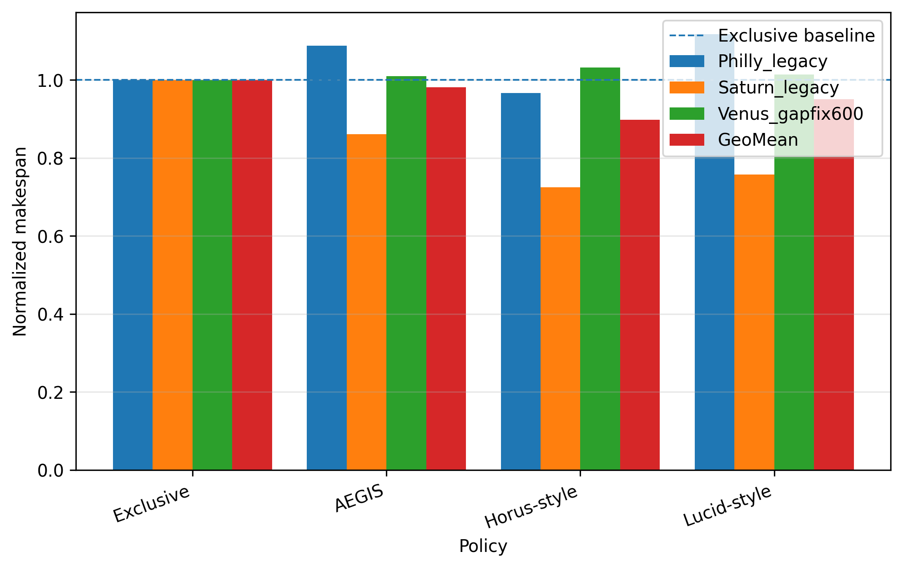

### Normalized mean JCT

| Policy      |   Philly_legacy |   Saturn_legacy |   Venus_gapfix600 |   GeoMean | Policy_display   |
|:------------|----------------:|----------------:|------------------:|----------:|:-----------------|
| Exclusive   |           1     |           1     |             1     |     1     | Exclusive        |
| AEGIS       |           0.969 |           0.838 |             0.921 |     0.907 | AEGIS            |
| Horus-style |           0.923 |           0.822 |             0.928 |     0.89  | Horus-style      |
| Lucid-style |           0.948 |           0.772 |             0.919 |     0.876 | Lucid-style      |

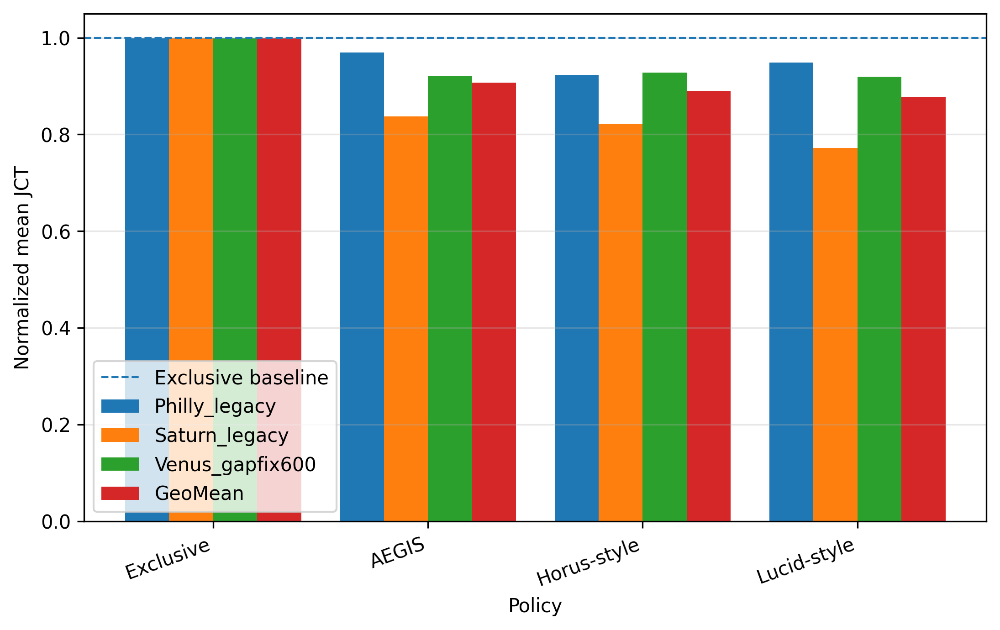

### Normalized P95 JCT

| Policy      |   Philly_legacy |   Saturn_legacy |   Venus_gapfix600 |   GeoMean | Policy_display   |
|:------------|----------------:|----------------:|------------------:|----------:|:-----------------|
| Exclusive   |           1     |           1     |             1     |     1     | Exclusive        |
| AEGIS       |           0.846 |           0.817 |             0.75  |     0.803 | AEGIS            |
| Horus-style |           0.898 |           0.85  |             0.787 |     0.844 | Horus-style      |
| Lucid-style |           0.883 |           0.812 |             0.805 |     0.832 | Lucid-style      |

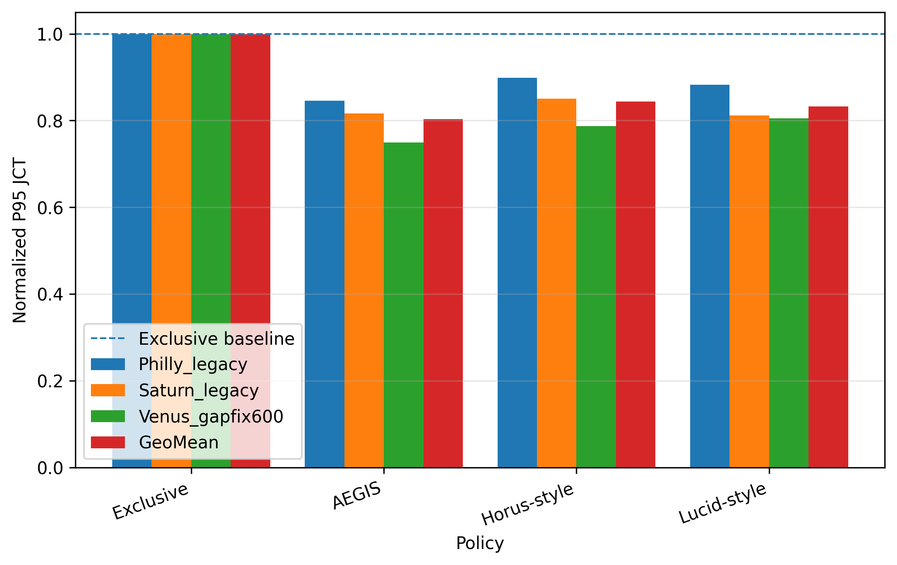

### Normalized mean queue wait

| Policy      |   Philly_legacy |   Saturn_legacy |   Venus_gapfix600 |   GeoMean | Policy_display   |
|:------------|----------------:|----------------:|------------------:|----------:|:-----------------|
| Exclusive   |           1     |           1     |             1     |     1     | Exclusive        |
| AEGIS       |           0.702 |           0.723 |             0.599 |     0.673 | AEGIS            |
| Horus-style |           0.74  |           0.666 |             0.55  |     0.647 | Horus-style      |
| Lucid-style |           0.581 |           0.589 |             0.387 |     0.51  | Lucid-style      |

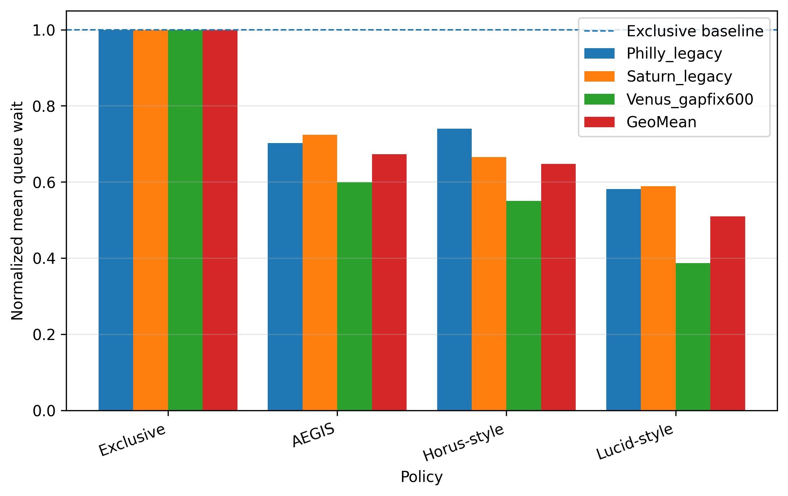

### Normalized P95 queue wait

| Policy      |   Philly_legacy |   Saturn_legacy |   Venus_gapfix600 |   GeoMean | Policy_display   |
|:------------|----------------:|----------------:|------------------:|----------:|:-----------------|
| Exclusive   |           1     |           1     |             1     |     1     | Exclusive        |
| AEGIS       |           0.793 |           0.832 |             0.862 |     0.828 | AEGIS            |
| Horus-style |           0.738 |           0.707 |             0.841 |     0.76  | Horus-style      |
| Lucid-style |           0.668 |           0.732 |             0.514 |     0.631 | Lucid-style      |

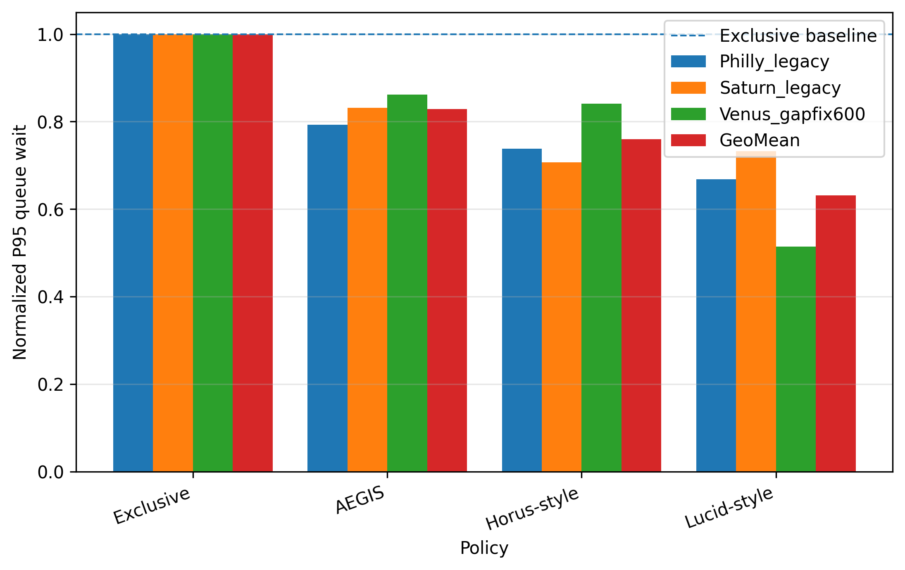

### Normalized mean execution span

| Policy      |   Philly_legacy |   Saturn_legacy |   Venus_gapfix600 |   GeoMean | Policy_display   |
|:------------|----------------:|----------------:|------------------:|----------:|:-----------------|
| Exclusive   |           1     |           1     |             1     |     1     | Exclusive        |
| AEGIS       |           1.189 |           1.092 |             1.062 |     1.113 | AEGIS            |
| Horus-style |           1.073 |           1.172 |             1.094 |     1.112 | Horus-style      |
| Lucid-style |           1.252 |           1.182 |             1.153 |     1.195 | Lucid-style      |

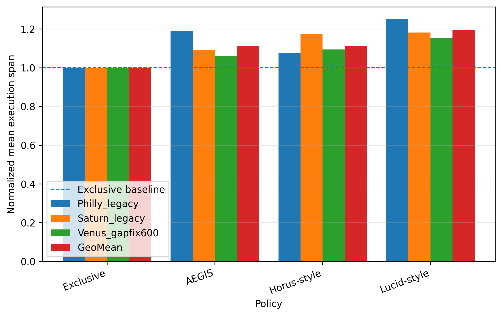

---

## Trace: philly_legacy

Results below contain only runs from this trace.

### Raw performance summary

| Policy      |   Completion |   Makespan (s) |   Mean wait (s) |   P95 wait (s) |   Mean JCT (s) |   P95 JCT (s) |   Mean execution span (s) |   P95 execution span (s) |   Mean successful runtime (s) |   Failed attempts |   Recovered attempts |
|:------------|-------------:|---------------:|----------------:|---------------:|---------------:|--------------:|--------------------------:|-------------------------:|------------------------------:|------------------:|---------------------:|
| Exclusive   |            1 |        30774.7 |        2482.51  |       10697    |        5487.91 |       16874.4 |                   3003.38 |                  8435.66 |                       3003.38 |                 0 |                    0 |
| AEGIS       |            1 |        33488.7 |        1743.46  |        8480.75 |        5317.71 |       14270.2 |                   3571.99 |                 10630.7  |                       3571.99 |                 0 |                    0 |
| AEGIS       |            1 |        28567.1 |        1449.38  |        6635.16 |        5194.3  |       14290.9 |                   3742.58 |                 10978.6  |                       3742.58 |                 0 |                    0 |
| AEGIS       |            1 |        29777.8 |        1484.1   |        6529.57 |        5310.98 |       15189.6 |                   3824.57 |                 11070.1  |                       3824.57 |                 0 |                    0 |
| AEGIS       |            1 |        30369.7 |        1385.04  |        6630.05 |        5351.65 |       15418.7 |                   3964.21 |                 11080.9  |                       3964.21 |                 0 |                    0 |
| Horus-style |            1 |        29745.7 |        1838.16  |        7895.31 |        5064.15 |       15156.4 |                   3223.85 |                 10643.9  |                       3223.85 |                 0 |                    0 |
| Lucid-style |            1 |        34400.2 |        1443.16  |        7146.03 |        5204.77 |       14895   |                   3759.33 |                  8926.63 |                       3759.33 |                 0 |                    0 |
| AEGIS       |            1 |        33900.5 |         990.833 |        6297.62 |        5549.61 |       16901.9 |                   4556.11 |                 16622.3  |                       4458.52 |                 1 |                    1 |

### Normalized performance summary

All ratios use Exclusive = 1.0 for this trace. Lower is better.

| Policy      |   Makespan / Exclusive |   Makespan reduction (%) |   Mean JCT / Exclusive |   P95 JCT / Exclusive |   Mean wait / Exclusive |   P95 wait / Exclusive |   Mean execution span / Exclusive |   P95 execution span / Exclusive |
|:------------|-----------------------:|-------------------------:|-----------------------:|----------------------:|------------------------:|-----------------------:|----------------------------------:|---------------------------------:|
| Exclusive   |                  1     |                    0     |                  1     |                 1     |                   1     |                  1     |                             1     |                            1     |
| AEGIS       |                  1.088 |                   -8.819 |                  0.969 |                 0.846 |                   0.702 |                  0.793 |                             1.189 |                            1.26  |
| AEGIS       |                  0.928 |                    7.174 |                  0.946 |                 0.847 |                   0.584 |                  0.62  |                             1.246 |                            1.301 |
| AEGIS       |                  0.968 |                    3.239 |                  0.968 |                 0.9   |                   0.598 |                  0.61  |                             1.273 |                            1.312 |
| AEGIS       |                  0.987 |                    1.316 |                  0.975 |                 0.914 |                   0.558 |                  0.62  |                             1.32  |                            1.314 |
| Horus-style |                  0.967 |                    3.344 |                  0.923 |                 0.898 |                   0.74  |                  0.738 |                             1.073 |                            1.262 |
| Lucid-style |                  1.118 |                  -11.781 |                  0.948 |                 0.883 |                   0.581 |                  0.668 |                             1.252 |                            1.058 |
| AEGIS       |                  1.102 |                  -10.157 |                  1.011 |                 1.002 |                   0.399 |                  0.589 |                             1.517 |                            1.97  |

### Normalized makespan by policy

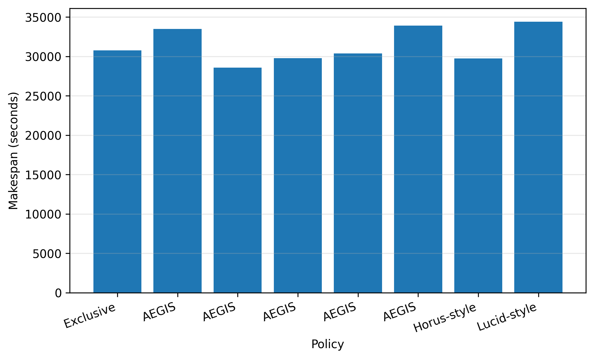

### Job completion time by policy

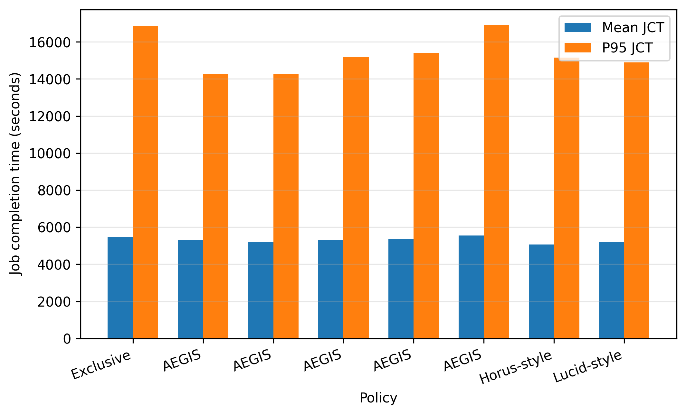

### Queueing time by policy

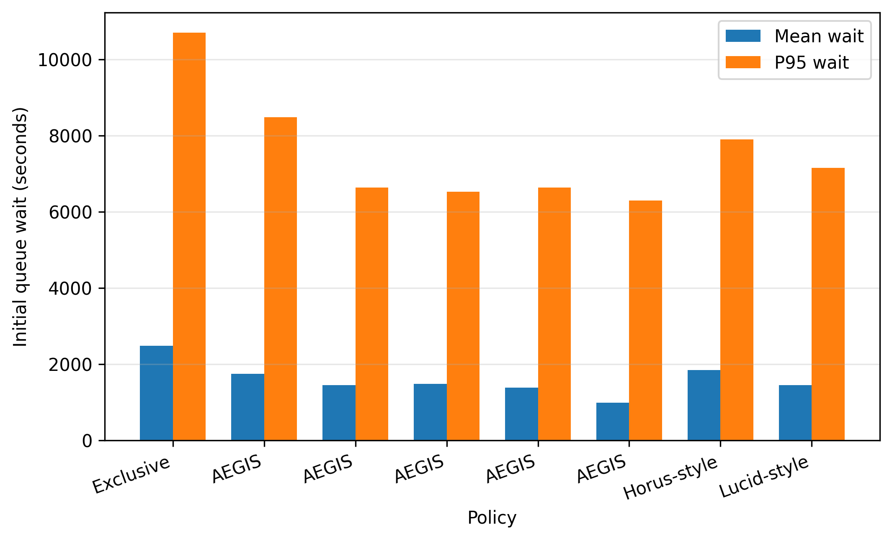

### Execution time by policy

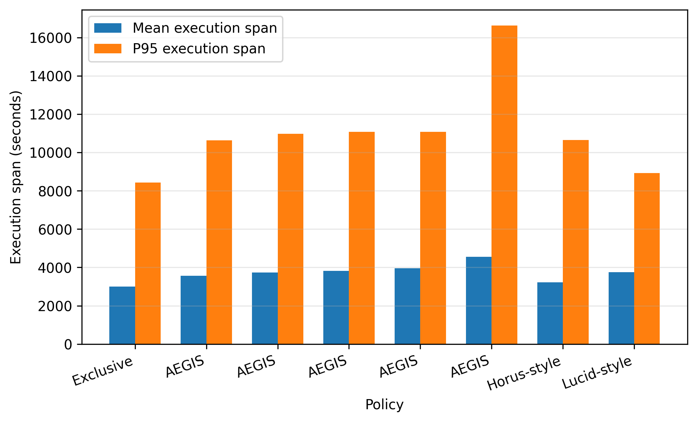

### Per-job normalized JCT distribution

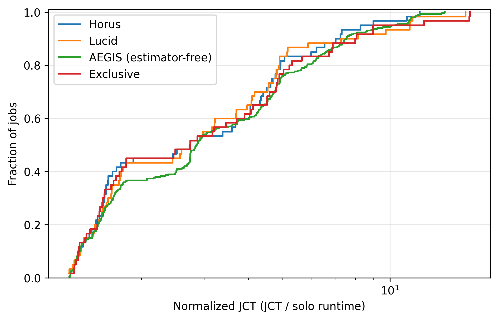

### Trace completion progress

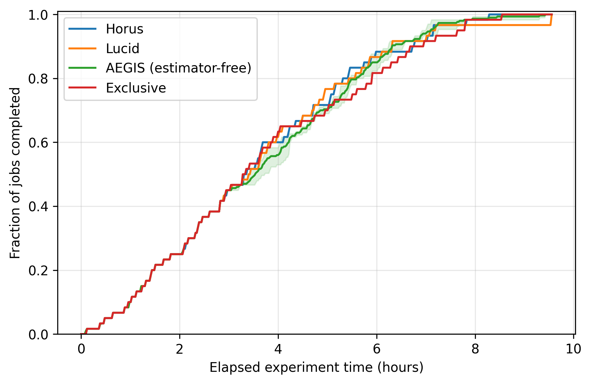

### Recovery cost

| Policy      |   Jobs with failures |   Recovered jobs |   Recovery stopped |   Failed attempts |   Mean recovery wait (s) |   P95 recovery wait (s) |   Max recovery wait (s) |   Lost runtime (s) |   Failure-to-relaunch gap (s) |   Total recovery overhead (s) |
|:------------|---------------------:|-----------------:|-------------------:|------------------:|-------------------------:|------------------------:|------------------------:|-------------------:|------------------------------:|------------------------------:|
| Horus-style |                    0 |                0 |                  0 |                 0 |                     0    |                    0    |                    0    |              0     |                          0    |                          0    |
| Lucid-style |                    0 |                0 |                  0 |                 0 |                     0    |                    0    |                    0    |              0     |                          0    |                          0    |
| AEGIS       |                    1 |                1 |                  0 |                 1 |                  5805.78 |                 5805.78 |                 5805.78 |             47.654 |                       5807.98 |                       5855.63 |
| Exclusive   |                    0 |                0 |                  0 |                 0 |                     0    |                    0    |                    0    |              0     |                          0    |                          0    |

#### Recovered-job cost breakdown

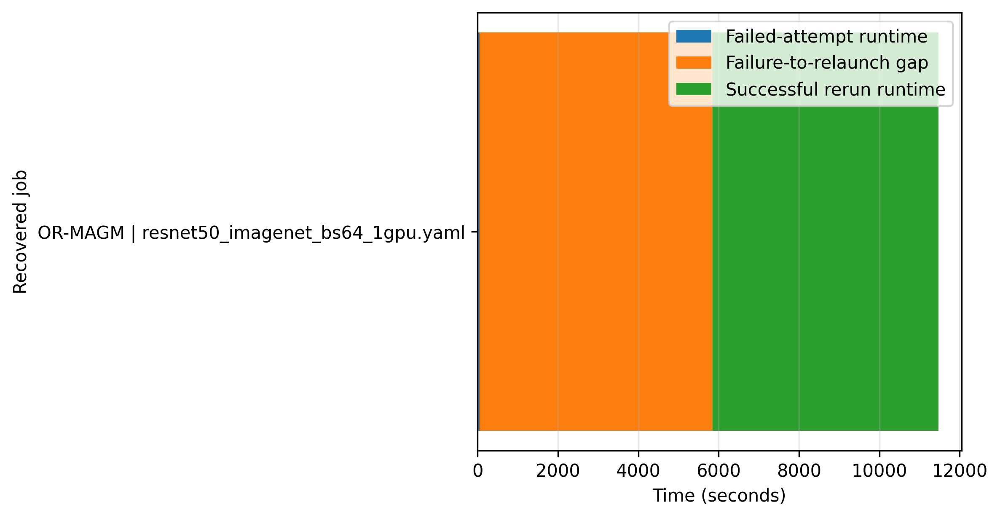

#### Policy recovery cost

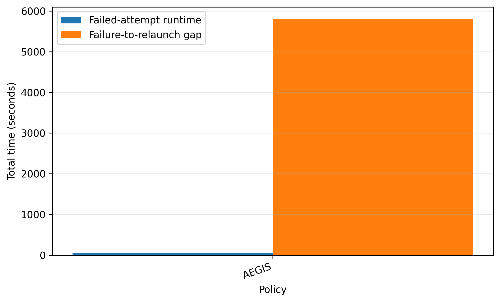

---

## Trace: saturn_legacy

Results below contain only runs from this trace.

### Raw performance summary

| Policy      |   Completion |   Makespan (s) |   Mean wait (s) |   P95 wait (s) |   Mean JCT (s) |   P95 JCT (s) |   Mean execution span (s) |   P95 execution span (s) |   Mean successful runtime (s) |   Failed attempts |   Recovered attempts |
|:------------|-------------:|---------------:|----------------:|---------------:|---------------:|--------------:|--------------------------:|-------------------------:|------------------------------:|------------------:|---------------------:|
| Exclusive   |            1 |        33744   |         7197.59 |       15054.1  |       10427.6  |       21829.3 |                   3227.54 |                  8747.97 |                       3227.54 |                 0 |                    0 |
| AEGIS       |            1 |        29050.2 |         5207.18 |       12522.5  |        8734.09 |       17831.6 |                   3524.3  |                  9276.6  |                       3524.3  |                 0 |                    0 |
| AEGIS       |            1 |        25113.2 |         5059.95 |       12137.1  |        8644.44 |       17592.3 |                   3581.71 |                  9132.03 |                       3581.71 |                 0 |                    0 |
| AEGIS       |            1 |        23758.2 |         4733.02 |       12173.7  |        8603.78 |       19732   |                   3867.84 |                 10847.1  |                       3867.84 |                 0 |                    0 |
| AEGIS       |            1 |        24867.5 |         4632.05 |       12013.4  |        8481.52 |       17238.1 |                   3846.45 |                  8982.28 |                       3846.45 |                 0 |                    0 |
| Horus-style |            1 |        24439.4 |         4792.06 |       10645.4  |        8576.57 |       18559.4 |                   3781.68 |                  9577.05 |                       3781.68 |                 0 |                    0 |
| Lucid-style |            1 |        25557.5 |         4236.7  |       11020.9  |        8052.84 |       17726.9 |                   3813.35 |                  8692.76 |                       3813.35 |                 0 |                    0 |
| AEGIS       |            1 |        29084.4 |         2657.94 |        8680.03 |       10697.7  |       25738.4 |                   8034.53 |                 25097.5  |                       8034.53 |                 0 |                    0 |

### Normalized performance summary

All ratios use Exclusive = 1.0 for this trace. Lower is better.

| Policy      |   Makespan / Exclusive |   Makespan reduction (%) |   Mean JCT / Exclusive |   P95 JCT / Exclusive |   Mean wait / Exclusive |   P95 wait / Exclusive |   Mean execution span / Exclusive |   P95 execution span / Exclusive |
|:------------|-----------------------:|-------------------------:|-----------------------:|----------------------:|------------------------:|-----------------------:|----------------------------------:|---------------------------------:|
| Exclusive   |                  1     |                    0     |                  1     |                 1     |                   1     |                  1     |                             1     |                            1     |
| AEGIS       |                  0.861 |                   13.91  |                  0.838 |                 0.817 |                   0.723 |                  0.832 |                             1.092 |                            1.06  |
| AEGIS       |                  0.744 |                   25.577 |                  0.829 |                 0.806 |                   0.703 |                  0.806 |                             1.11  |                            1.044 |
| AEGIS       |                  0.704 |                   29.593 |                  0.825 |                 0.904 |                   0.658 |                  0.809 |                             1.198 |                            1.24  |
| AEGIS       |                  0.737 |                   26.305 |                  0.813 |                 0.79  |                   0.644 |                  0.798 |                             1.192 |                            1.027 |
| Horus-style |                  0.724 |                   27.574 |                  0.822 |                 0.85  |                   0.666 |                  0.707 |                             1.172 |                            1.095 |
| Lucid-style |                  0.757 |                   24.26  |                  0.772 |                 0.812 |                   0.589 |                  0.732 |                             1.182 |                            0.994 |
| AEGIS       |                  0.862 |                   13.809 |                  1.026 |                 1.179 |                   0.369 |                  0.577 |                             2.489 |                            2.869 |

### Normalized makespan by policy

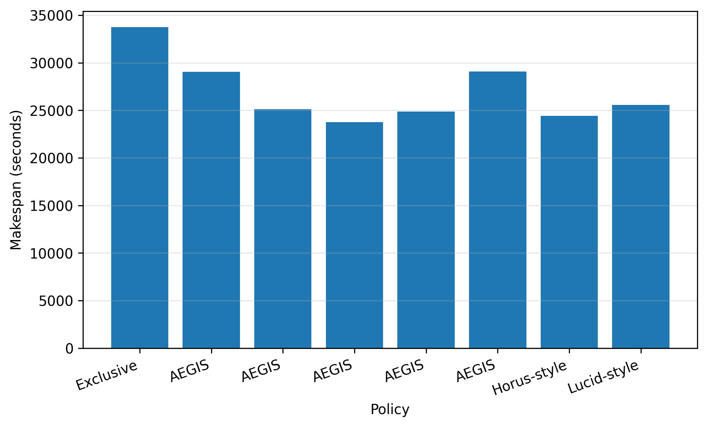

### Job completion time by policy

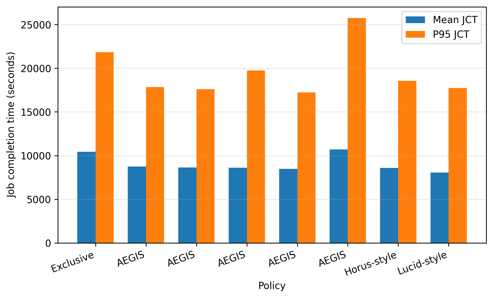

### Queueing time by policy

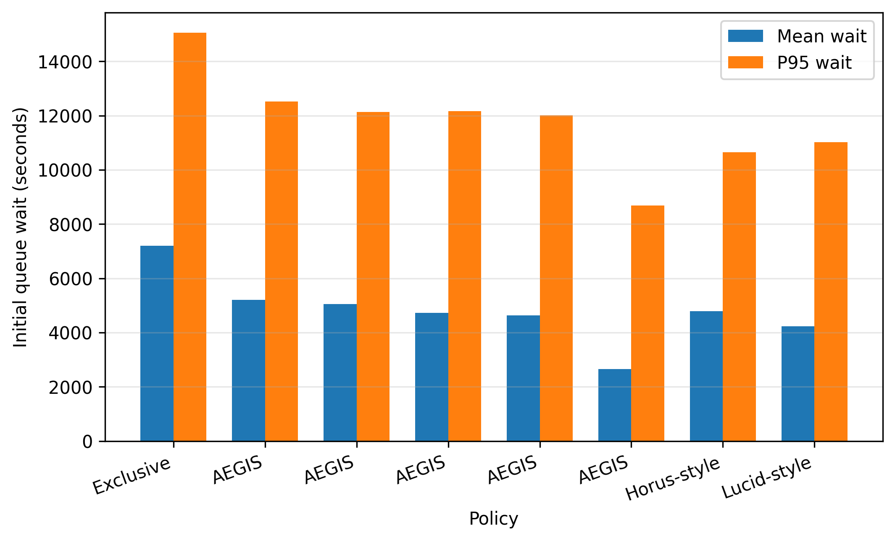

### Execution time by policy

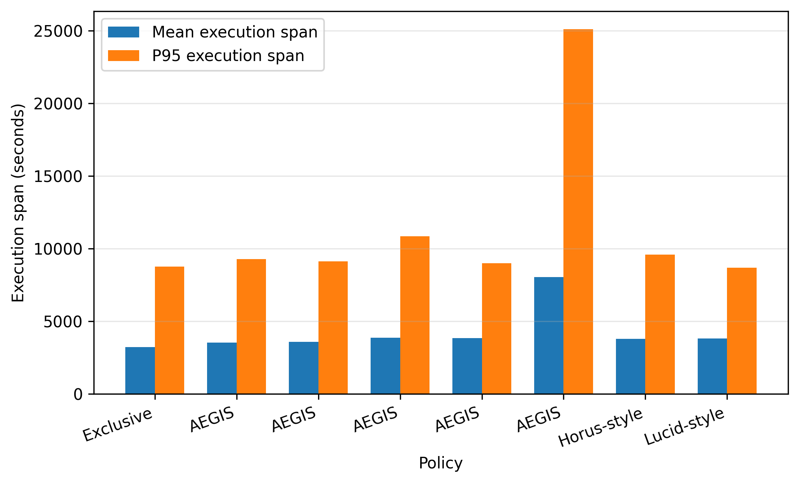

### Per-job normalized JCT distribution

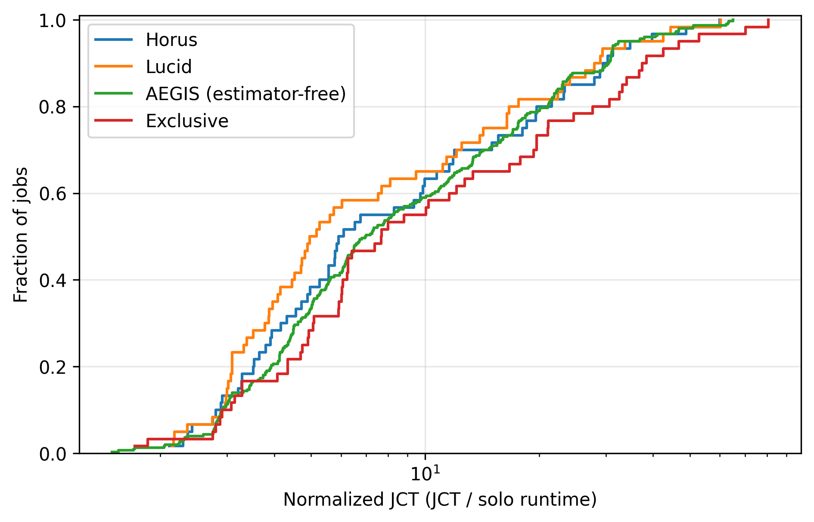

### Trace completion progress

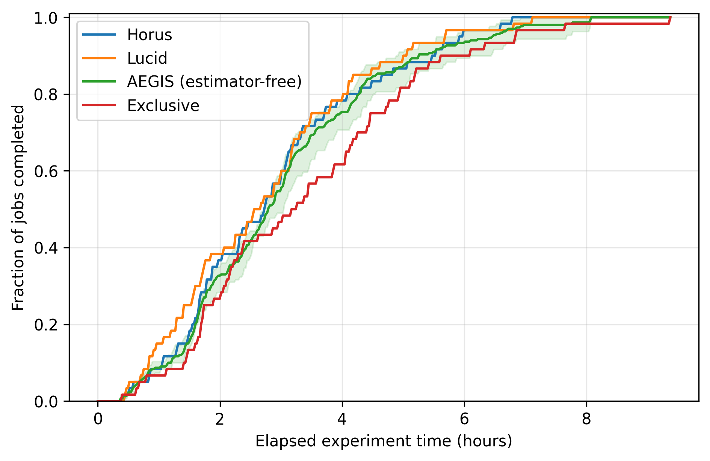

### Recovery cost

| Policy      |   Jobs with failures |   Recovered jobs |   Recovery stopped |   Failed attempts |   Mean recovery wait (s) |   P95 recovery wait (s) |   Max recovery wait (s) |   Lost runtime (s) |   Failure-to-relaunch gap (s) |   Total recovery overhead (s) |
|:------------|---------------------:|-----------------:|-------------------:|------------------:|-------------------------:|------------------------:|------------------------:|-------------------:|------------------------------:|------------------------------:|
| Horus-style |                    0 |                0 |                  0 |                 0 |                        0 |                       0 |                       0 |                  0 |                             0 |                             0 |
| Lucid-style |                    0 |                0 |                  0 |                 0 |                        0 |                       0 |                       0 |                  0 |                             0 |                             0 |
| AEGIS       |                    0 |                0 |                  0 |                 0 |                        0 |                       0 |                       0 |                  0 |                             0 |                             0 |
| Exclusive   |                    0 |                0 |                  0 |                 0 |                        0 |                       0 |                       0 |                  0 |                             0 |                             0 |

---

## Trace: venus_gapfix600

Results below contain only runs from this trace.

### Raw performance summary

| Policy      |   Completion |   Makespan (s) |   Mean wait (s) |   P95 wait (s) |   Mean JCT (s) |   P95 JCT (s) |   Mean execution span (s) |   P95 execution span (s) |   Mean successful runtime (s) |   Failed attempts |   Recovered attempts |
|:------------|-------------:|---------------:|----------------:|---------------:|---------------:|--------------:|--------------------------:|-------------------------:|------------------------------:|------------------:|---------------------:|
| Exclusive   |            1 |        25519.8 |        1337.95  |       6121.7   |        4381.45 |      12968.3  |                   3041.41 |                 10322.2  |                       3041.41 |                 0 |                    0 |
| AEGIS       |            1 |        25757   |         801.322 |       5275.09  |        4034.64 |       9722.19 |                   3231.09 |                  8615.09 |                       3231.09 |                 0 |                    0 |
| AEGIS       |            1 |        26194.4 |         916.73  |       5109.34  |        4328.17 |      10353.3  |                   3409.16 |                  8667.54 |                       3409.16 |                 0 |                    0 |
| AEGIS       |            1 |        25912.9 |         682.258 |       5319.39  |        3895.78 |      10056.7  |                   3211.27 |                  8793.97 |                       3211.27 |                 0 |                    0 |
| AEGIS       |            1 |        25843.7 |         675.782 |       5333.29  |        3894.19 |       9625.86 |                   3216.21 |                  8911.81 |                       3216.21 |                 0 |                    0 |
| Horus-style |            1 |        26343.3 |         736.391 |       5148.63  |        4065.85 |      10208.6  |                   3327.27 |                  8509.41 |                       3327.27 |                 0 |                    0 |
| Lucid-style |            1 |        25881.8 |         517.92  |       3148.58  |        4027.36 |      10437    |                   3507.2  |                  8756.44 |                       3507.2  |                 0 |                    0 |
| AEGIS       |            1 |        27459.5 |          14.299 |         67.272 |        4192.5  |      13664.3  |                   4175.91 |                 13648.5  |                       4175.91 |                 0 |                    0 |

### Normalized performance summary

All ratios use Exclusive = 1.0 for this trace. Lower is better.

| Policy      |   Makespan / Exclusive |   Makespan reduction (%) |   Mean JCT / Exclusive |   P95 JCT / Exclusive |   Mean wait / Exclusive |   P95 wait / Exclusive |   Mean execution span / Exclusive |   P95 execution span / Exclusive |
|:------------|-----------------------:|-------------------------:|-----------------------:|----------------------:|------------------------:|-----------------------:|----------------------------------:|---------------------------------:|
| Exclusive   |                  1     |                    0     |                  1     |                 1     |                   1     |                  1     |                             1     |                            1     |
| AEGIS       |                  1.009 |                   -0.93  |                  0.921 |                 0.75  |                   0.599 |                  0.862 |                             1.062 |                            0.835 |
| AEGIS       |                  1.026 |                   -2.643 |                  0.988 |                 0.798 |                   0.685 |                  0.835 |                             1.121 |                            0.84  |
| AEGIS       |                  1.015 |                   -1.54  |                  0.889 |                 0.775 |                   0.51  |                  0.869 |                             1.056 |                            0.852 |
| AEGIS       |                  1.013 |                   -1.269 |                  0.889 |                 0.742 |                   0.505 |                  0.871 |                             1.057 |                            0.863 |
| Horus-style |                  1.032 |                   -3.227 |                  0.928 |                 0.787 |                   0.55  |                  0.841 |                             1.094 |                            0.824 |
| Lucid-style |                  1.014 |                   -1.419 |                  0.919 |                 0.805 |                   0.387 |                  0.514 |                             1.153 |                            0.848 |
| AEGIS       |                  1.076 |                   -7.601 |                  0.957 |                 1.054 |                   0.011 |                  0.011 |                             1.373 |                            1.322 |

### Normalized makespan by policy

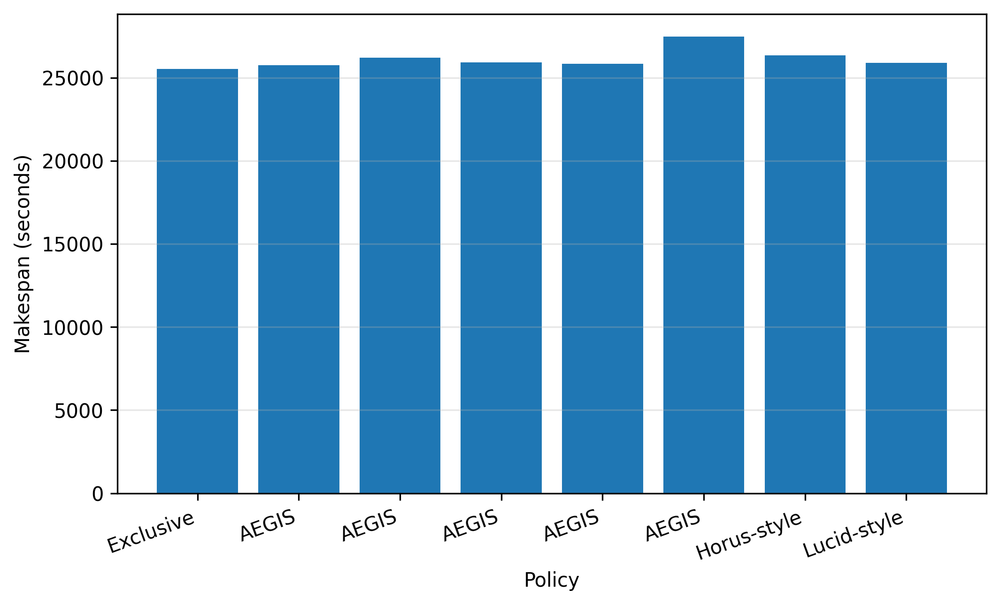

### Job completion time by policy

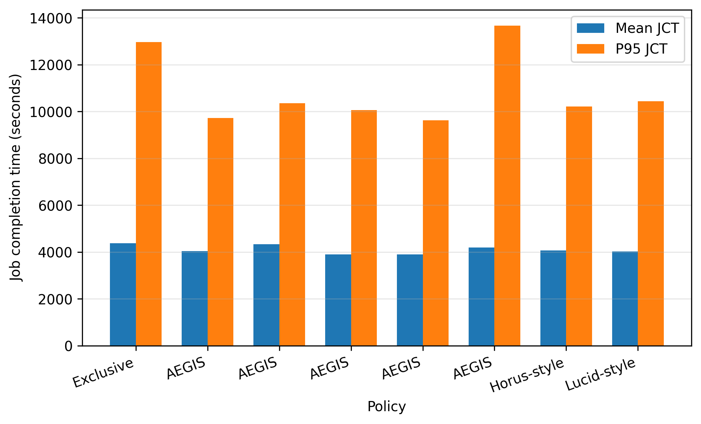

### Queueing time by policy

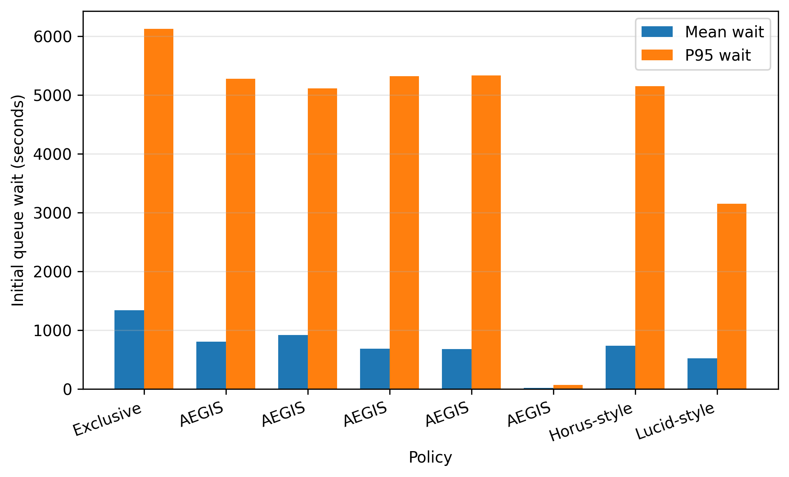

### Execution time by policy

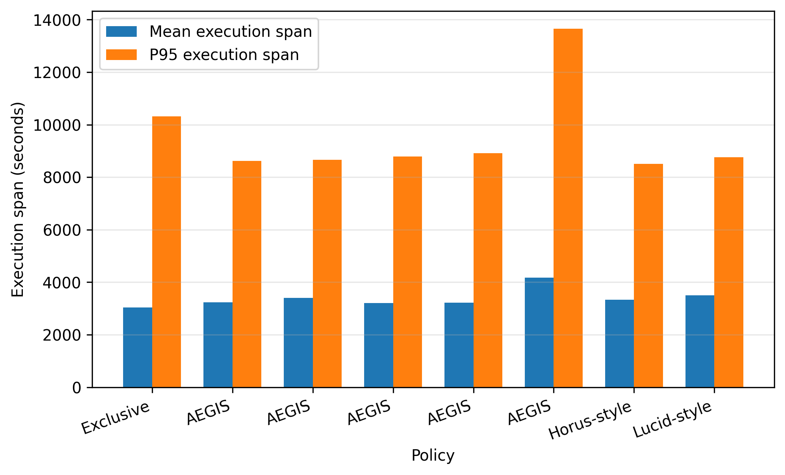

### Per-job normalized JCT distribution

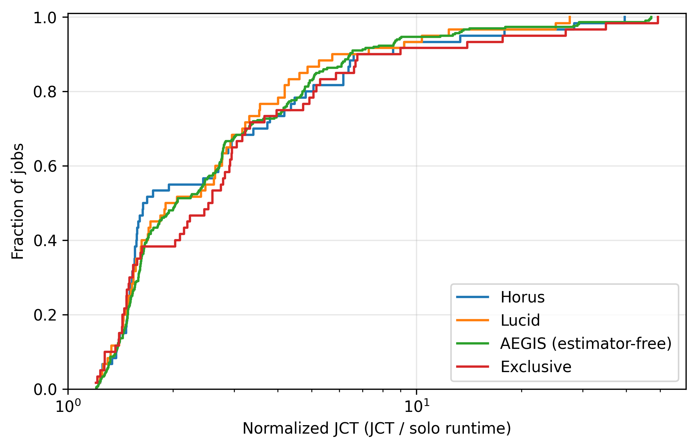

### Trace completion progress

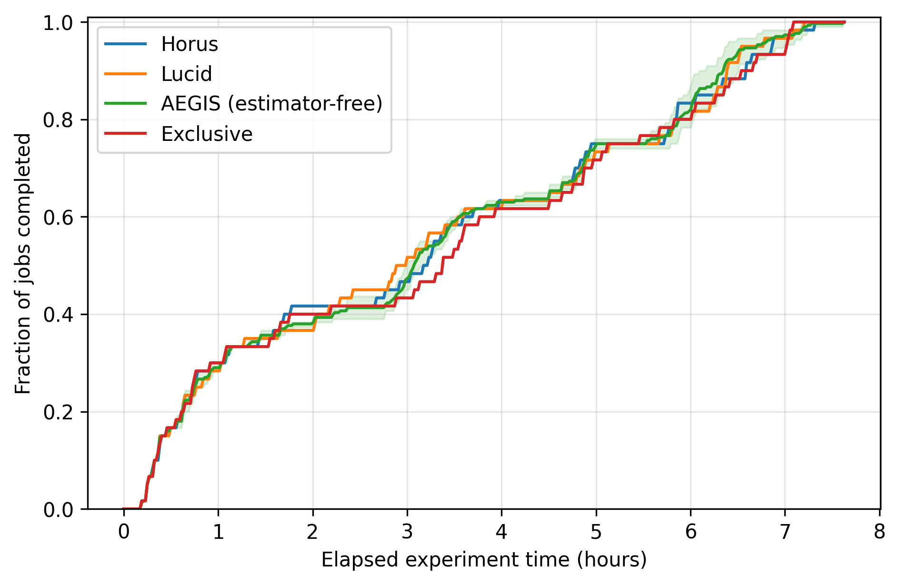

### Recovery cost

| Policy      |   Jobs with failures |   Recovered jobs |   Recovery stopped |   Failed attempts |   Mean recovery wait (s) |   P95 recovery wait (s) |   Max recovery wait (s) |   Lost runtime (s) |   Failure-to-relaunch gap (s) |   Total recovery overhead (s) |
|:------------|---------------------:|-----------------:|-------------------:|------------------:|-------------------------:|------------------------:|------------------------:|-------------------:|------------------------------:|------------------------------:|
| Horus-style |                    0 |                0 |                  0 |                 0 |                        0 |                       0 |                       0 |                  0 |                             0 |                             0 |
| Lucid-style |                    0 |                0 |                  0 |                 0 |                        0 |                       0 |                       0 |                  0 |                             0 |                             0 |
| AEGIS       |                    0 |                0 |                  0 |                 0 |                        0 |                       0 |                       0 |                  0 |                             0 |                             0 |
| Exclusive   |                    0 |                0 |                  0 |                 0 |                        0 |                       0 |                       0 |                  0 |                             0 |                             0 |
