# Final Representative Evaluation

This report is generated automatically by `analyze_evaluation_manifest.py`.

## Evaluation status

| trace_name   |   complete |
|:-------------|-----------:|
| philly       |          4 |
| saturn       |          4 |
| venus        |          4 |

## Cross-trace comparison

Each table reports every completed trace separately. GeoMean summarizes normalized ratios across traces; lower is better.

### Normalized makespan

| Policy                |   Philly |   Saturn |   Venus |   GeoMean | Policy_display        |
|:----------------------|---------:|---------:|--------:|----------:|:----------------------|
| Exclusive             |    1     |    1     |   1     |     1     | Exclusive             |
| AEGIS - EstimatorFree |    0.709 |    0.701 |   0.783 |     0.73  | AEGIS - EstimatorFree |
| OR-LUG                |    0.787 |    0.74  |   0.74  |     0.755 | OR-LUG                |
| OR-RR                 |    0.786 |    0.726 |   0.818 |     0.776 | OR-RR                 |

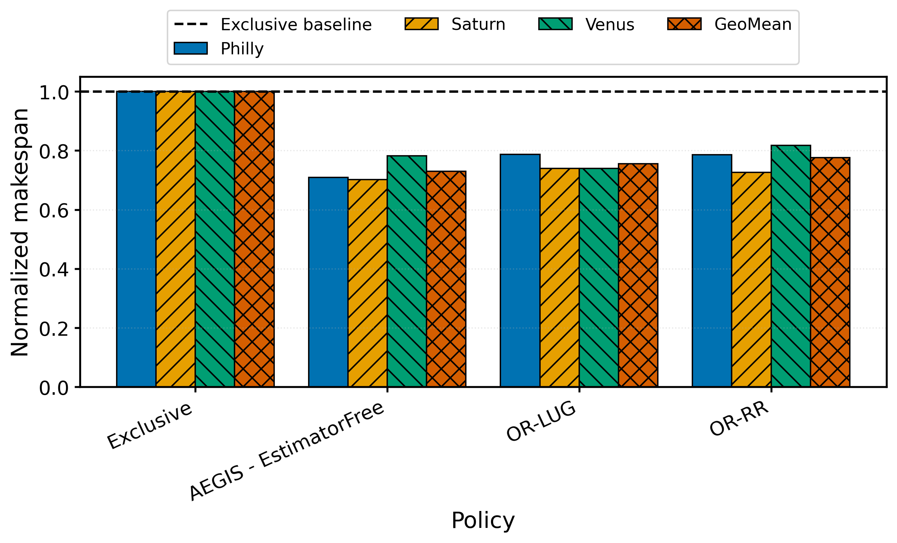

### Normalized mean JCT

| Policy                |   Philly |   Saturn |   Venus |   GeoMean | Policy_display        |
|:----------------------|---------:|---------:|--------:|----------:|:----------------------|
| Exclusive             |    1     |    1     |   1     |     1     | Exclusive             |
| AEGIS - EstimatorFree |    0.633 |    0.583 |   0.622 |     0.613 | AEGIS - EstimatorFree |
| OR-LUG                |    0.636 |    0.58  |   0.547 |     0.587 | OR-LUG                |
| OR-RR                 |    0.666 |    0.578 |   0.665 |     0.635 | OR-RR                 |

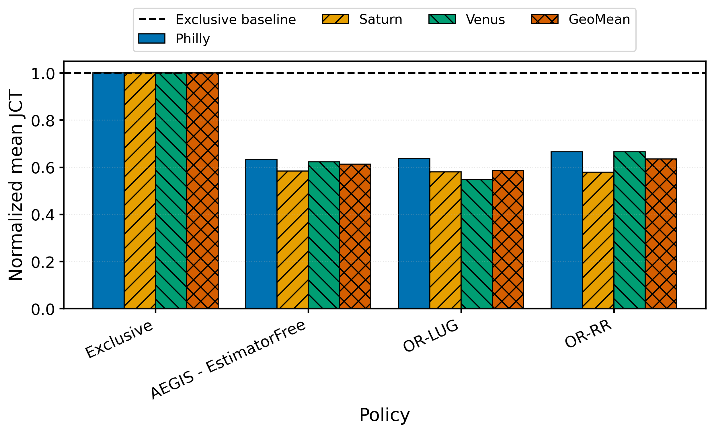

### Normalized P95 JCT

| Policy                |   Philly |   Saturn |   Venus |   GeoMean | Policy_display        |
|:----------------------|---------:|---------:|--------:|----------:|:----------------------|
| Exclusive             |    1     |    1     |   1     |     1     | Exclusive             |
| AEGIS - EstimatorFree |    0.673 |    0.52  |   0.61  |     0.598 | AEGIS - EstimatorFree |
| OR-LUG                |    0.698 |    0.598 |   0.569 |     0.619 | OR-LUG                |
| OR-RR                 |    0.69  |    0.539 |   0.692 |     0.636 | OR-RR                 |

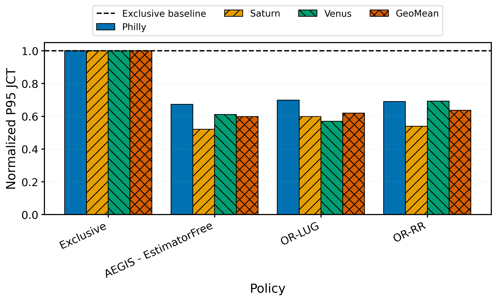

### Normalized mean total queue wait

| Policy                |   Philly |   Saturn |   Venus |   GeoMean | Policy_display        |
|:----------------------|---------:|---------:|--------:|----------:|:----------------------|
| Exclusive             |    1     |    1     |   1     |     1     | Exclusive             |
| AEGIS - EstimatorFree |    0.513 |    0.439 |   0.534 |     0.494 | AEGIS - EstimatorFree |
| OR-LUG                |    0.513 |    0.437 |   0.404 |     0.449 | OR-LUG                |
| OR-RR                 |    0.537 |    0.416 |   0.561 |     0.501 | OR-RR                 |

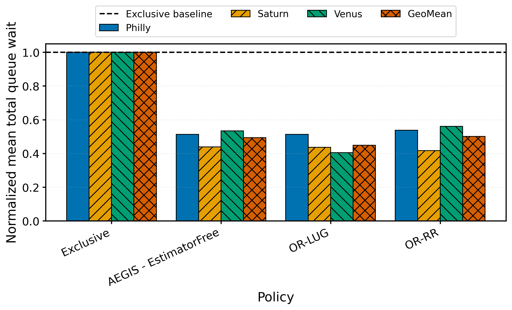

### Normalized P95 total queue wait

| Policy                |   Philly |   Saturn |   Venus |   GeoMean | Policy_display        |
|:----------------------|---------:|---------:|--------:|----------:|:----------------------|
| Exclusive             |    1     |    1     |   1     |     1     | Exclusive             |
| AEGIS - EstimatorFree |    0.546 |    0.544 |   0.549 |     0.546 | AEGIS - EstimatorFree |
| OR-LUG                |    0.582 |    0.63  |   0.468 |     0.556 | OR-LUG                |
| OR-RR                 |    0.677 |    0.475 |   0.586 |     0.573 | OR-RR                 |

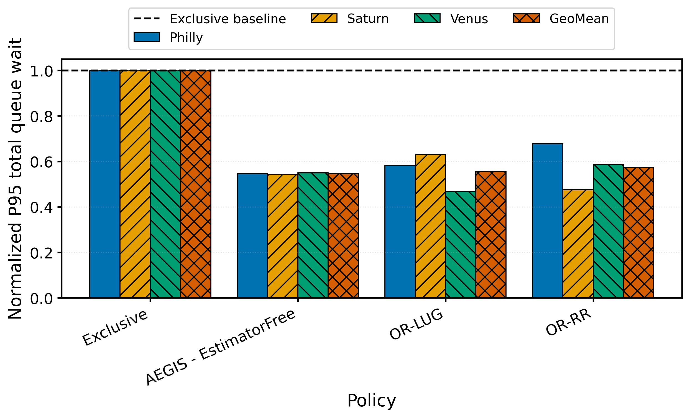

### Normalized mean total execution time

| Policy                |   Philly |   Saturn |   Venus |   GeoMean | Policy_display        |
|:----------------------|---------:|---------:|--------:|----------:|:----------------------|
| Exclusive             |    1     |    1     |   1     |     1     | Exclusive             |
| AEGIS - EstimatorFree |    1.704 |    1.699 |   1.285 |     1.55  | AEGIS - EstimatorFree |
| OR-LUG                |    1.739 |    1.692 |   1.619 |     1.683 | OR-LUG                |
| OR-RR                 |    1.81  |    1.833 |   1.444 |     1.686 | OR-RR                 |

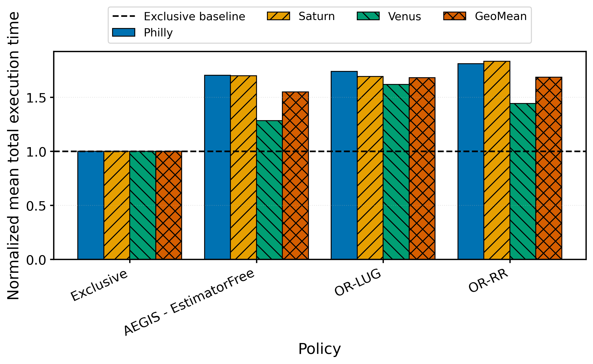

### Normalized P95 total execution time

| Policy                |   Philly |   Saturn |   Venus |   GeoMean | Policy_display        |
|:----------------------|---------:|---------:|--------:|----------:|:----------------------|
| Exclusive             |    1     |    1     |   1     |     1     | Exclusive             |
| AEGIS - EstimatorFree |    2.114 |    2.554 |   1.418 |     1.971 | AEGIS - EstimatorFree |
| OR-LUG                |    2.298 |    1.961 |   2.235 |     2.16  | OR-LUG                |
| OR-RR                 |    1.868 |    2.382 |   1.778 |     1.993 | OR-RR                 |

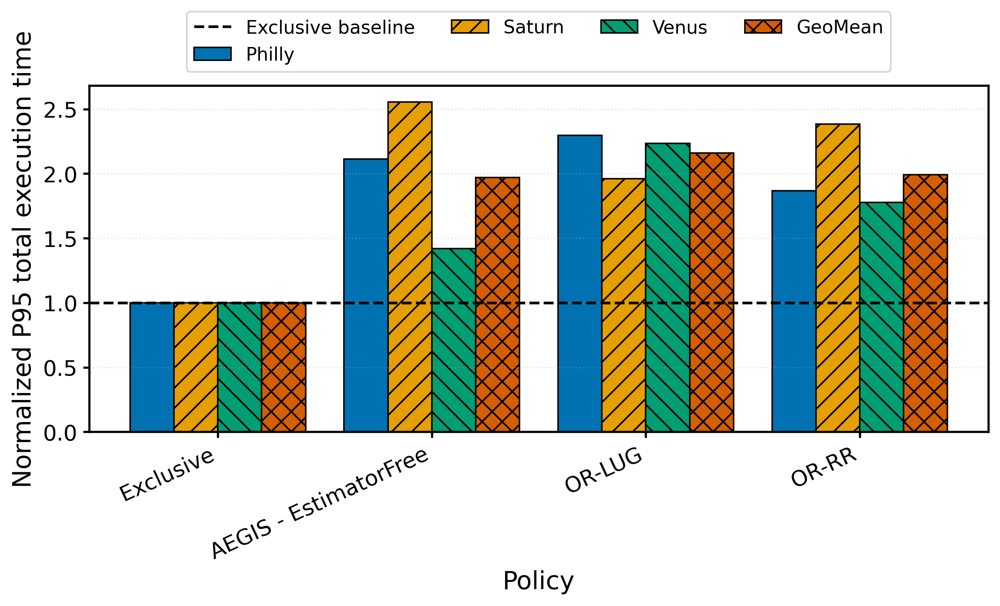

## Cross-trace queue and execution-time summary

Total queue time is initial queue wait plus recovery queue wait. Total execution time is the sum of all attempt runtimes, including failed attempts before recovery.

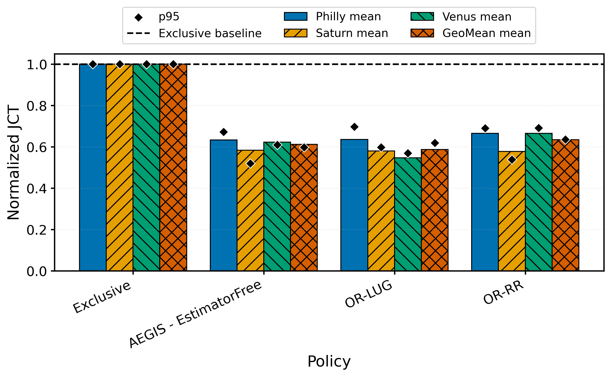

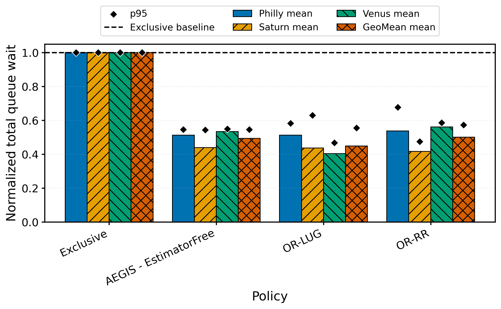

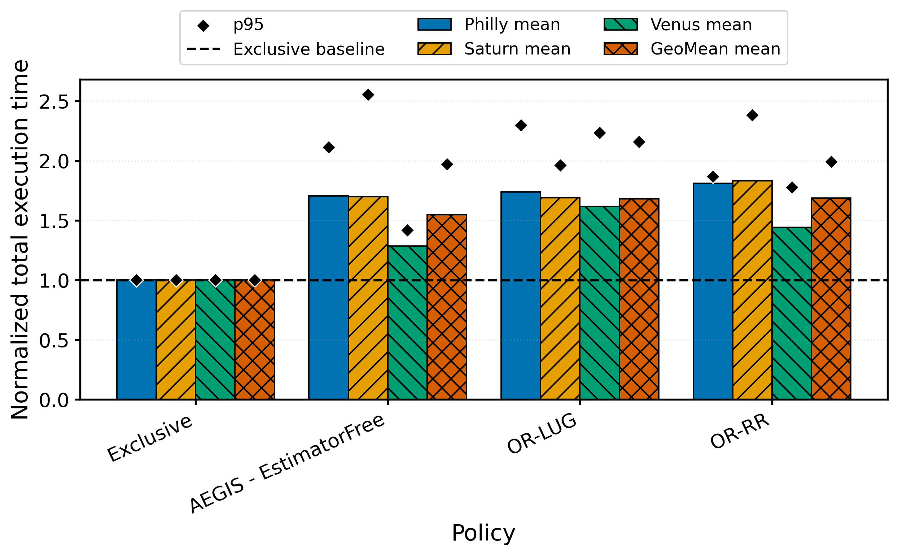

---

## Trace: philly

Results below contain only runs from this trace.

### Raw performance summary

| Policy                |   Completion |   Makespan (s) |   Mean total wait (s) |   P95 total wait (s) |   Mean JCT (s) |   P95 JCT (s) |   Mean total execution time (s) |   P95 total execution time (s) |   Mean successful runtime (s) |   Failed attempts |   Recovered attempts |
|:----------------------|-------------:|---------------:|----------------------:|---------------------:|---------------:|--------------:|--------------------------------:|-------------------------------:|------------------------------:|------------------:|---------------------:|
| Exclusive             |            1 |        42633.5 |              16928.3  |              29115.1 |        18823.2 |       30761.5 |                         1894.81 |                        3520.2  |                       1894.81 |                 0 |                    0 |
| OR-LUG                |            1 |        33560.2 |               8677.04 |              16953.2 |        11972.1 |       21465   |                         3294.99 |                        8089.41 |                       3294.36 |                 3 |                    3 |
| AEGIS - EstimatorFree |            1 |        30208.2 |               8686.46 |              15885.2 |        11915.9 |       20698.9 |                         3229.45 |                        7443.16 |                       3228.94 |                 3 |                    3 |
| OR-RR                 |            1 |        33521.8 |               9097.99 |              19721.9 |        12528.2 |       21231.1 |                         3430.2  |                        6576.55 |                       3427.27 |                 8 |                    8 |

### Normalized performance summary

All ratios use Exclusive = 1.0 for this trace. Lower is better.

| Policy                |   Makespan / Exclusive |   Makespan reduction (%) |   Mean JCT / Exclusive |   P95 JCT / Exclusive |   Mean wait / Exclusive |   P95 wait / Exclusive |   Mean total execution time / Exclusive |   P95 total execution time / Exclusive |
|:----------------------|-----------------------:|-------------------------:|-----------------------:|----------------------:|------------------------:|-----------------------:|----------------------------------------:|---------------------------------------:|
| Exclusive             |                  1     |                    0     |                  1     |                 1     |                   1     |                  1     |                                   1     |                                  1     |
| OR-LUG                |                  0.787 |                   21.282 |                  0.636 |                 0.698 |                   0.513 |                  0.582 |                                   1.739 |                                  2.298 |
| AEGIS - EstimatorFree |                  0.709 |                   29.144 |                  0.633 |                 0.673 |                   0.513 |                  0.546 |                                   1.704 |                                  2.114 |
| OR-RR                 |                  0.786 |                   21.372 |                  0.666 |                 0.69  |                   0.537 |                  0.677 |                                   1.81  |                                  1.868 |

### Normalized makespan by policy

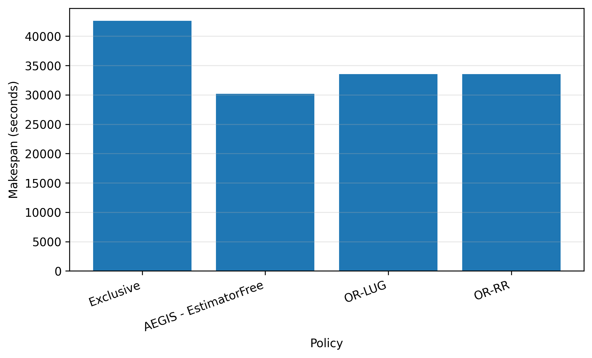

### Job completion time by policy

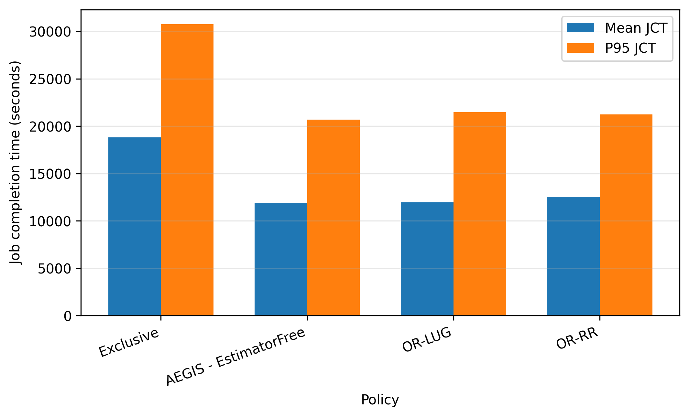

### Queueing time by policy

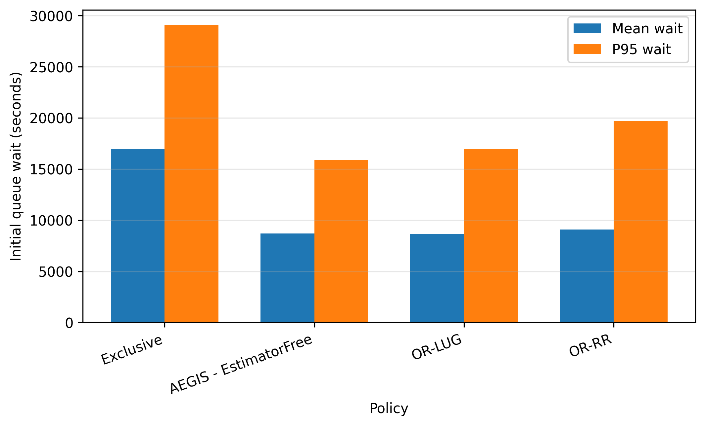

### Execution time by policy

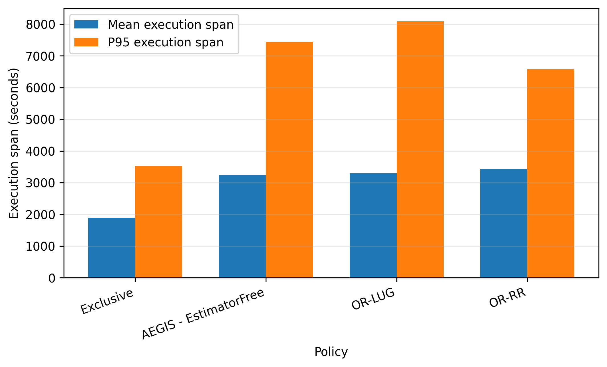

### Per-job normalized JCT distribution

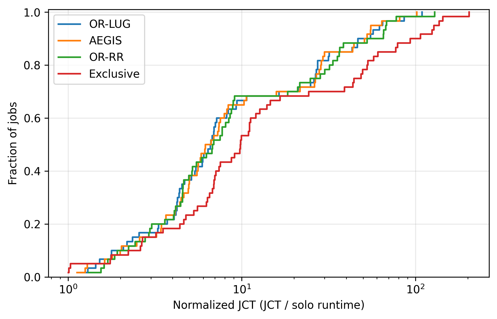

### Trace completion progress

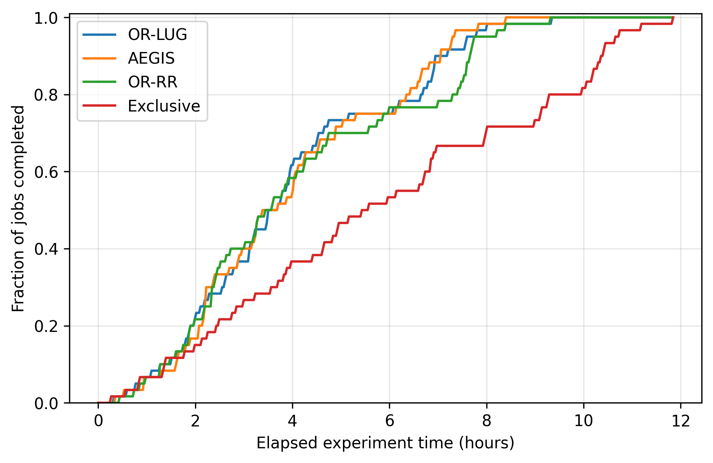

### Recovery cost

| Policy                |   Jobs with failures |   Recovered jobs |   Recovery stopped |   Failed attempts |   Mean recovery wait (s) |   P95 recovery wait (s) |   Max recovery wait (s) |   Lost runtime (s) |   Failure-to-relaunch gap (s) |   Total recovery overhead (s) |
|:----------------------|---------------------:|-----------------:|-------------------:|------------------:|-------------------------:|------------------------:|------------------------:|-------------------:|------------------------------:|------------------------------:|
| OR-LUG                |                    3 |                3 |                  0 |                 3 |                  4505.01 |                 7147.98 |                 7562.06 |             38.029 |                      13515.1  |                      13553.1  |
| AEGIS - EstimatorFree |                    3 |                3 |                  0 |                 3 |                  2608.29 |                 4822.69 |                 5184.11 |             30.435 |                       7824.95 |                       7855.39 |
| OR-RR                 |                    8 |                8 |                  0 |                 8 |                  4059.29 |                 6329.72 |                 6462.09 |            175.987 |                      32474.6  |                      32650.6  |
| Exclusive             |                    0 |                0 |                  0 |                 0 |                     0    |                    0    |                    0    |              0     |                          0    |                          0    |

#### Recovered-job cost breakdown

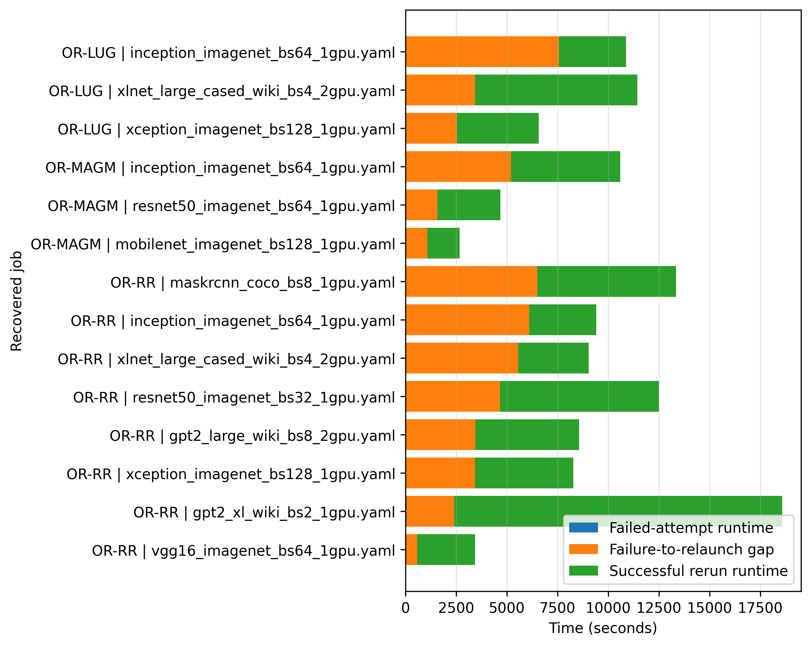

#### Policy recovery cost

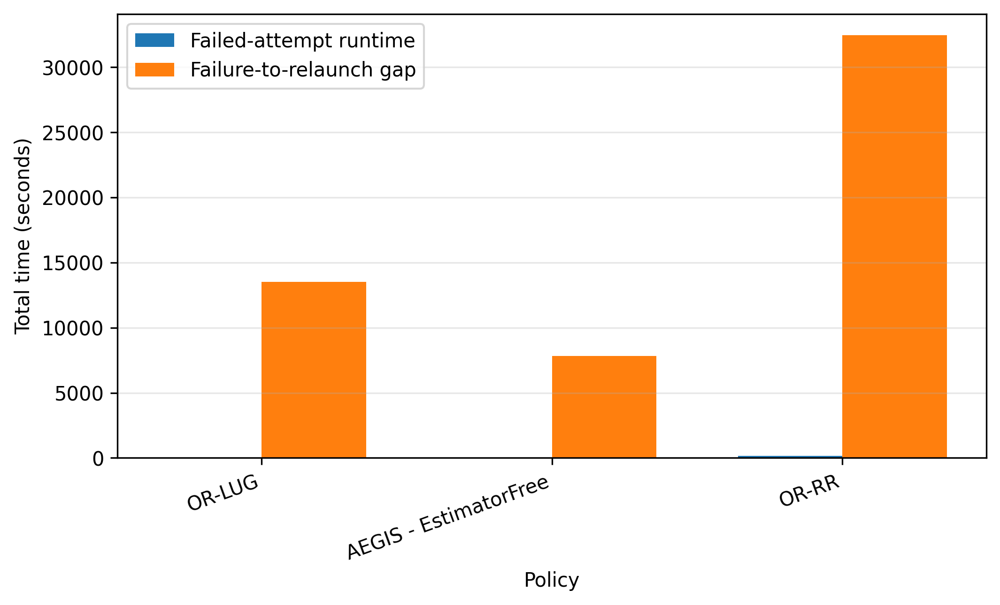

---

## Trace: saturn

Results below contain only runs from this trace.

### Raw performance summary

| Policy                |   Completion |   Makespan (s) |   Mean total wait (s) |   P95 total wait (s) |   Mean JCT (s) |   P95 JCT (s) |   Mean total execution time (s) |   P95 total execution time (s) |   Mean successful runtime (s) |   Failed attempts |   Recovered attempts |
|:----------------------|-------------:|---------------:|----------------------:|---------------------:|---------------:|--------------:|--------------------------------:|-------------------------------:|------------------------------:|------------------:|---------------------:|
| Exclusive             |            1 |        47406.4 |              15241.4  |              36809.2 |       17207.5  |       40915.9 |                         1966.07 |                        3581.06 |                       1966.07 |                 0 |                    0 |
| OR-LUG                |            1 |        35073.6 |               6659.04 |              23190.8 |        9985.67 |       24464.2 |                         3326.6  |                        7023.85 |                       3318.93 |                 5 |                    5 |
| AEGIS - EstimatorFree |            1 |        33248.6 |               6696.88 |              20007.3 |       10037.9  |       21282.5 |                         3341.03 |                        9147.41 |                       3338.93 |                 3 |                    3 |
| OR-RR                 |            1 |        34425.3 |               6347.27 |              17494.5 |        9951.86 |       22054.9 |                         3604.56 |                        8531.48 |                       3601.57 |                 7 |                    7 |

### Normalized performance summary

All ratios use Exclusive = 1.0 for this trace. Lower is better.

| Policy                |   Makespan / Exclusive |   Makespan reduction (%) |   Mean JCT / Exclusive |   P95 JCT / Exclusive |   Mean wait / Exclusive |   P95 wait / Exclusive |   Mean total execution time / Exclusive |   P95 total execution time / Exclusive |
|:----------------------|-----------------------:|-------------------------:|-----------------------:|----------------------:|------------------------:|-----------------------:|----------------------------------------:|---------------------------------------:|
| Exclusive             |                  1     |                    0     |                  1     |                 1     |                   1     |                  1     |                                   1     |                                  1     |
| OR-LUG                |                  0.74  |                   26.015 |                  0.58  |                 0.598 |                   0.437 |                  0.63  |                                   1.692 |                                  1.961 |
| AEGIS - EstimatorFree |                  0.701 |                   29.865 |                  0.583 |                 0.52  |                   0.439 |                  0.544 |                                   1.699 |                                  2.554 |
| OR-RR                 |                  0.726 |                   27.383 |                  0.578 |                 0.539 |                   0.416 |                  0.475 |                                   1.833 |                                  2.382 |

### Normalized makespan by policy

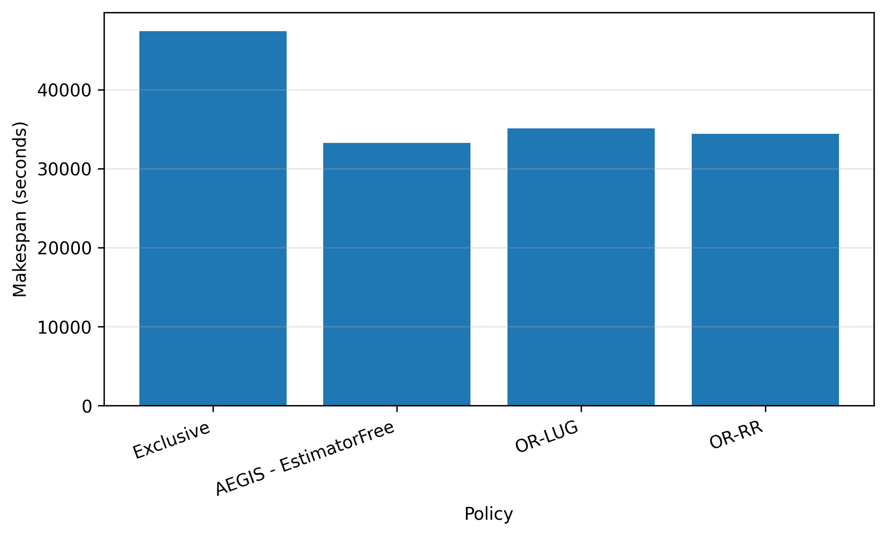

### Job completion time by policy

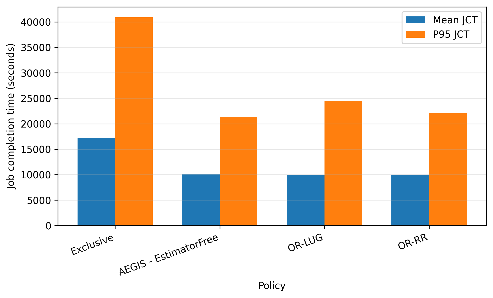

### Queueing time by policy

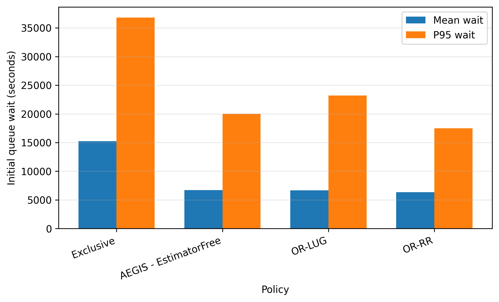

### Execution time by policy

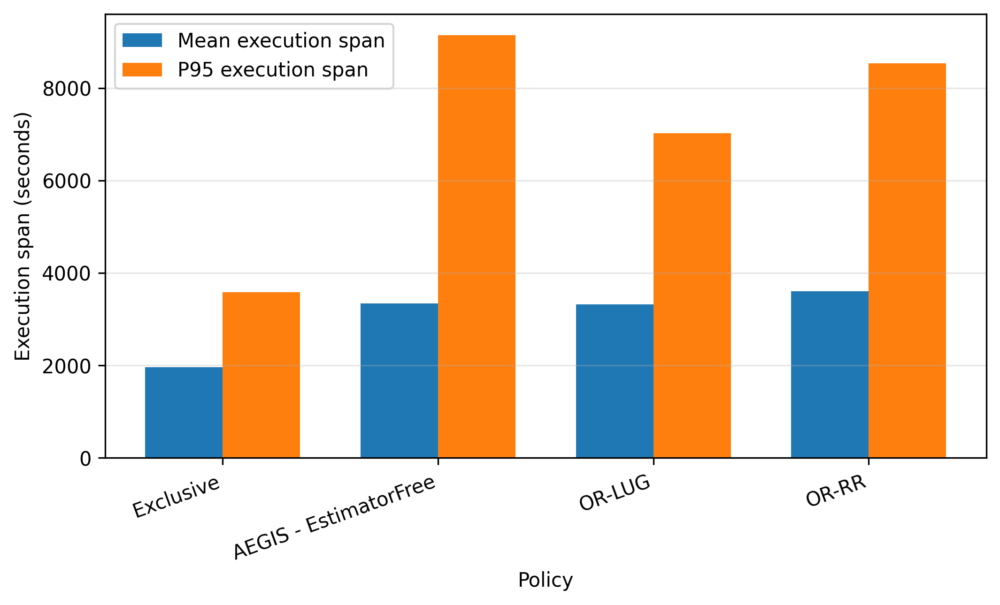

### Per-job normalized JCT distribution

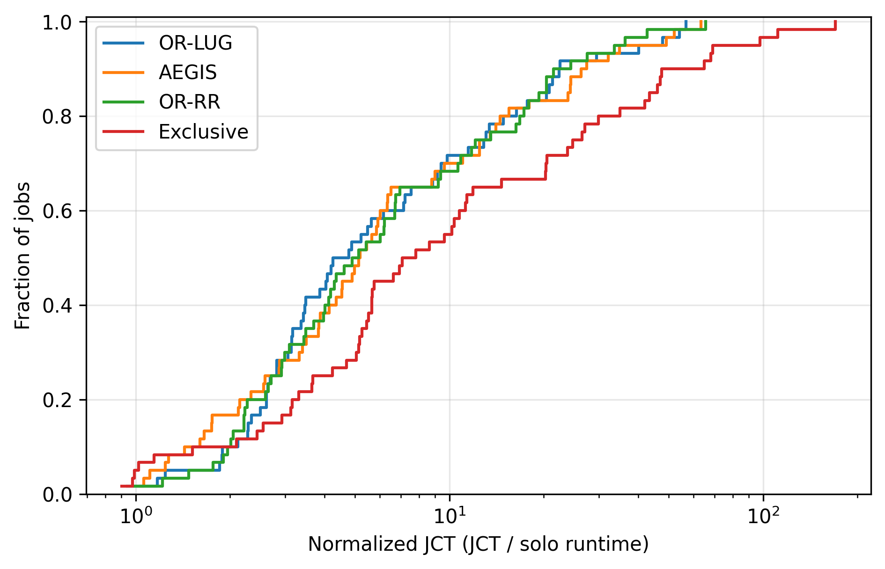

### Trace completion progress

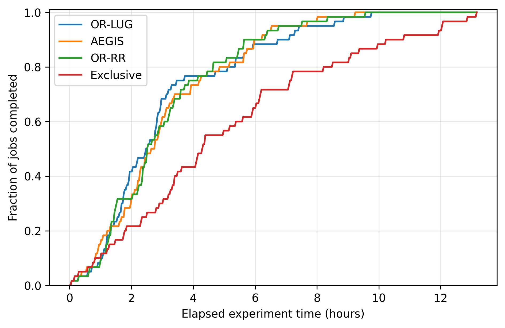

### Recovery cost

| Policy                |   Jobs with failures |   Recovered jobs |   Recovery stopped |   Failed attempts |   Mean recovery wait (s) |   P95 recovery wait (s) |   Max recovery wait (s) |   Lost runtime (s) |   Failure-to-relaunch gap (s) |   Total recovery overhead (s) |
|:----------------------|---------------------:|-----------------:|-------------------:|------------------:|-------------------------:|------------------------:|------------------------:|-------------------:|------------------------------:|------------------------------:|
| OR-LUG                |                    5 |                5 |                  0 |                 5 |                  4224.58 |                 6485.12 |                 6818.12 |            460.286 |                      21123.1  |                      21583.3  |
| AEGIS - EstimatorFree |                    3 |                3 |                  0 |                 3 |                  3035.8  |                 4209.92 |                 4293.59 |            126.047 |                       9107.49 |                       9233.54 |
| OR-RR                 |                    7 |                7 |                  0 |                 7 |                  3672.58 |                 5543.42 |                 6116.79 |            179.663 |                      25708.2  |                      25887.9  |
| Exclusive             |                    0 |                0 |                  0 |                 0 |                     0    |                    0    |                    0    |              0     |                          0    |                          0    |

#### Recovered-job cost breakdown

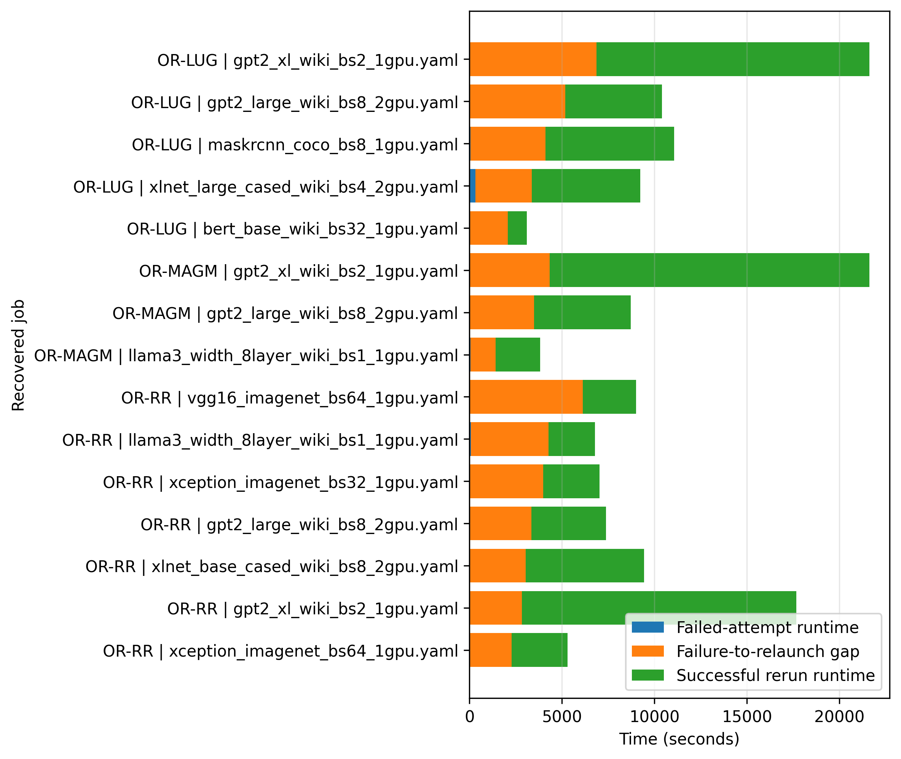

#### Policy recovery cost

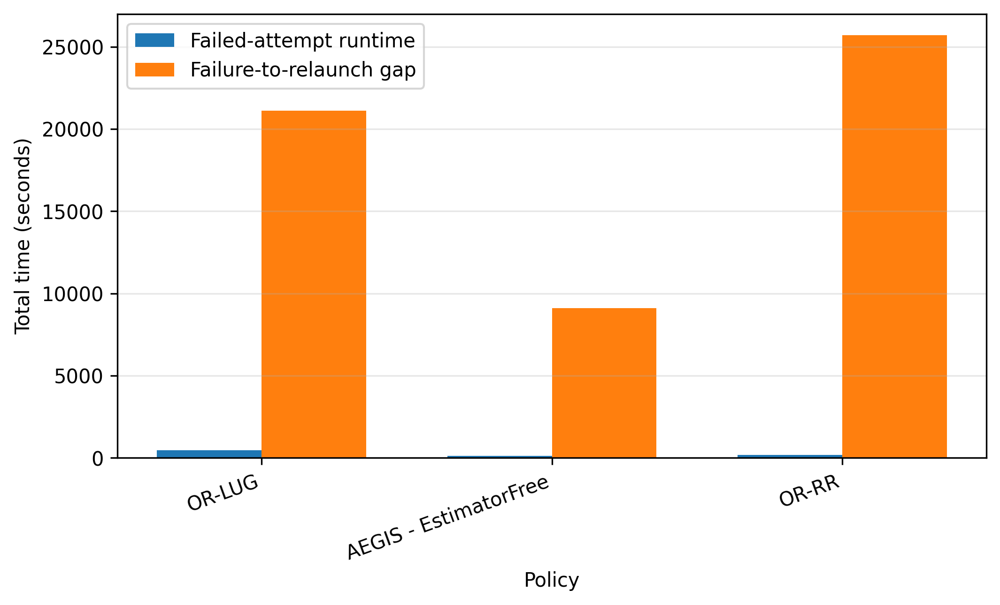

---

## Trace: venus

Results below contain only runs from this trace.

### Raw performance summary

| Policy                |   Completion |   Makespan (s) |   Mean total wait (s) |   P95 total wait (s) |   Mean JCT (s) |   P95 JCT (s) |   Mean total execution time (s) |   P95 total execution time (s) |   Mean successful runtime (s) |   Failed attempts |   Recovered attempts |
|:----------------------|-------------:|---------------:|----------------------:|---------------------:|---------------:|--------------:|--------------------------------:|-------------------------------:|------------------------------:|------------------:|---------------------:|
| Exclusive             |            1 |        44446.8 |              14463.7  |              23847.2 |        16391.2 |       24677.9 |                         1927.51 |                        3593.68 |                       1927.51 |                 0 |                    0 |
| OR-LUG                |            1 |        32878.5 |               5849.09 |              11159   |         8970.3 |       14041.8 |                         3121.19 |                        8030.18 |                       3119.33 |                 5 |                    5 |
| AEGIS - EstimatorFree |            1 |        34787.7 |               7725.67 |              13097.8 |        10202.9 |       15059.7 |                         2477.25 |                        5096.02 |                       2475.34 |                 6 |                    6 |
| OR-RR                 |            1 |        36353.3 |               8112.86 |              13966.3 |        10896.3 |       17068.1 |                         2783.36 |                        6389.66 |                       2780.46 |                13 |                   13 |

### Normalized performance summary

All ratios use Exclusive = 1.0 for this trace. Lower is better.

| Policy                |   Makespan / Exclusive |   Makespan reduction (%) |   Mean JCT / Exclusive |   P95 JCT / Exclusive |   Mean wait / Exclusive |   P95 wait / Exclusive |   Mean total execution time / Exclusive |   P95 total execution time / Exclusive |
|:----------------------|-----------------------:|-------------------------:|-----------------------:|----------------------:|------------------------:|-----------------------:|----------------------------------------:|---------------------------------------:|
| Exclusive             |                  1     |                    0     |                  1     |                 1     |                   1     |                  1     |                                   1     |                                  1     |
| OR-LUG                |                  0.74  |                   26.027 |                  0.547 |                 0.569 |                   0.404 |                  0.468 |                                   1.619 |                                  2.235 |
| AEGIS - EstimatorFree |                  0.783 |                   21.732 |                  0.622 |                 0.61  |                   0.534 |                  0.549 |                                   1.285 |                                  1.418 |
| OR-RR                 |                  0.818 |                   18.209 |                  0.665 |                 0.692 |                   0.561 |                  0.586 |                                   1.444 |                                  1.778 |

### Normalized makespan by policy

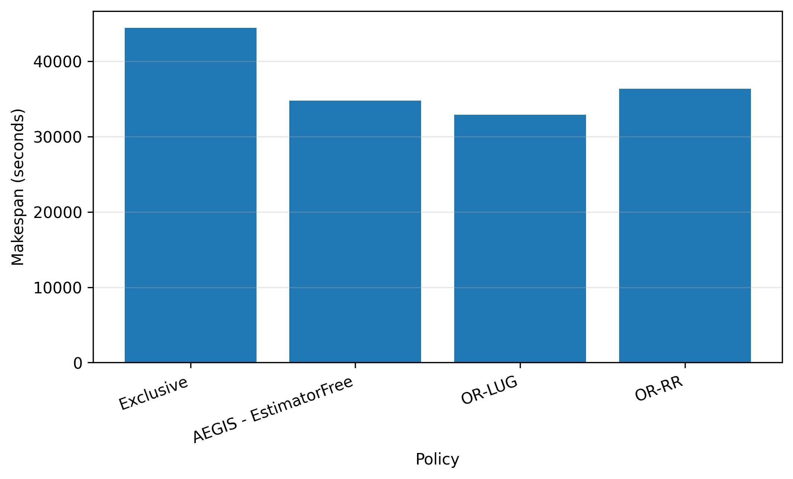

### Job completion time by policy

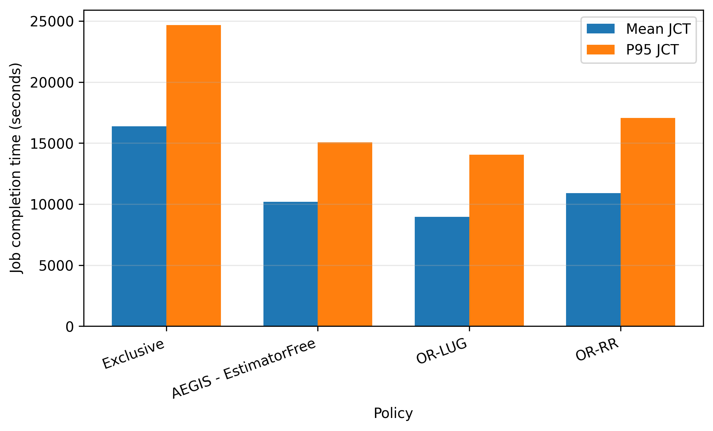

### Queueing time by policy

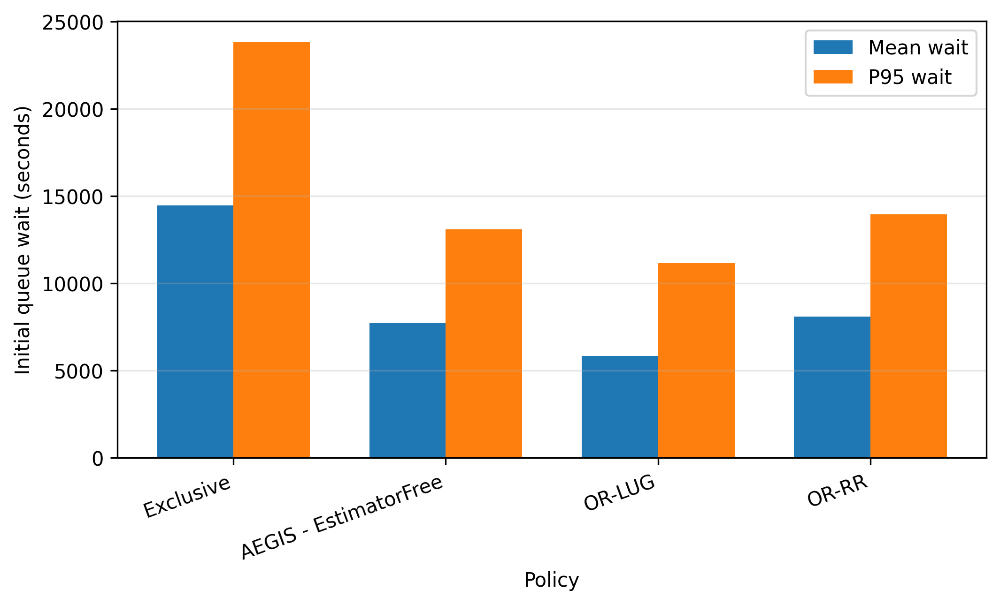

### Execution time by policy

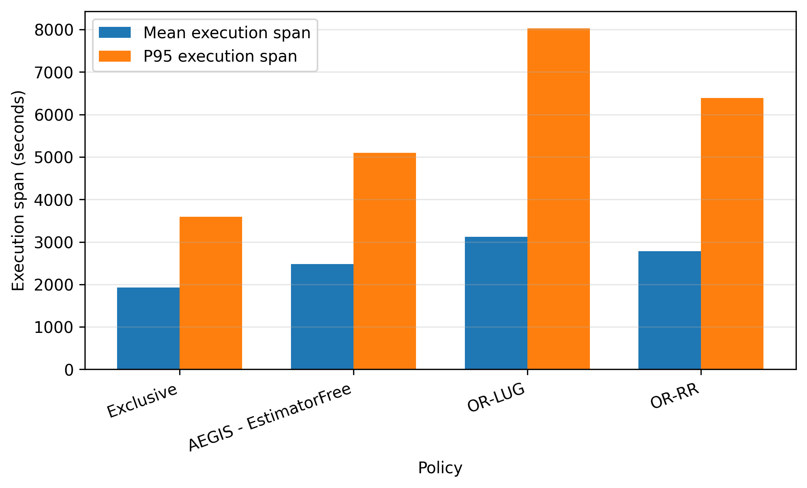

### Per-job normalized JCT distribution

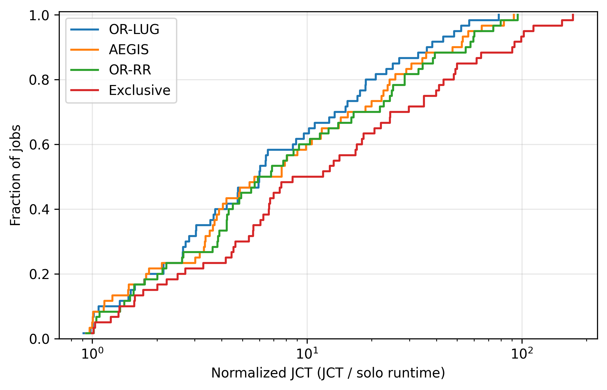

### Trace completion progress

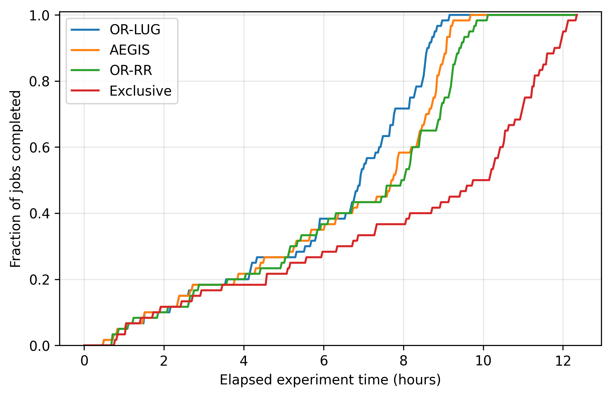

### Recovery cost

| Policy                |   Jobs with failures |   Recovered jobs |   Recovery stopped |   Failed attempts |   Mean recovery wait (s) |   P95 recovery wait (s) |   Max recovery wait (s) |   Lost runtime (s) |   Failure-to-relaunch gap (s) |   Total recovery overhead (s) |
|:----------------------|---------------------:|-----------------:|-------------------:|------------------:|-------------------------:|------------------------:|------------------------:|-------------------:|------------------------------:|------------------------------:|
| OR-LUG                |                    5 |                5 |                  0 |                 5 |                  2642.37 |                 4786.21 |                 4970.63 |            111.213 |                       13212   |                       13323.2 |
| AEGIS - EstimatorFree |                    6 |                6 |                  0 |                 6 |                  1838.28 |                 3647.29 |                 3651.97 |            114.588 |                       11029.9 |                       11144.5 |
| OR-RR                 |                   13 |               13 |                  0 |                13 |                  2229.14 |                 5071.9  |                 5666.24 |            173.902 |                       28979.3 |                       29153.2 |
| Exclusive             |                    0 |                0 |                  0 |                 0 |                     0    |                    0    |                    0    |              0     |                           0   |                           0   |

#### Recovered-job cost breakdown

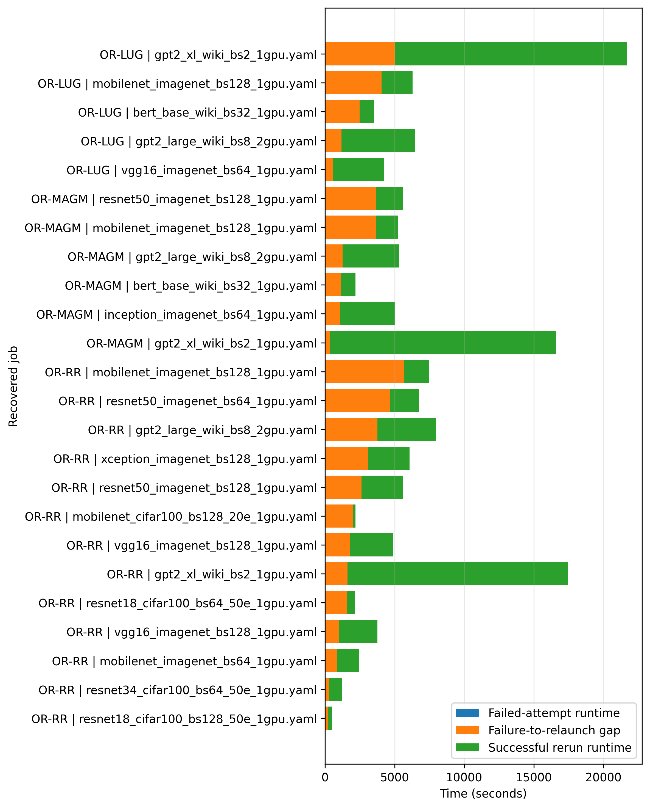

#### Policy recovery cost

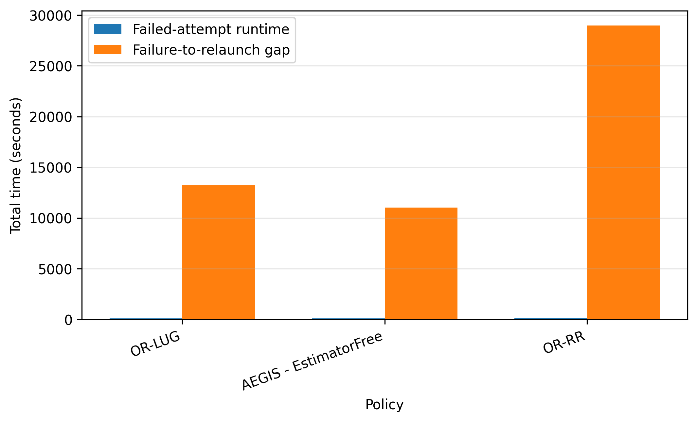
