# DCGMI resource and energy evidence

This report is secondary evidence and is not part of the main performance pipeline.

## Method

Important correction: `dcgmi_metrics.csv` reports `free_gpu_memory`, so used memory is computed as:

```text
used_gpu_memory_gb = (max_free_gpu_memory_for_that_gpu - free_gpu_memory) / 1024
```

The trace-window memory mean includes idle samples. The active memory mean/p95 only includes samples where the GPU appears active.

Energy is computed from the cumulative `energy` counter:

```text
energy_delta_j = (energy_last - energy_first) / 1000
total_gpu_energy_j = sum energy_delta_j over GPUs
```

## Numeric takeaway

- No `AEGIS-EstimatorFree` rows found, so no focused takeaway could be computed.

## Absolute summary

| trace   | policy             |   active_row_fraction |   used_gpu_memory_trace_mean_gb |   used_gpu_memory_active_mean_gb |   used_gpu_memory_active_p95_gb |   gpu_utilization_active_mean_pct |   smact_active_mean |   smocc_active_mean |   drama_active_mean |   power_active_mean_w |   total_gpu_energy_j |   total_gpu_energy_j_vs_exclusive | window_source   |
|:--------|:-------------------|----------------------:|--------------------------------:|---------------------------------:|--------------------------------:|----------------------------------:|--------------------:|--------------------:|--------------------:|----------------------:|---------------------:|----------------------------------:|:----------------|
| philly  | Exclusive          |                0.923  |                           12.41 |                            13.44 |                           33.86 |                             75.32 |              0.4231 |              0.1927 |              0.2623 |                 218   |            2.635e+07 |                            1      | dcgmi_span      |
| philly  | AEGIS-MAGM         |                0.9293 |                           24.06 |                            25.89 |                           38.76 |                             95.11 |              0.6377 |              0.3022 |              0.3824 |                 262.6 |            2.256e+07 |                            0.856  | dcgmi_span      |
| philly  | AEGIS-LUG          |                0.8167 |                           20.97 |                            25.67 |                           37.27 |                             95.55 |              0.6324 |              0.2998 |              0.3854 |                 263.3 |            2.301e+07 |                            0.8731 | dcgmi_span      |
| philly  | MAGM no thresholds |                0.8868 |                           25    |                            28.18 |                           37.49 |                             94.57 |              0.851  |              0.4086 |              0.3831 |                 261.5 |            2.274e+07 |                            0.8628 | dcgmi_span      |
| philly  | LUG no thresholds  |                0.8459 |                           22.67 |                            26.79 |                           38.6  |                             94.55 |              0.6481 |              0.3099 |              0.3818 |                 261.9 |            2.319e+07 |                            0.88   | dcgmi_span      |
| saturn  | Exclusive          |                0.8571 |                           11.2  |                            13.03 |                           34.75 |                             74.74 |              0.4299 |              0.1937 |              0.2518 |                 212.9 |            2.745e+07 |                            1      | dcgmi_span      |
| saturn  | AEGIS-MAGM         |                0.8923 |                           21.56 |                            24.16 |                           39.28 |                             94.76 |              0.6149 |              0.2877 |              0.366  |                 261.9 |            2.389e+07 |                            0.8703 | dcgmi_span      |
| saturn  | AEGIS-LUG          |                0.8431 |                           20.66 |                            24.48 |                           34.92 |                             93.29 |              0.6232 |              0.2879 |              0.3507 |                 257.2 |            2.414e+07 |                            0.8793 | dcgmi_span      |
| saturn  | MAGM no thresholds |                0.9304 |                           22.22 |                            23.88 |                           38.14 |                             92.62 |              0.599  |              0.2791 |              0.3535 |                 256.2 |            2.381e+07 |                            0.8673 | dcgmi_span      |
| saturn  | LUG no thresholds  |                0.8327 |                           19.9  |                            23.87 |                           34.87 |                             92.98 |              0.6115 |              0.2843 |              0.3558 |                 256.3 |            2.429e+07 |                            0.8847 | dcgmi_span      |
| venus   | Exclusive          |                0.8879 |                           12.64 |                            14.21 |                           34.7  |                             76.97 |              0.6052 |              0.2693 |              0.2646 |                 221.3 |            2.729e+07 |                            1      | dcgmi_span      |
| venus   | AEGIS-MAGM         |                0.909  |                           18.1  |                            19.9  |                           36.15 |                             90.02 |              0.7689 |              0.3531 |              0.3384 |                 252.7 |            2.475e+07 |                            0.907  | dcgmi_span      |
| venus   | AEGIS-LUG          |                0.9235 |                           21.6  |                            23.4  |                           39.29 |                             92.41 |              0.6041 |              0.2806 |              0.3564 |                 257   |            2.415e+07 |                            0.8851 | dcgmi_span      |
| venus   | MAGM no thresholds |                0.92   |                           20.11 |                            21.85 |                           37.25 |                             90.63 |              0.6046 |              0.2809 |              0.349  |                 250.7 |            2.415e+07 |                            0.885  | dcgmi_span      |
| venus   | LUG no thresholds  |                0.9295 |                           20.34 |                            21.89 |                           38.54 |                             90.79 |              0.6162 |              0.2844 |              0.3488 |                 253.7 |            2.43e+07  |                            0.8906 | dcgmi_span      |

## Normalized to Exclusive

Values above 1 mean higher than Exclusive. For energy-to-solution, lower than 1 is better; for utilization/activity metrics, higher than 1 means more active GPU usage.

| trace   | policy             |   used_gpu_memory_active_mean_gb_vs_exclusive |   used_gpu_memory_active_p95_gb_vs_exclusive |   gpu_utilization_active_mean_pct_vs_exclusive |   smact_active_mean_vs_exclusive |   smocc_active_mean_vs_exclusive |   drama_active_mean_vs_exclusive |   power_active_mean_w_vs_exclusive |   total_gpu_energy_j_vs_exclusive |
|:--------|:-------------------|----------------------------------------------:|---------------------------------------------:|-----------------------------------------------:|---------------------------------:|---------------------------------:|---------------------------------:|-----------------------------------:|----------------------------------:|
| philly  | Exclusive          |                                         1     |                                        1     |                                          1     |                           1      |                            1     |                            1     |                              1     |                            1      |
| philly  | AEGIS-MAGM         |                                         1.927 |                                        1.145 |                                          1.263 |                           1.507  |                            1.568 |                            1.458 |                              1.204 |                            0.856  |
| philly  | AEGIS-LUG          |                                         1.911 |                                        1.101 |                                          1.269 |                           1.495  |                            1.556 |                            1.469 |                              1.208 |                            0.8731 |
| philly  | MAGM no thresholds |                                         2.097 |                                        1.107 |                                          1.256 |                           2.011  |                            2.121 |                            1.46  |                              1.199 |                            0.8628 |
| philly  | LUG no thresholds  |                                         1.994 |                                        1.14  |                                          1.255 |                           1.532  |                            1.608 |                            1.456 |                              1.201 |                            0.88   |
| saturn  | Exclusive          |                                         1     |                                        1     |                                          1     |                           1      |                            1     |                            1     |                              1     |                            1      |
| saturn  | AEGIS-MAGM         |                                         1.854 |                                        1.131 |                                          1.268 |                           1.43   |                            1.486 |                            1.453 |                              1.23  |                            0.8703 |
| saturn  | AEGIS-LUG          |                                         1.878 |                                        1.005 |                                          1.248 |                           1.45   |                            1.486 |                            1.392 |                              1.208 |                            0.8793 |
| saturn  | MAGM no thresholds |                                         1.832 |                                        1.098 |                                          1.239 |                           1.393  |                            1.441 |                            1.404 |                              1.204 |                            0.8673 |
| saturn  | LUG no thresholds  |                                         1.831 |                                        1.003 |                                          1.244 |                           1.422  |                            1.468 |                            1.413 |                              1.204 |                            0.8847 |
| venus   | Exclusive          |                                         1     |                                        1     |                                          1     |                           1      |                            1     |                            1     |                              1     |                            1      |
| venus   | AEGIS-MAGM         |                                         1.4   |                                        1.042 |                                          1.17  |                           1.27   |                            1.311 |                            1.279 |                              1.142 |                            0.907  |
| venus   | AEGIS-LUG          |                                         1.647 |                                        1.132 |                                          1.201 |                           0.9983 |                            1.042 |                            1.347 |                              1.161 |                            0.8851 |
| venus   | MAGM no thresholds |                                         1.538 |                                        1.074 |                                          1.177 |                           0.9991 |                            1.043 |                            1.319 |                              1.133 |                            0.885  |
| venus   | LUG no thresholds  |                                         1.541 |                                        1.111 |                                          1.18  |                           1.018  |                            1.056 |                            1.318 |                              1.146 |                            0.8906 |

## Figures

### normalized energy to solution

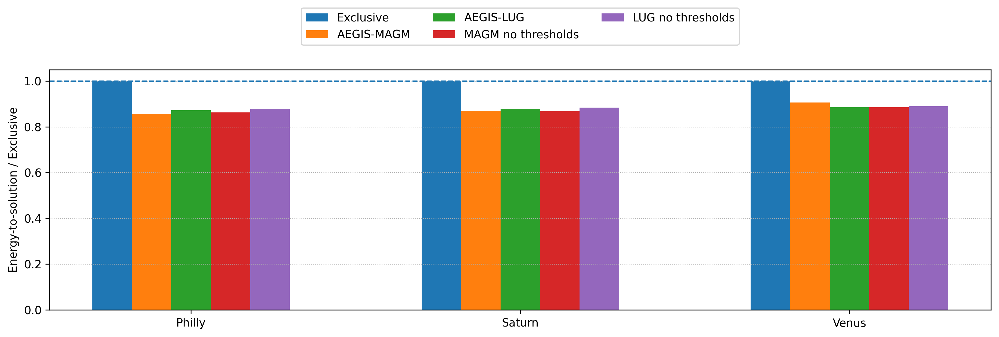

### normalized active memory mean

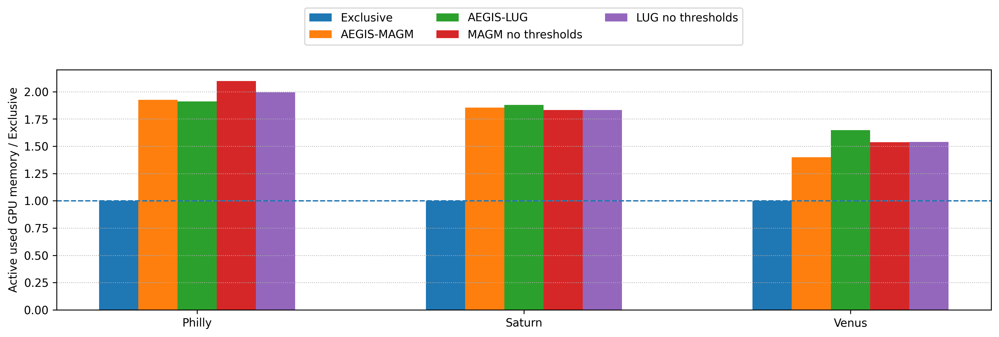

### active memory mean gb

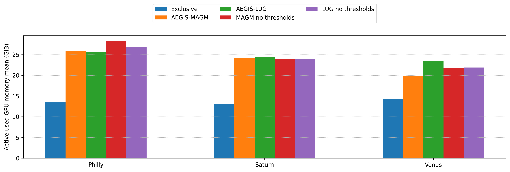

### active memory p95 gb

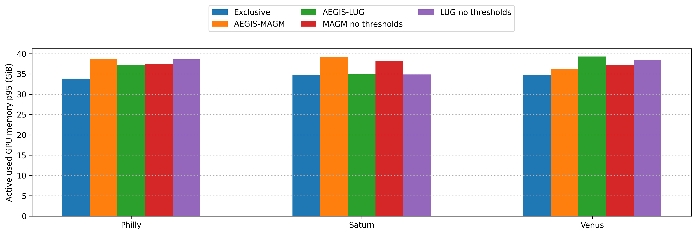

### active smact mean

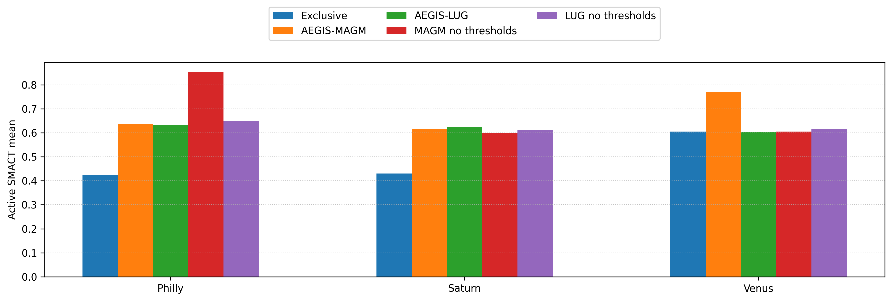

### active smocc mean

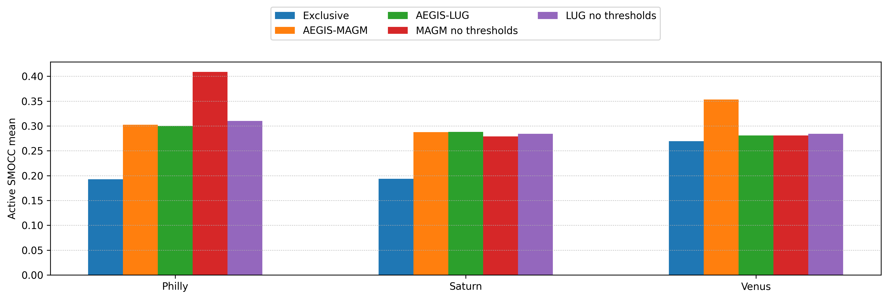

### active drama mean

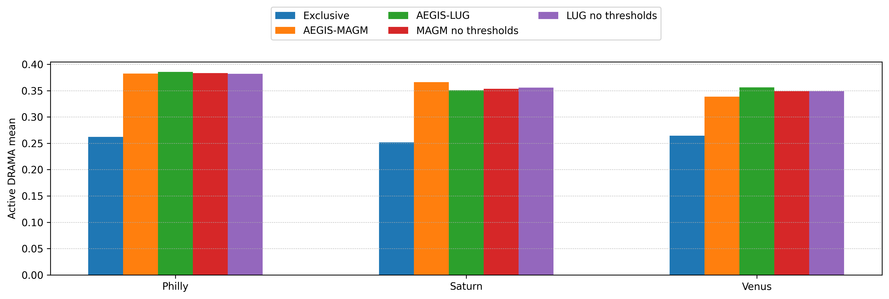

### memory timeline exclusive vs aegis philly

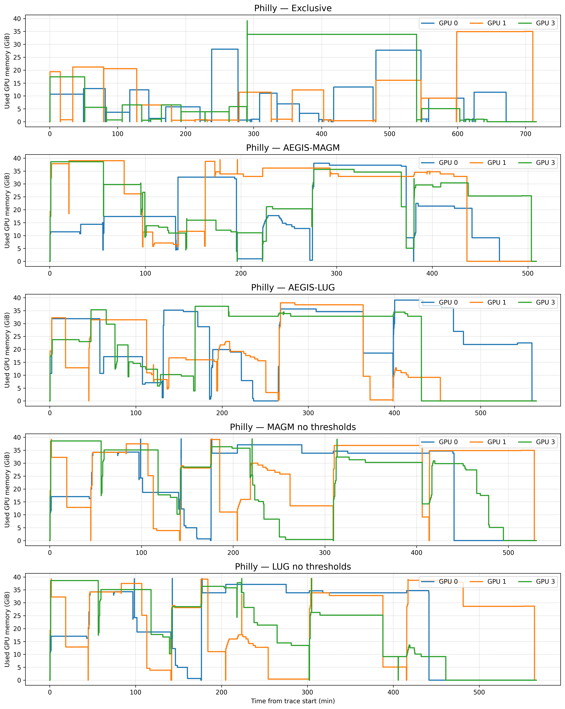

### memory timeline exclusive vs aegis saturn

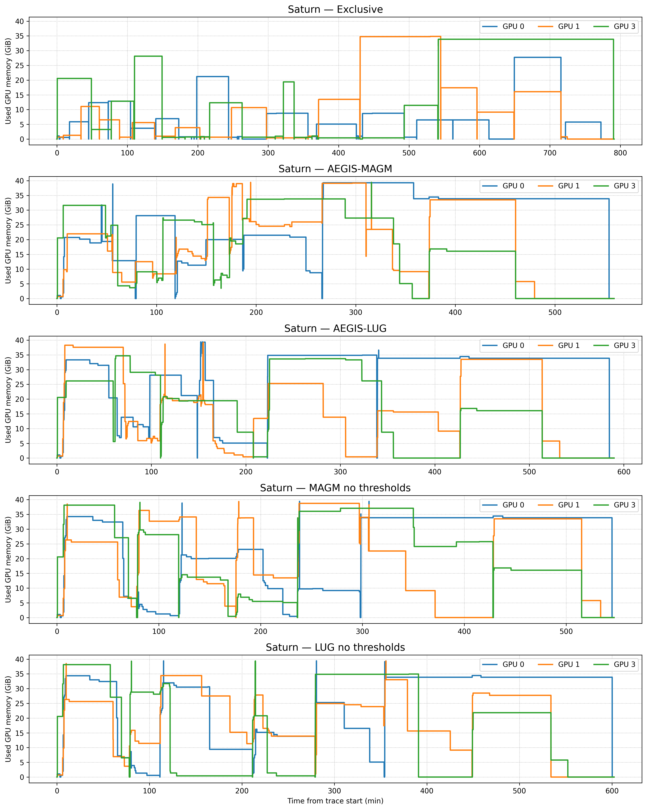

### memory timeline exclusive vs aegis venus

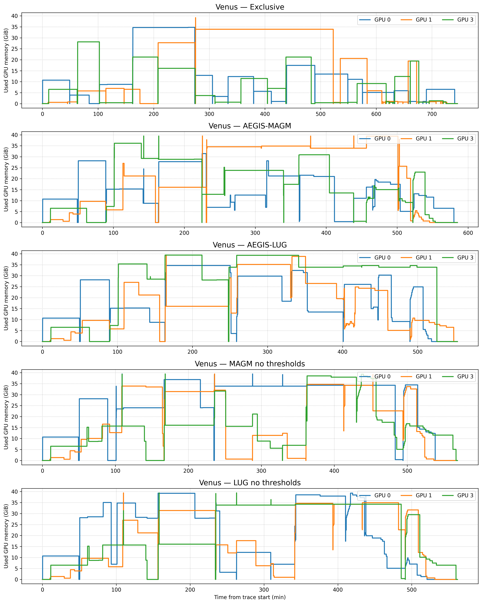

### normalized active drama

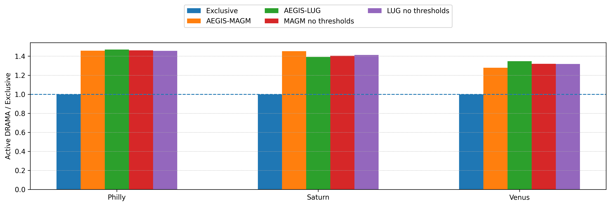

### normalized active smact

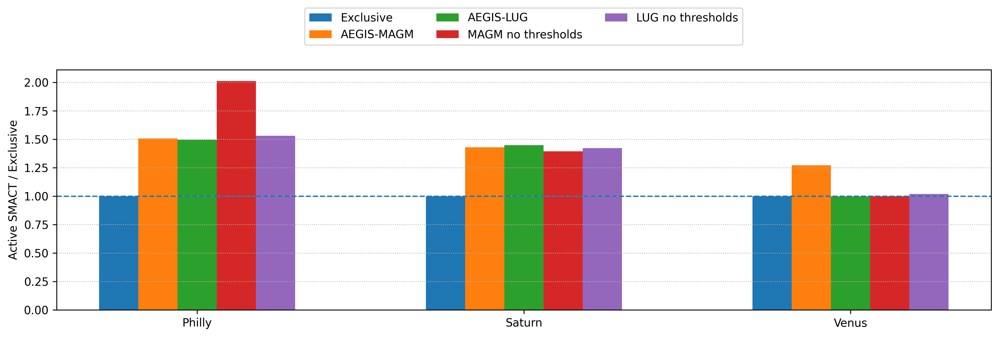

### normalized active smocc

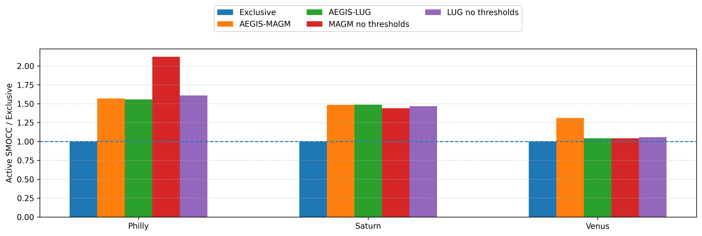
