# Final Representative Evaluation

This report is generated automatically by `analyze_evaluation_manifest.py`.

## Evaluation status

| trace_name   |   complete |
|:-------------|-----------:|
| philly       |          5 |
| saturn       |          5 |
| venus        |          5 |

## Cross-trace comparison

Each table reports every completed trace separately. GeoMean summarizes normalized ratios across traces; lower is better.

### Normalized makespan

| Policy                   |   Philly |   Saturn |   Venus |   GeoMean | Policy_display           |
|:-------------------------|---------:|---------:|--------:|----------:|:-------------------------|
| Exclusive                |    1     |    1     |   1     |     1     | Exclusive                |
| AEGIS-MAGM               |    0.709 |    0.701 |   0.783 |     0.73  | AEGIS-MAGM               |
| AEGIS-LUG                |    0.787 |    0.74  |   0.74  |     0.755 | AEGIS-LUG                |
| AEGIS-MAGM no thresholds |    0.743 |    0.69  |   0.765 |     0.732 | AEGIS-MAGM no thresholds |
| AEGIS-LUG no thresholds  |    0.794 |    0.76  |   0.756 |     0.77  | AEGIS-LUG no thresholds  |

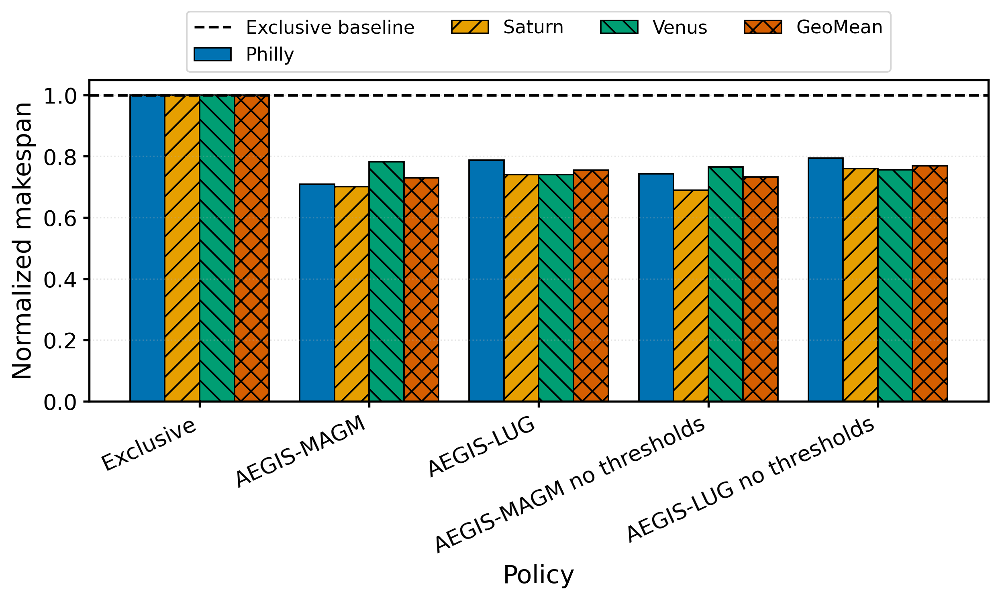

### Normalized mean JCT

| Policy                   |   Philly |   Saturn |   Venus |   GeoMean | Policy_display           |
|:-------------------------|---------:|---------:|--------:|----------:|:-------------------------|
| Exclusive                |    1     |    1     |   1     |     1     | Exclusive                |
| AEGIS-MAGM               |    0.633 |    0.583 |   0.622 |     0.613 | AEGIS-MAGM               |
| AEGIS-LUG                |    0.636 |    0.58  |   0.547 |     0.587 | AEGIS-LUG                |
| AEGIS-MAGM no thresholds |    0.666 |    0.587 |   0.616 |     0.622 | AEGIS-MAGM no thresholds |
| AEGIS-LUG no thresholds  |    0.653 |    0.635 |   0.564 |     0.616 | AEGIS-LUG no thresholds  |

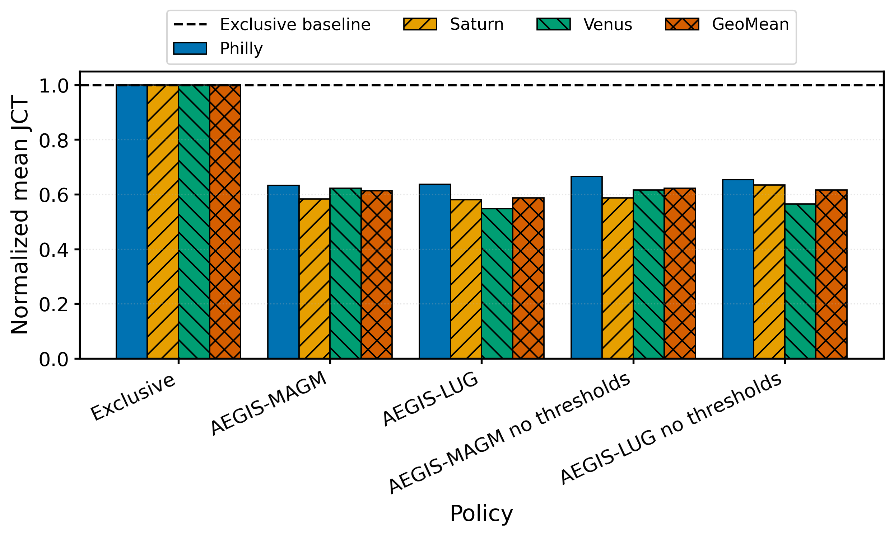

### Normalized P95 JCT

| Policy                   |   Philly |   Saturn |   Venus |   GeoMean | Policy_display           |
|:-------------------------|---------:|---------:|--------:|----------:|:-------------------------|
| Exclusive                |    1     |    1     |   1     |     1     | Exclusive                |
| AEGIS-MAGM               |    0.673 |    0.52  |   0.61  |     0.598 | AEGIS-MAGM               |
| AEGIS-LUG                |    0.698 |    0.598 |   0.569 |     0.619 | AEGIS-LUG                |
| AEGIS-MAGM no thresholds |    0.722 |    0.6   |   0.623 |     0.646 | AEGIS-MAGM no thresholds |
| AEGIS-LUG no thresholds  |    0.646 |    0.632 |   0.601 |     0.626 | AEGIS-LUG no thresholds  |

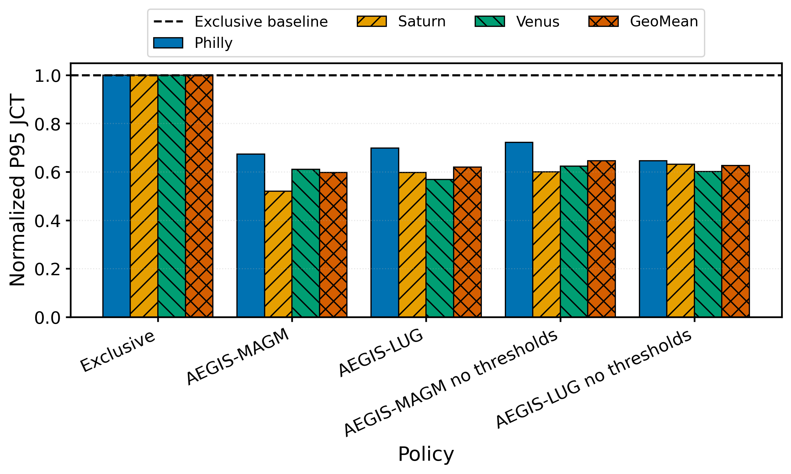

### Normalized mean total queue wait

| Policy                   |   Philly |   Saturn |   Venus |   GeoMean | Policy_display           |
|:-------------------------|---------:|---------:|--------:|----------:|:-------------------------|
| Exclusive                |    1     |    1     |   1     |     1     | Exclusive                |
| AEGIS-MAGM               |    0.513 |    0.439 |   0.534 |     0.494 | AEGIS-MAGM               |
| AEGIS-LUG                |    0.513 |    0.437 |   0.404 |     0.449 | AEGIS-LUG                |
| AEGIS-MAGM no thresholds |    0.494 |    0.443 |   0.484 |     0.473 | AEGIS-MAGM no thresholds |
| AEGIS-LUG no thresholds  |    0.497 |    0.499 |   0.435 |     0.476 | AEGIS-LUG no thresholds  |

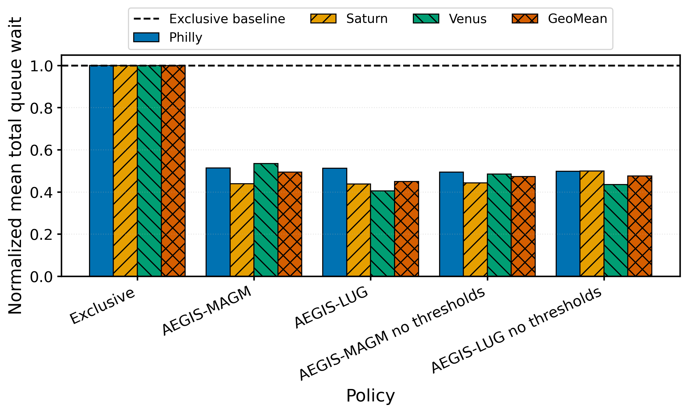

### Normalized P95 total queue wait

| Policy                   |   Philly |   Saturn |   Venus |   GeoMean | Policy_display           |
|:-------------------------|---------:|---------:|--------:|----------:|:-------------------------|
| Exclusive                |    1     |    1     |   1     |     1     | Exclusive                |
| AEGIS-MAGM               |    0.546 |    0.544 |   0.549 |     0.546 | AEGIS-MAGM               |
| AEGIS-LUG                |    0.582 |    0.63  |   0.468 |     0.556 | AEGIS-LUG                |
| AEGIS-MAGM no thresholds |    0.593 |    0.633 |   0.495 |     0.571 | AEGIS-MAGM no thresholds |
| AEGIS-LUG no thresholds  |    0.616 |    0.666 |   0.479 |     0.582 | AEGIS-LUG no thresholds  |

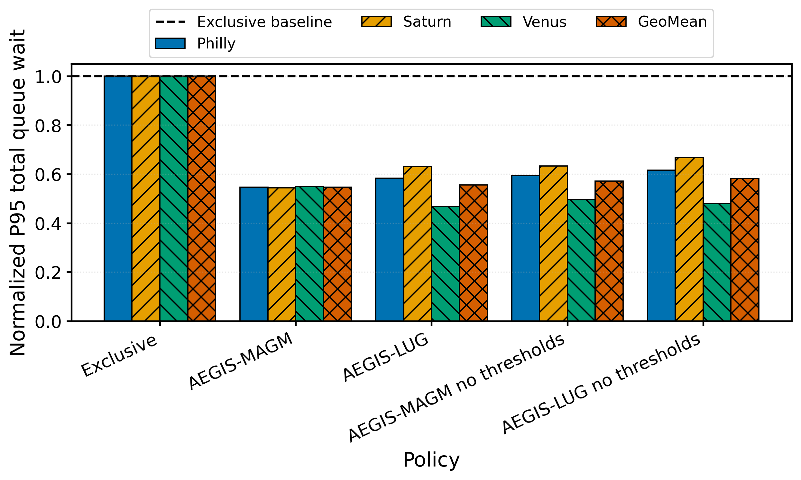

### Normalized mean total execution time

| Policy                   |   Philly |   Saturn |   Venus |   GeoMean | Policy_display           |
|:-------------------------|---------:|---------:|--------:|----------:|:-------------------------|
| Exclusive                |    1     |    1     |   1     |     1     | Exclusive                |
| AEGIS-MAGM               |    1.704 |    1.699 |   1.285 |     1.55  | AEGIS-MAGM               |
| AEGIS-LUG                |    1.739 |    1.692 |   1.619 |     1.683 | AEGIS-LUG                |
| AEGIS-MAGM no thresholds |    2.201 |    1.709 |   1.606 |     1.821 | AEGIS-MAGM no thresholds |
| AEGIS-LUG no thresholds  |    2.043 |    1.689 |   1.534 |     1.743 | AEGIS-LUG no thresholds  |

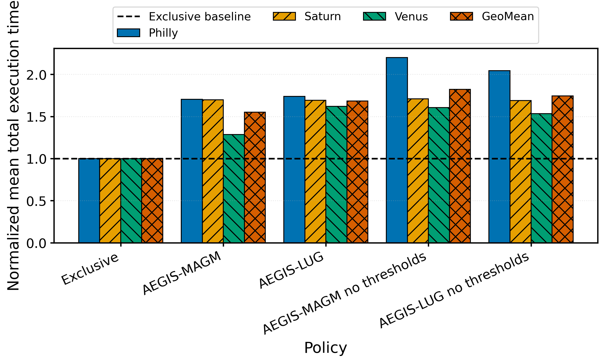

### Normalized P95 total execution time

| Policy                   |   Philly |   Saturn |   Venus |   GeoMean | Policy_display           |
|:-------------------------|---------:|---------:|--------:|----------:|:-------------------------|
| Exclusive                |    1     |    1     |   1     |     1     | Exclusive                |
| AEGIS-MAGM               |    2.114 |    2.554 |   1.418 |     1.971 | AEGIS-MAGM               |
| AEGIS-LUG                |    2.298 |    1.961 |   2.235 |     2.16  | AEGIS-LUG                |
| AEGIS-MAGM no thresholds |    2.766 |    1.901 |   2.211 |     2.265 | AEGIS-MAGM no thresholds |
| AEGIS-LUG no thresholds  |    2.56  |    2.129 |   2.09  |     2.25  | AEGIS-LUG no thresholds  |

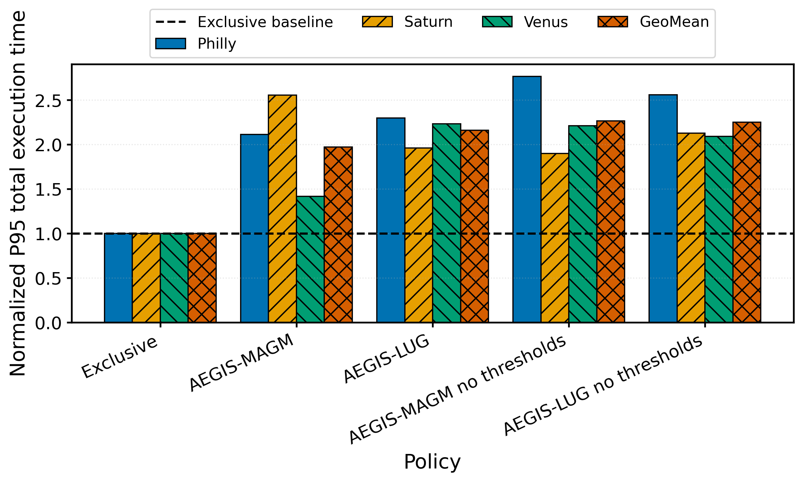

## Cross-trace queue and execution-time summary

Total queue time is initial queue wait plus recovery queue wait. Total execution time is the sum of all attempt runtimes, including failed attempts before recovery.

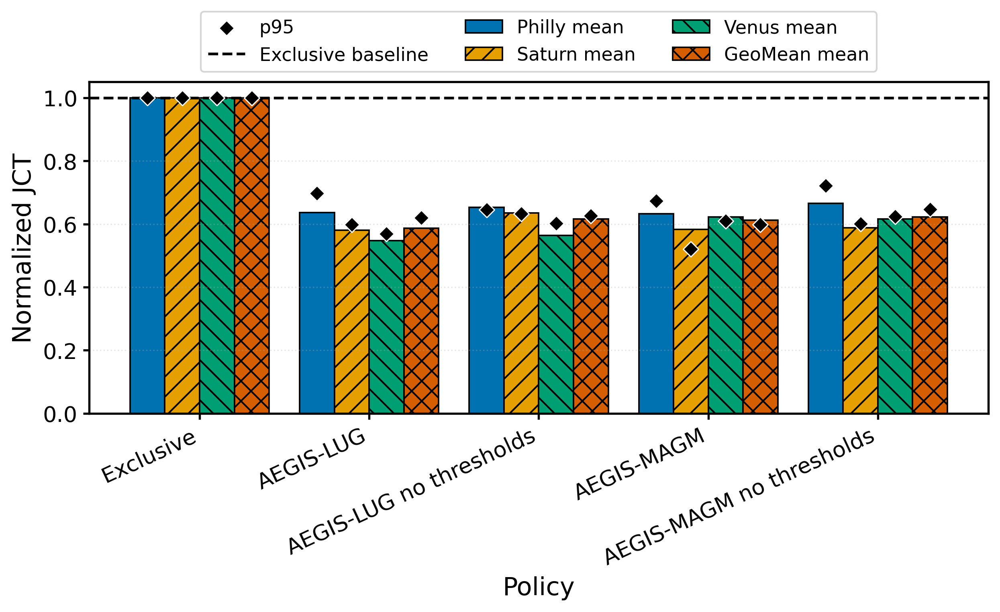

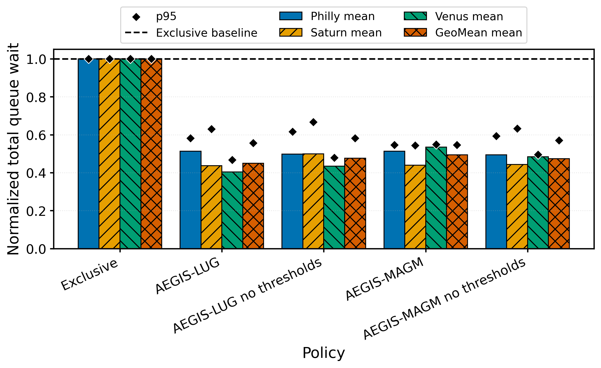

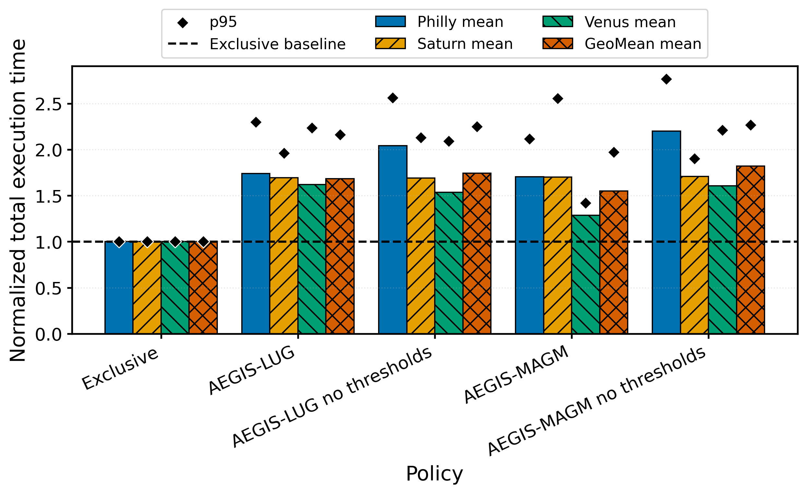

---

## Trace: philly

Results below contain only runs from this trace.

### Raw performance summary

| Policy                   |   Completion |   Makespan (s) |   Mean total wait (s) |   P95 total wait (s) |   Mean JCT (s) |   P95 JCT (s) |   Mean total execution time (s) |   P95 total execution time (s) |   Mean successful runtime (s) |   Failed attempts |   Recovered attempts |
|:-------------------------|-------------:|---------------:|----------------------:|---------------------:|---------------:|--------------:|--------------------------------:|-------------------------------:|------------------------------:|------------------:|---------------------:|
| AEGIS-LUG no thresholds  |            1 |        33846.9 |               8421.46 |              17938.4 |        12293.4 |       19860.6 |                         3871.89 |                        9013.03 |                       3868.62 |                 7 |                    7 |
| AEGIS-LUG                |            1 |        33560.2 |               8677.04 |              16953.2 |        11972.1 |       21465   |                         3294.99 |                        8089.41 |                       3294.36 |                 3 |                    3 |
| AEGIS-MAGM no thresholds |            1 |        31691   |               8359.28 |              17276.3 |        12528.9 |       22207.6 |                         4169.57 |                        9738.57 |                       4166.36 |                 6 |                    6 |
| AEGIS-MAGM               |            1 |        30208.2 |               8686.46 |              15885.2 |        11915.9 |       20698.9 |                         3229.45 |                        7443.16 |                       3228.94 |                 3 |                    3 |
| Exclusive                |            1 |        42633.5 |              16928.3  |              29115.1 |        18823.2 |       30761.5 |                         1894.81 |                        3520.2  |                       1894.81 |                 0 |                    0 |

### Normalized performance summary

All ratios use Exclusive = 1.0 for this trace. Lower is better.

| Policy                   |   Makespan / Exclusive |   Makespan reduction (%) |   Mean JCT / Exclusive |   P95 JCT / Exclusive |   Mean wait / Exclusive |   P95 wait / Exclusive |   Mean total execution time / Exclusive |   P95 total execution time / Exclusive |
|:-------------------------|-----------------------:|-------------------------:|-----------------------:|----------------------:|------------------------:|-----------------------:|----------------------------------------:|---------------------------------------:|
| AEGIS-LUG no thresholds  |                  0.794 |                   20.61  |                  0.653 |                 0.646 |                   0.497 |                  0.616 |                                   2.043 |                                  2.56  |
| AEGIS-LUG                |                  0.787 |                   21.282 |                  0.636 |                 0.698 |                   0.513 |                  0.582 |                                   1.739 |                                  2.298 |
| AEGIS-MAGM no thresholds |                  0.743 |                   25.667 |                  0.666 |                 0.722 |                   0.494 |                  0.593 |                                   2.201 |                                  2.766 |
| AEGIS-MAGM               |                  0.709 |                   29.144 |                  0.633 |                 0.673 |                   0.513 |                  0.546 |                                   1.704 |                                  2.114 |
| Exclusive                |                  1     |                    0     |                  1     |                 1     |                   1     |                  1     |                                   1     |                                  1     |

### Normalized makespan by policy

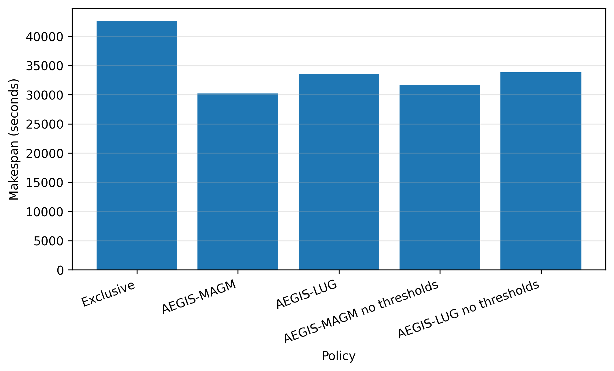

### Job completion time by policy

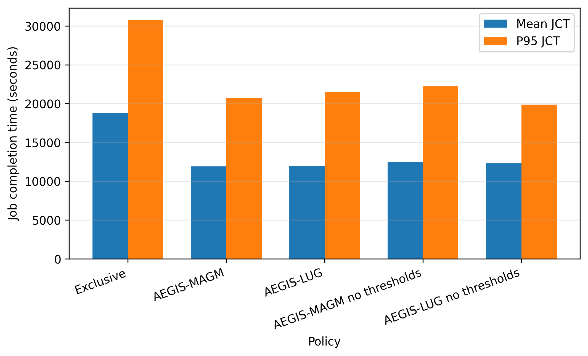

### Queueing time by policy

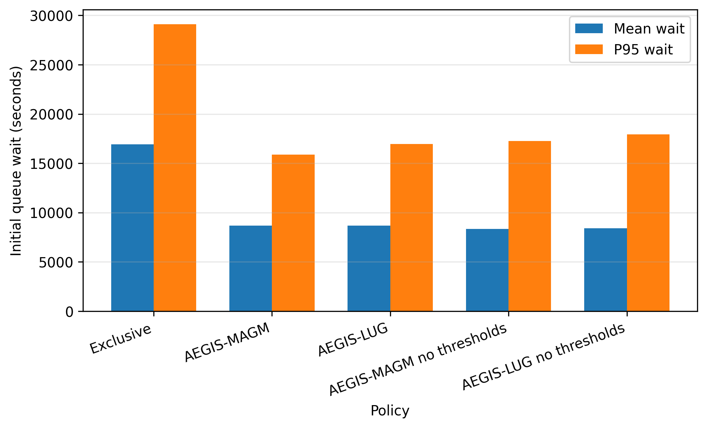

### Execution time by policy

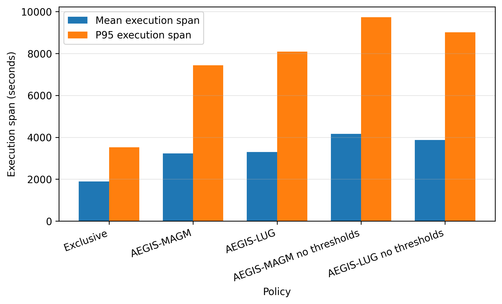

### Per-job normalized JCT distribution

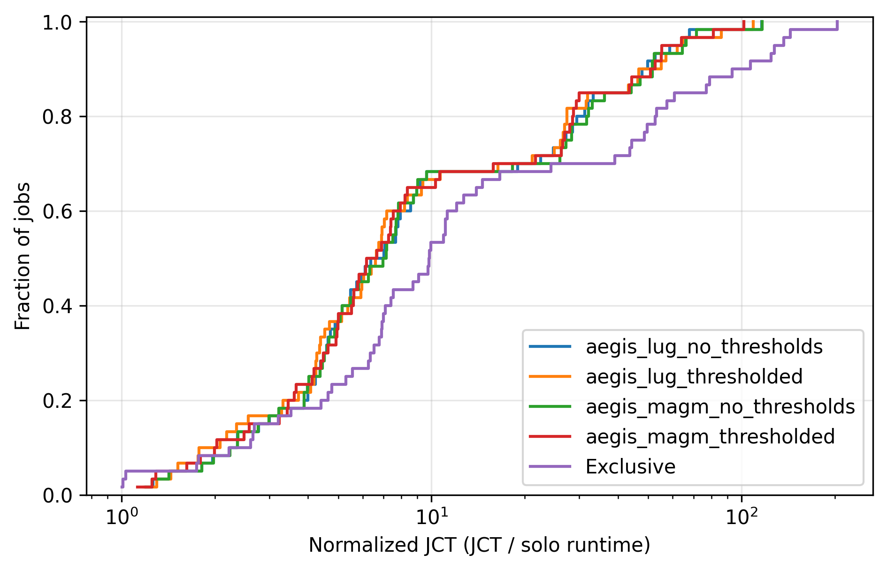

### Trace completion progress

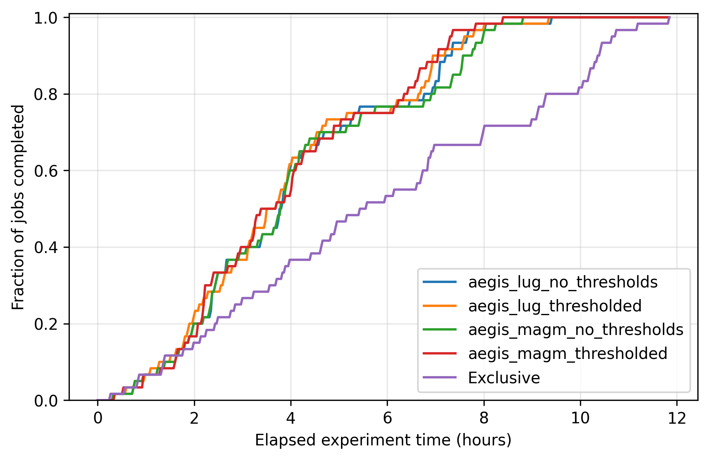

### Recovery cost

| Policy                   |   Jobs with failures |   Recovered jobs |   Recovery stopped |   Failed attempts |   Mean recovery wait (s) |   P95 recovery wait (s) |   Max recovery wait (s) |   Lost runtime (s) |   Failure-to-relaunch gap (s) |   Total recovery overhead (s) |
|:-------------------------|---------------------:|-----------------:|-------------------:|------------------:|-------------------------:|------------------------:|------------------------:|-------------------:|------------------------------:|------------------------------:|
| AEGIS-LUG no thresholds  |                    7 |                7 |                  0 |                 7 |                  3734.32 |                 6451.87 |                 6616.3  |            196.399 |                      26140.4  |                      26336.8  |
| AEGIS-LUG                |                    3 |                3 |                  0 |                 3 |                  4505.01 |                 7147.98 |                 7562.06 |             38.029 |                      13515.1  |                      13553.1  |
| AEGIS-MAGM no thresholds |                    6 |                6 |                  0 |                 6 |                  3335.06 |                 5834.17 |                 6014.15 |            193.033 |                      20010.6  |                      20203.6  |
| AEGIS-MAGM               |                    3 |                3 |                  0 |                 3 |                  2608.29 |                 4822.69 |                 5184.11 |             30.435 |                       7824.95 |                       7855.39 |
| Exclusive                |                    0 |                0 |                  0 |                 0 |                     0    |                    0    |                    0    |              0     |                          0    |                          0    |

#### Recovered-job cost breakdown

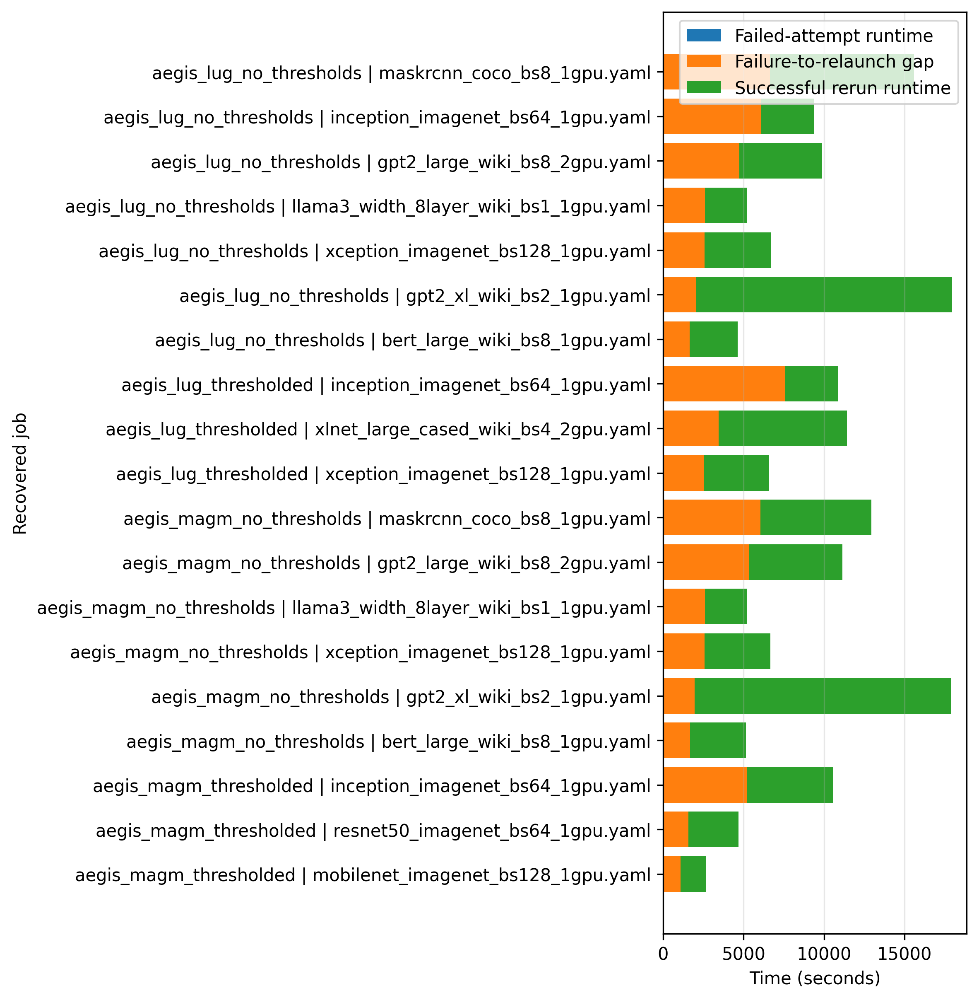

#### Policy recovery cost

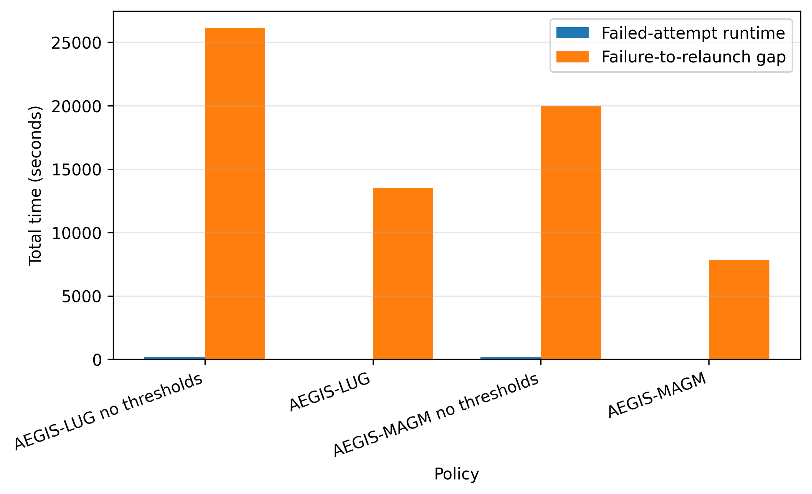

---

## Trace: saturn

Results below contain only runs from this trace.

### Raw performance summary

| Policy                   |   Completion |   Makespan (s) |   Mean total wait (s) |   P95 total wait (s) |   Mean JCT (s) |   P95 JCT (s) |   Mean total execution time (s) |   P95 total execution time (s) |   Mean successful runtime (s) |   Failed attempts |   Recovered attempts |
|:-------------------------|-------------:|---------------:|----------------------:|---------------------:|---------------:|--------------:|--------------------------------:|-------------------------------:|------------------------------:|------------------:|---------------------:|
| AEGIS-LUG no thresholds  |            1 |        36005.6 |               7600.31 |              24526.5 |       10921.7  |       25855.9 |                         3321.38 |                        7622.92 |                       3317.91 |                 6 |                    6 |
| AEGIS-LUG                |            1 |        35073.6 |               6659.04 |              23190.8 |        9985.67 |       24464.2 |                         3326.6  |                        7023.85 |                       3318.93 |                 5 |                    5 |
| AEGIS-MAGM no thresholds |            1 |        32691.1 |               6748.82 |              23288.9 |       10108.3  |       24554.7 |                         3359.45 |                        6806.38 |                       3356.04 |                 6 |                    6 |
| AEGIS-MAGM               |            1 |        33248.6 |               6696.88 |              20007.3 |       10037.9  |       21282.5 |                         3341.03 |                        9147.41 |                       3338.93 |                 3 |                    3 |
| Exclusive                |            1 |        47406.4 |              15241.4  |              36809.2 |       17207.5  |       40915.9 |                         1966.07 |                        3581.06 |                       1966.07 |                 0 |                    0 |

### Normalized performance summary

All ratios use Exclusive = 1.0 for this trace. Lower is better.

| Policy                   |   Makespan / Exclusive |   Makespan reduction (%) |   Mean JCT / Exclusive |   P95 JCT / Exclusive |   Mean wait / Exclusive |   P95 wait / Exclusive |   Mean total execution time / Exclusive |   P95 total execution time / Exclusive |
|:-------------------------|-----------------------:|-------------------------:|-----------------------:|----------------------:|------------------------:|-----------------------:|----------------------------------------:|---------------------------------------:|
| AEGIS-LUG no thresholds  |                  0.76  |                   24.049 |                  0.635 |                 0.632 |                   0.499 |                  0.666 |                                   1.689 |                                  2.129 |
| AEGIS-LUG                |                  0.74  |                   26.015 |                  0.58  |                 0.598 |                   0.437 |                  0.63  |                                   1.692 |                                  1.961 |
| AEGIS-MAGM no thresholds |                  0.69  |                   31.041 |                  0.587 |                 0.6   |                   0.443 |                  0.633 |                                   1.709 |                                  1.901 |
| AEGIS-MAGM               |                  0.701 |                   29.865 |                  0.583 |                 0.52  |                   0.439 |                  0.544 |                                   1.699 |                                  2.554 |
| Exclusive                |                  1     |                    0     |                  1     |                 1     |                   1     |                  1     |                                   1     |                                  1     |

### Normalized makespan by policy

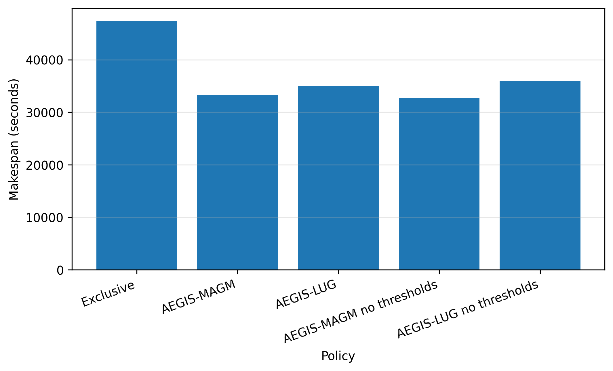

### Job completion time by policy

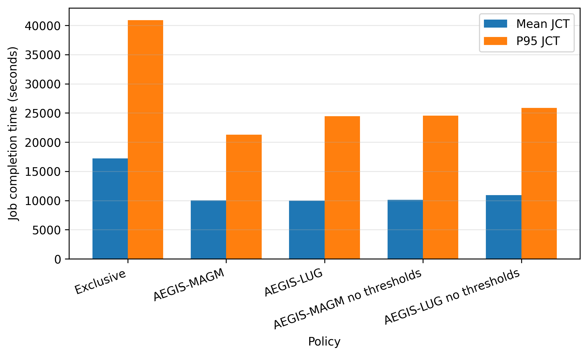

### Queueing time by policy

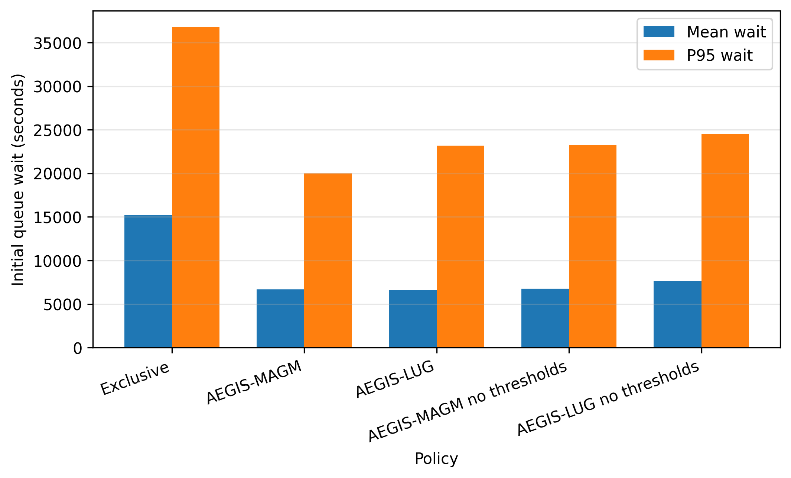

### Execution time by policy

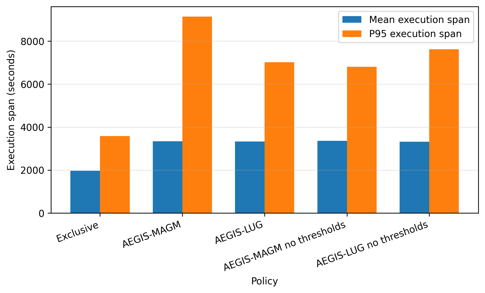

### Per-job normalized JCT distribution

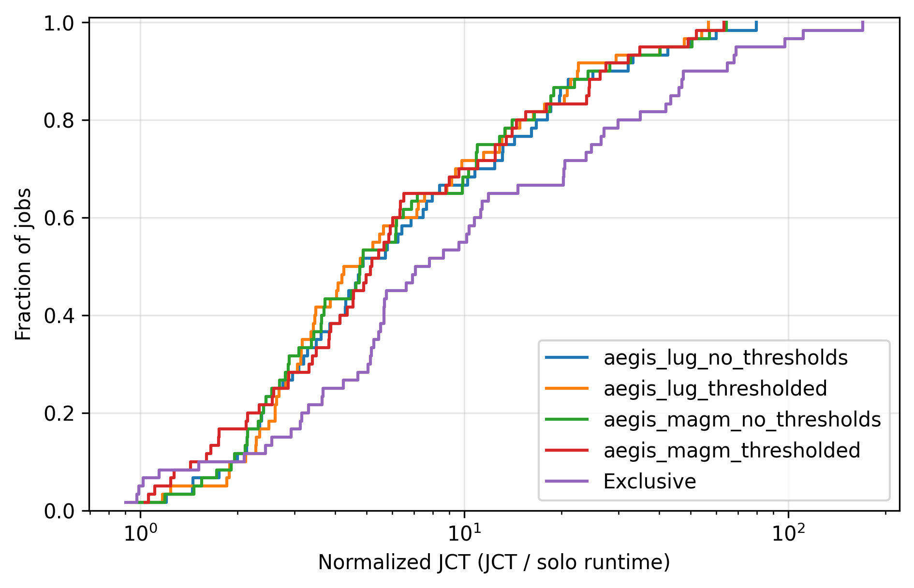

### Trace completion progress

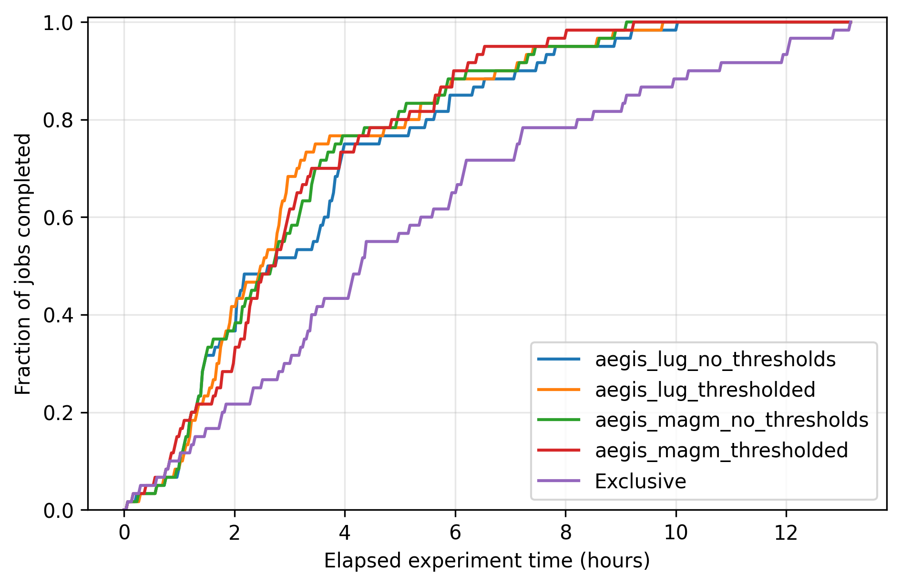

### Recovery cost

| Policy                   |   Jobs with failures |   Recovered jobs |   Recovery stopped |   Failed attempts |   Mean recovery wait (s) |   P95 recovery wait (s) |   Max recovery wait (s) |   Lost runtime (s) |   Failure-to-relaunch gap (s) |   Total recovery overhead (s) |
|:-------------------------|---------------------:|-----------------:|-------------------:|------------------:|-------------------------:|------------------------:|------------------------:|-------------------:|------------------------------:|------------------------------:|
| AEGIS-LUG no thresholds  |                    6 |                6 |                  0 |                 6 |                  4255.48 |                 5716.9  |                 5761.08 |            208.388 |                      25533    |                      25741.4  |
| AEGIS-LUG                |                    5 |                5 |                  0 |                 5 |                  4224.58 |                 6485.12 |                 6818.12 |            460.286 |                      21123.1  |                      21583.3  |
| AEGIS-MAGM no thresholds |                    6 |                6 |                  0 |                 6 |                  3973.84 |                 6496.06 |                 7298.94 |            204.653 |                      23843.2  |                      24047.9  |
| AEGIS-MAGM               |                    3 |                3 |                  0 |                 3 |                  3035.8  |                 4209.92 |                 4293.59 |            126.047 |                       9107.49 |                       9233.54 |
| Exclusive                |                    0 |                0 |                  0 |                 0 |                     0    |                    0    |                    0    |              0     |                          0    |                          0    |

#### Recovered-job cost breakdown

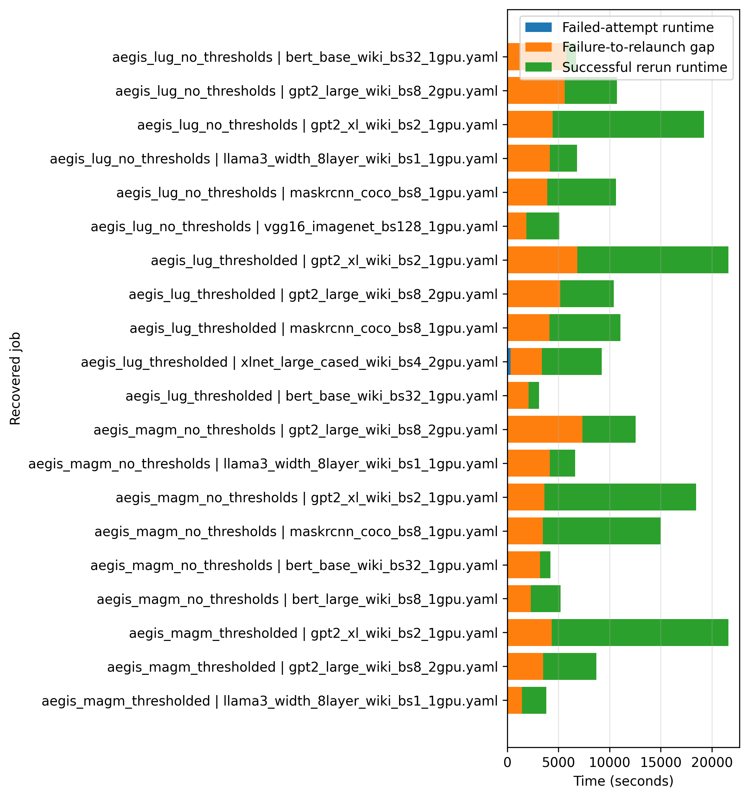

#### Policy recovery cost

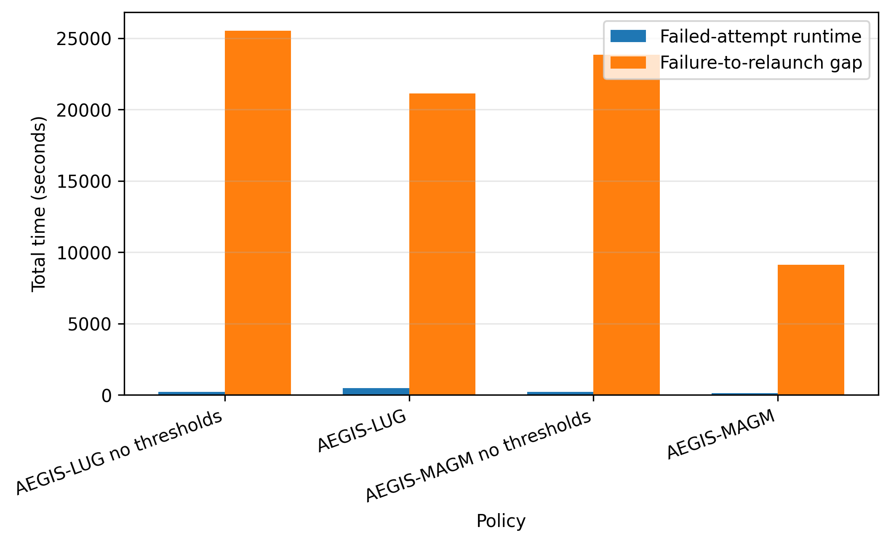

---

## Trace: venus

Results below contain only runs from this trace.

### Raw performance summary

| Policy                   |   Completion |   Makespan (s) |   Mean total wait (s) |   P95 total wait (s) |   Mean JCT (s) |   P95 JCT (s) |   Mean total execution time (s) |   P95 total execution time (s) |   Mean successful runtime (s) |   Failed attempts |   Recovered attempts |
|:-------------------------|-------------:|---------------:|----------------------:|---------------------:|---------------:|--------------:|--------------------------------:|-------------------------------:|------------------------------:|------------------:|---------------------:|
| AEGIS-LUG no thresholds  |            1 |        33587.6 |               6289.53 |              11422.4 |        9246.37 |       14843.4 |                         2956.81 |                        7512.48 |                       2954.69 |                 6 |                    6 |
| AEGIS-LUG                |            1 |        32878.5 |               5849.09 |              11159   |        8970.3  |       14041.8 |                         3121.19 |                        8030.18 |                       3119.33 |                 5 |                    5 |
| AEGIS-MAGM no thresholds |            1 |        33998.1 |               7005.61 |              11813.7 |       10100.9  |       15380.6 |                         3095.31 |                        7946.38 |                       3093.34 |                 6 |                    6 |
| AEGIS-MAGM               |            1 |        34787.7 |               7725.67 |              13097.8 |       10202.9  |       15059.7 |                         2477.25 |                        5096.02 |                       2475.34 |                 6 |                    6 |
| Exclusive                |            1 |        44446.8 |              14463.7  |              23847.2 |       16391.2  |       24677.9 |                         1927.51 |                        3593.68 |                       1927.51 |                 0 |                    0 |

### Normalized performance summary

All ratios use Exclusive = 1.0 for this trace. Lower is better.

| Policy                   |   Makespan / Exclusive |   Makespan reduction (%) |   Mean JCT / Exclusive |   P95 JCT / Exclusive |   Mean wait / Exclusive |   P95 wait / Exclusive |   Mean total execution time / Exclusive |   P95 total execution time / Exclusive |
|:-------------------------|-----------------------:|-------------------------:|-----------------------:|----------------------:|------------------------:|-----------------------:|----------------------------------------:|---------------------------------------:|
| AEGIS-LUG no thresholds  |                  0.756 |                   24.432 |                  0.564 |                 0.601 |                   0.435 |                  0.479 |                                   1.534 |                                  2.09  |
| AEGIS-LUG                |                  0.74  |                   26.027 |                  0.547 |                 0.569 |                   0.404 |                  0.468 |                                   1.619 |                                  2.235 |
| AEGIS-MAGM no thresholds |                  0.765 |                   23.508 |                  0.616 |                 0.623 |                   0.484 |                  0.495 |                                   1.606 |                                  2.211 |
| AEGIS-MAGM               |                  0.783 |                   21.732 |                  0.622 |                 0.61  |                   0.534 |                  0.549 |                                   1.285 |                                  1.418 |
| Exclusive                |                  1     |                    0     |                  1     |                 1     |                   1     |                  1     |                                   1     |                                  1     |

### Normalized makespan by policy

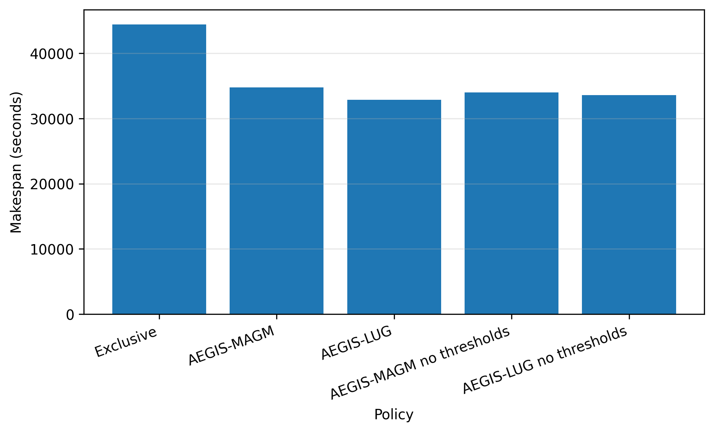

### Job completion time by policy

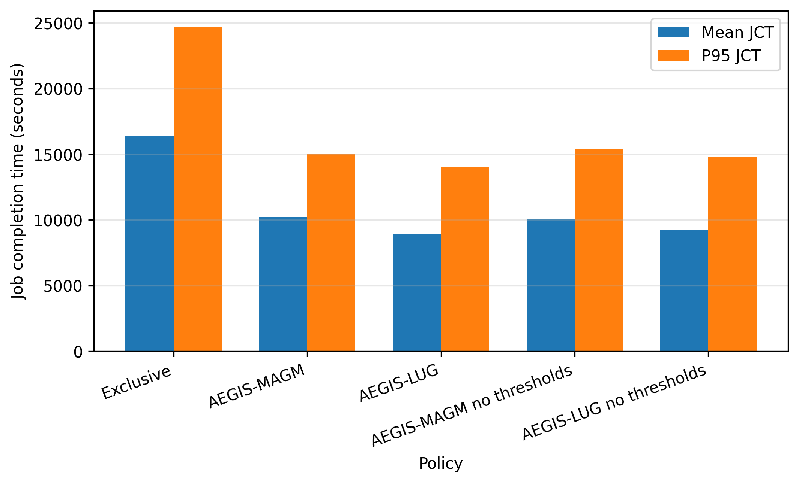

### Queueing time by policy

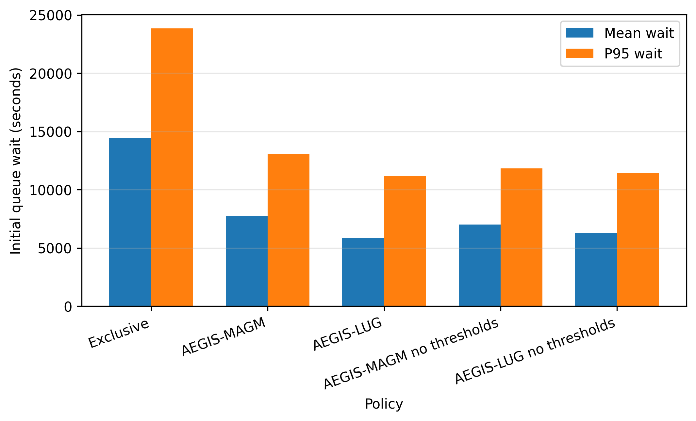

### Execution time by policy

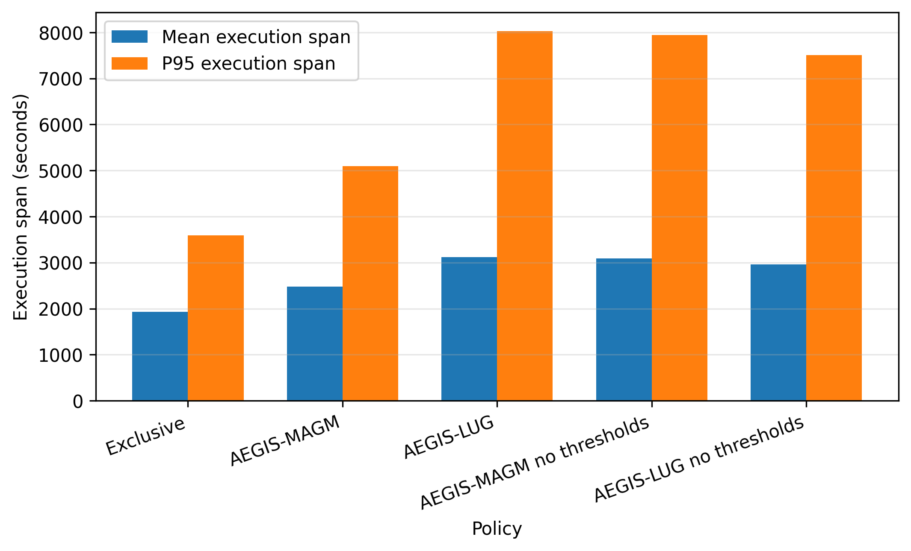

### Per-job normalized JCT distribution

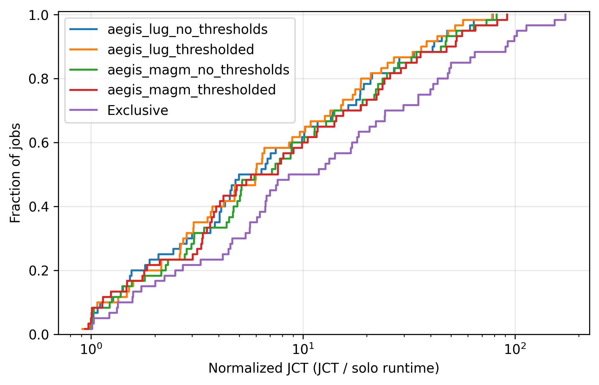

### Trace completion progress

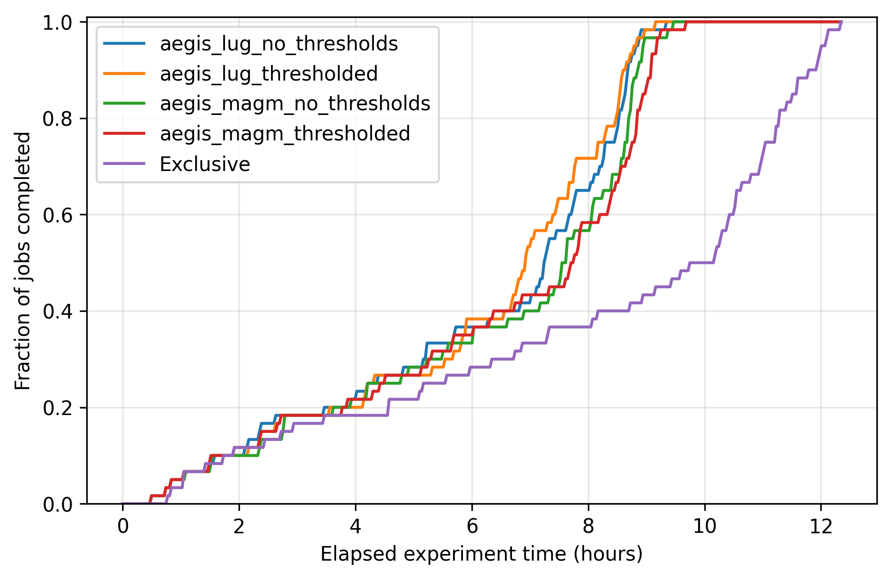

### Recovery cost

| Policy                   |   Jobs with failures |   Recovered jobs |   Recovery stopped |   Failed attempts |   Mean recovery wait (s) |   P95 recovery wait (s) |   Max recovery wait (s) |   Lost runtime (s) |   Failure-to-relaunch gap (s) |   Total recovery overhead (s) |
|:-------------------------|---------------------:|-----------------:|-------------------:|------------------:|-------------------------:|------------------------:|------------------------:|-------------------:|------------------------------:|------------------------------:|
| AEGIS-LUG no thresholds  |                    6 |                6 |                  0 |                 6 |                  2815.75 |                 4223.49 |                 4566.79 |            126.906 |                       16894.7 |                       17021.6 |
| AEGIS-LUG                |                    5 |                5 |                  0 |                 5 |                  2642.37 |                 4786.21 |                 4970.63 |            111.213 |                       13212   |                       13323.2 |
| AEGIS-MAGM no thresholds |                    6 |                6 |                  0 |                 6 |                  2897.22 |                 3862.71 |                 4003.97 |            118.208 |                       17383.5 |                       17501.7 |
| AEGIS-MAGM               |                    6 |                6 |                  0 |                 6 |                  1838.28 |                 3647.29 |                 3651.97 |            114.588 |                       11029.9 |                       11144.5 |
| Exclusive                |                    0 |                0 |                  0 |                 0 |                     0    |                    0    |                    0    |              0     |                           0   |                           0   |

#### Recovered-job cost breakdown

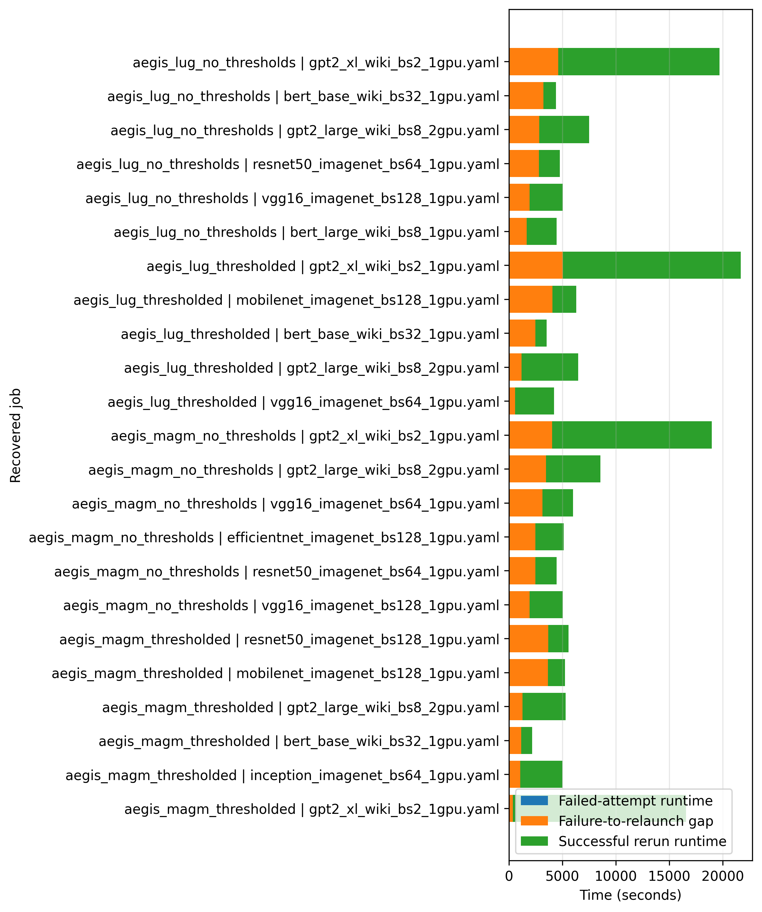

#### Policy recovery cost

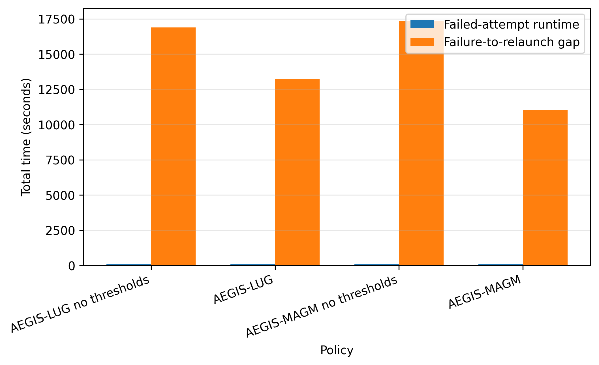
